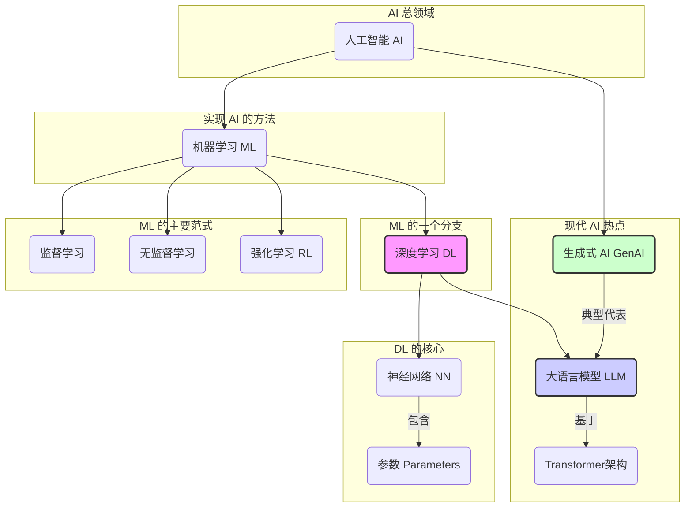

<h1 align="center" id="基础与历史">AI 基础与历史</h1>

**概要：** 本章节旨在梳理人工智能（AI）的核心概念、发展历程、关键技术及其相互关系，助你构建对 AI 领域的基础认知。

## 1. 什么是人工智能 (What is AI?)

人工智能（Artificial Intelligence, AI）是一个广阔的计算机科学领域（包括机器人、语言识别、图像识别、[自然语言处理](/AI/01c_NLP基础)、专家系统、[机器学习](/AI/01a_机器学习基础)、计算机视觉等），致力于创造能够执行通常需要人类智能才能完成的任务的机器或系统。这些任务包括学习、推理、问题解决、感知、理解语言和决策等。AI 的目标是让机器能够像人一样思考和行动，甚至在某些方面超越人类。

## 2. 核心概念：让机器“学习” (Core Concepts: Enabling Machines to "Learn")

现代 AI 的许多突破都源于[机器学习 (Machine Learning, ML)](/AI/01a_机器学习基础)，它是 AI 的一个核心子领域，专注于开发能够让计算机系统从数据中学习并改进性能的算法，而无需进行显式编程。

### 2.1 机器学习的主要范式 (Main Paradigms of ML)

根据学习方式和数据类型的不同，机器学习主要分为以下几种范式（详见 [机器学习基础](/AI/01a_机器学习基础)）：

-   **[监督学习 (Supervised Learning)](/AI/01a_机器学习基础?id=_2-监督学习-supervised-learning):**
    *   **原理：** 使用带有明确“标签”或“答案”的数据集进行训练。模型学习输入数据与对应输出标签之间的映射关系。
    *   **例子：** 图像分类（输入图片，输出“猫”或“狗”标签）、房价预测（输入房屋特征，输出价格）。
-   **[无监督学习 (Unsupervised Learning)](/AI/01a_机器学习基础?id=_3-无监督学习-unsupervised-learning):**
    *   **原理：** 使用没有标签的数据进行训练。模型需要自己发现数据中隐藏的结构、模式或关系。
    *   **例子：** 用户聚类（将相似用户分组）、降维（减少数据复杂度）。
-   **[强化学习 (Reinforcement Learning - RL)](/AI/03_强化学习(RL)):**
    *   **原理：** 模型（称为 [Agent](/AI/04_智能体(Agent))）通过与环境互动来学习。它根据执行的“动作 (Action)”获得“奖励 (Reward)”或“惩罚 (Penalty)”，目标是学会在特定“状态 (State)”下选择能最大化长期累积奖励的动作策略。
    *   **例子：** 训练 AI 下棋（AlphaGo）、机器人控制、自动驾驶策略优化。

### 2.2 神经网络与深度学习 (Neural Networks & Deep Learning - DL)

-   **[人工神经网络 (Artificial Neural Networks - ANN)](/AI/01b_深度学习基础?id=_2-人工神经网络-ann-基础):** 受到人脑神经元网络结构的启发，ANN 由相互连接的节点（神经元）层组成。信息从输入层流经一个或多个隐藏层，最终到达输出层。层与层之间的连接具有**权重 (Weights)**，神经元自身有**偏置 (Biases)**。
-   **参数 (Parameters):** 在神经网络中，**权重和偏置**就是模型的**参数**。这些参数是在训练过程中通过算法（如反向传播）不断调整优化的，它们决定了模型如何处理输入数据并做出预测。**参数的数量**是衡量神经网络模型规模和复杂度的一个常用指标。
-   **[深度学习 (Deep Learning - DL)](/AI/01b_深度学习基础):** 是[机器学习](/AI/01a_机器学习基础)的一个分支，特指使用具有**多个隐藏层**（即“深层”结构）的神经网络。通过深层结构，模型能够学习数据中更复杂、更抽象的特征表示，从而在图像识别、[自然语言处理](/AI/01c_NLP基础)等领域取得了革命性进展。可以说，**深度学习是驱动当前 AI 浪潮的核心技术**。

## 3. 现代 AI 的前沿：大语言模型与生成式 AI (Frontiers of Modern AI: LLMs & Generative AI)

近年来，基于深度学习的大型模型，特别是大语言模型，极大地推动了 AI 的发展。

### 3.1 大语言模型 (Large Language Models - LLMs)

-   **定义：** LLM 是一种基于深度学习（尤其是 Transformer 架构）训练出来的、能够理解和生成人类语言的大型神经网络模型。它们通过在海量文本数据上进行训练，学习语言的模式、语法、语义甚至一定的世界知识。
-   **模型大小之辩：大模型 vs. 小模型**:
    *   **参数量：** 模型的大小通常用其包含的**参数数量**来衡量。例如，GPT-3 拥有 1750 亿参数，而一些更小的模型可能只有几百万或几十亿参数。
    *   **能力与成本：** **大模型**（通常指百亿参数以上）通常在理解复杂语境、生成高质量文本、执行多样化任务方面能力更强，但训练和运行它们需要巨大的计算资源（算力）和高昂的成本。**小模型**虽然在某些任务上可能不如大模型，但它们更轻量、部署成本更低、运行速度更快，在特定应用场景（如移动设备、边缘计算）或针对性任务上可能更具优势。
    *   **重要澄清：AI ≠ 大模型！** 大语言模型只是 AI 领域中一个非常活跃和成功的**分支**，AI 还包括计算机视觉、机器人学、专家系统等众多其他领域和技术。认为 AI 就是大模型是一种常见的误解。

### 3.2 Transformer 架构

2017 年 Google 提出的 Transformer 模型是现代 LLM 的基石。其核心创新在于 **自注意力机制 (Self-Attention)**，它允许模型在处理序列数据（如文本）时，动态地衡量输入序列中不同部分（例如，不同单词）之间的相互重要性，从而高效地捕捉长距离依赖关系，并且易于并行计算。这极大地提升了处理长文本的能力，超越了之前的 RNN、LSTM 等架构。（详细介绍见后文“技术突破”部分）

### 3.3 生成式 AI (Generative AI)

-   **定义：** 指能够基于训练数据学习到的模式和结构，创造出全新的、原创性的内容（如文本、图像、音乐、代码等）的 AI 系统。
-   **与 LLM 的关系：** 大语言模型是生成式 AI 在文本领域最典型的代表。它们不仅能理解文本，更能“生成”连贯、相关甚至富有创造性的文本内容。同样，像 Stable Diffusion、Midjourney 这样的模型则属于图像领域的生成式 AI。

## 4. 概念关系梳理 (Mapping the Concepts)

为了更清晰地理解这些概念，我们可以这样梳理它们的关系：

**文字解释：**

-   **人工智能 (AI)** 是最广泛的概念，是目标领域。
-   **[机器学习 (ML)](/AI/01a_机器学习基础)** 是实现 AI 的一种主要途径（让机器从数据中学习）。
-   **[深度学习 (DL)](/AI/01b_深度学习基础)** 是 ML 的一个强大分支，使用深度神经网络。神经网络包含需要学习的**参数**。
-   **[监督学习](/AI/01a_机器学习基础?id=_2-监督学习-supervised-learning)、[无监督学习](/AI/01a_机器学习基础?id=_3-无监督学习-unsupervised-learning)、[强化学习](/AI/03_强化学习(RL))** 是 ML 的不同学习方法或范式。
-   **大语言模型 (LLM)** 是基于深度学习（特别是 **Transformer** 架构）的一类特定模型，擅长处理语言。
-   **生成式 AI (GenAI)** 是一类能够创造新内容的 AI 应用，LLM 是其在文本领域的重要实例。

## 5. 人工智能发展简史 (Brief History of AI)

AI 的发展并非一帆风顺，经历了数次浪潮与低谷。

-   **诞生与早期探索 (1950s - 1970s):**
    *   1956 年达特茅斯会议标志着 AI 作为学科的诞生。
    *   早期研究集中于逻辑推理、问题求解（如 GPS 程序）、早期神经网络（感知机）。
    *   出现 ELIZA 等早期对话系统。
    *   Shakey 机器人展示了感知与规划能力。
    *   局限性（如 Minsky 对感知机的批评）和计算能力不足导致了第一次 AI 寒冬。
-   **知识驱动的 AI 与复兴 (1980s - 1990s):**
    *   专家系统（如 MYCIN）兴起，试图编码人类专家的知识。
    *   神经网络研究复苏，**[反向传播算法 (Backpropagation, 1986)](/AI/01b_深度学习基础?id=_33-反向传播-backward-propagation-与梯度下降-gradient-descent)** 的普及使得训练多层网络成为可能。
    *   **[卷积神经网络 (CNN, 1989)](/AI/01b_深度学习基础?id=_51-卷积神经网络-convolutional-neural-network-cnn)** 和 **[长短期记忆网络 (LSTM, 1997)](/AI/01b_深度学习基础?id=_53-长短期记忆网络-lstm-与门控循环单元-gru)** 等重要架构被提出。
    *   IBM 的 Deep Blue 击败国际象棋冠军卡斯帕罗夫 (1997)，展示了计算能力的力量。
    *   但专家系统维护困难、神经网络训练仍面临挑战，AI 发展再次放缓。
-   **数据驱动的 AI 与深度学习革命 (2000s - 至今):**
    *   互联网发展带来海量数据，GPU 等计算硬件性能大幅提升。
    *   **[深度学习](/AI/01b_深度学习基础)**迎来突破：Hinton 等人提出深度置信网络 (DBN, 2006) 重启研究热潮。
    *   **AlexNet (2012)** 在 ImageNet 图像识别竞赛中取得压倒性胜利，引爆了深度学习在计算机视觉领域的应用。
    *   **生成对抗网络 (GAN, 2014)** 推动了图像生成技术。
    *   **[Transformer (2017)](/AI/01b_深度学习基础?id=_5-重要神经网络架构)** 架构彻底改变了[自然语言处理](/AI/01c_NLP基础)领域。
    *   **BERT (2018)** 和 **GPT 系列 (GPT-3 2020, GPT-4 2023)** 等大规模预训练模型涌现，将 AI 能力推向新高度。
    *   **AlphaGo (2016)** 击败围棋世界冠军李世石，展示了[强化学习](/AI/03_强化学习(RL))的巨大潜力。
    *   **ChatGPT (2022)** 的发布引发了全球对生成式 AI 和大语言模型的广泛关注和应用热潮。
    *   MLOps、模型卡 (Model Cards)、多 [Agent](/AI/04_智能体(Agent)) 协同 ([A2A](/AI/06_A2A协议)) 等工程化和[负责任 AI](/AI/09_AI伦理与安全?id=_4-负责任-ai-的原则与实践-principles-and-practices-of-responsible-ai) 的理念也随之发展。

## 6. 技术突破树状图 (Technological Breakthrough Tree)

  <!-- 早期神经网络起源 -->
  

    
McCulloch–Pitts 神经元 (1943)

    

    

      
感知机 (Perceptron, 1958)

      
多层感知机与停滞 (1969)

    

  

  <!-- 反向传播和关键网络结构 -->
  

    
反向传播算法 BP (1986)

    

    

      
卷积神经网络 CNN (1989)

      
长短期记忆 LSTM (1997)

    

  

  <!-- 深度学习复兴与现代模型 -->
  

    
深度置信网络 DBN (2006)

    

    

      
AlexNet (2012) - 引爆点

      
生成对抗网络 GAN (2014)

      
<strong>Transformer (2017) - LLM 基石</strong>

      
BERT (2018)

      
GPT 系列 (2018-至今)

    

  

点击查看详细技术节点说明

<pre><code>
McCulloch–Pitts 神经元 (1943)：首个形式化神经元模型，奠定理论基础。
感知机 (Perceptron, 1958)：第一个可学习的神经网络模型，但能力有限（线性可分）。
多层感知机与停滞 (1969)：Minsky 指出单层感知机局限，缺乏有效训练多层网络的方法，导致研究低谷。
反向传播算法 BP (1986)：Rumelhart 等人推广，提供了有效训练多层神经网络的梯度计算方法，是 DL 复兴的关键。
卷积神经网络 CNN (1989)：LeCun 等人提出，特别适用于处理网格状数据（如图像），通过权值共享、局部连接降低参数量。
长短期记忆 LSTM (1997)：Hochreiter & Schmidhuber 提出，通过门控机制解决 RNN 的长期依赖问题，适用于序列数据。
深度置信网络 DBN (2006)：Hinton 等人提出，通过无监督逐层预训练初始化深层网络，克服了早期深层网络训练困难的问题，重启 DL 热潮。
AlexNet (2012)：Krizhevsky 等人使用深层 CNN 结合 GPU 加速，在 ImageNet 竞赛上取得突破性成果，引爆 DL 革命。
生成对抗网络 GAN (2014)：Goodfellow 等人提出，通过生成器和判别器的对抗训练生成逼真数据，极大推动生成模型发展。
Transformer (2017)：Vaswani 等人提出，完全基于自注意力机制，并行计算能力强，能捕捉长距离依赖，成为现代 NLP 和 LLM 的标准架构。
BERT (2018)：Devlin 等人提出，基于 Transformer Encoder 的双向预训练模型，显著提升了各项 NLP 理解任务的性能。
GPT 系列 (2018-至今)：OpenAI 开发，基于 Transformer Decoder 的单向预训练模型，参数规模不断扩大 (GPT-1, 2, 3, 4)，展示了强大的文本生成和通用能力，推动了生成式 AI 浪潮。
</code></pre>

## 7. 现代 AI 模型的进阶概念 (Advanced Concepts in Modern AI Models)

随着模型能力增强，研究者们开发了更高级的技术来提升 AI 的推理和复杂问题解决能力。

### 7.1 链式思维 (Chain-of-Thought, CoT)

一种**提示 (Prompting)** 技术，引导 LLM 在回答复杂问题时，模拟人类思考过程，显式地写出中间推理步骤，而不仅仅是最终答案。通过在提示中提供带有详细思考过程的示例，可以显著提高模型在需要多步推理任务（如数学题、逻辑题）上的准确性。

**示例对比：**

*   **标准提示：**
    *   问：篮子里有 5 个苹果，我又放进去 3 篮，每篮 6 个。现在总共有多少个苹果？
    *   答：23
*   **CoT 提示：**
    *   问：篮子里有 5 个苹果，我又放进去 3 篮，每篮 6 个。现在总共有多少个苹果？
    *   答：开始有 5 个苹果。后来放进去 3 篮，每篮 6 个，所以新增加了 3 * 6 = 18 个苹果。总共的苹果数是 5 + 18 = 23 个。

### 7.2 推理与能力增强技术

除了提示技巧，模型架构和训练方法也在不断进化以增强推理能力：

-   **基于人类反馈的强化学习 (RLHF):** 通过收集人类对模型输出的偏好排序，训练一个奖励模型，再用[强化学习](/AI/03_强化学习(RL))根据奖励模型优化 LLM，使其输出更符合人类期望（更真实、无害、有帮助）。ChatGPT 和 Claude 都使用了类似技术。
-   **混合专家模型 (Mixture-of-Experts, MoE):** 将大型模型分解为多个“专家”子网络，每个专家处理特定类型的信息。通过门控机制动态选择激活哪些专家，可以在保持甚至提升性能的同时，显著降低推理时的计算成本。
-   **工具使用与 Agentic AI:** 让 LLM 学会调用外部工具（计算器、搜索引擎、API、代码执行器）来弥补自身知识或能力的不足。这使得 AI 能够执行更复杂的、需要与外部世界交互的任务，是构建 [AI Agent](/AI/04_智能体(Agent)) 的关键。

## 8. 当前局限与未来挑战 (Current Limitations & Future Challenges)

尽管 AI 成就斐然，但挑战依然严峻。

### 8.1 当前局限

-   **理解与常识的缺失:** AI 仍主要依赖模式识别，缺乏真正的世界理解和因果推理能力，易产生“幻觉”。
-   **数据依赖与偏见:** 高度依赖训练数据，数据质量和[偏见](/AI/09_AI伦理与安全?id=偏见与歧视-bias-and-discrimination)会直接影响模型表现和公平性。
-   **[可解释性差](/AI/09_AI伦理与安全?id=透明度与可解释性缺乏-lack-of-transparency-and-explainability):** “黑箱”特性使得决策过程难以理解和信任。
-   **[鲁棒性不足](/AI/09_AI伦理与安全?id=鲁棒性与泛化能力不足-lack-of-robustness-and-generalization):** 对抗性攻击或环境变化可能导致模型失效。
-   **高昂成本:** 训练和运行大型模型需要巨大投入。

### 8.2 未来挑战

-   **通用人工智能 (AGI):** 实现具有人类水平通用智能的 AI 仍是长期目标。
-   **[安全性与对齐](/AI/09_AI伦理与安全?id=_3-ai-安全的关键挑战-key-safety-challenges):** 确保强大 AI 的目标与人类价值观一致，避免风险。
-   **[伦理与治理](/AI/09_AI伦理与安全):** 制定合理的法规和伦理框架，应对社会影响。
-   **持续学习:** 让 AI 能够像人一样不断学习新知识而不遗忘旧知识。

## 9. 弄潮儿：代表性 AI 模型与公司 (Prominent Models & Companies)

（此部分保留原内容，仅作格式微调）

**ChatGPT (OpenAI)**
- 初始发布：2022 年 11 月 30 日
- 公司：美国 AI 研究实验室 (非营利 OpenAI Inc + 营利 OpenAI LP)。
- 核心技术：基于 GPT‑3.5/GPT‑4 系列模型，对话式文本生成，多模态。
- 里程碑：史上增长最快的消费级应用之一。

**Claude 系列 (Anthropic)**
- 初始发布：Claude 2 (2023 年 7 月)
- 公司：美国 AI 初创与公益公司，由前 OpenAI 成员创立。
- 核心技术：Constitutional AI + RLHF，注重安全性与对齐，支持长上下文。

**Gemini (Google DeepMind)**
- 初始发布：2023 年 12 月 6 日
- 公司：Google 旗下 AI 研究公司 (原 DeepMind)。
- 核心技术：原生多模态设计，依托 Google TPU 算力。
- 应用：集成于 Google 产品线 (Bard/搜索/Workspace)。

**LLaMA 系列 (Meta AI)**
- 初始发布：LLaMA 3 (2024 年 4 月)
- 公司：Meta Platforms (原 Facebook)。
- 核心技术：强大的开源模型，社区驱动，训练数据量巨大。
- 应用：推动开源 AI 生态发展，降低研究和应用门槛。

**DeepSeek 系列 (杭州深度求索)**
- 初始发布：DeepSeek-V3 (2025 年 1 月)
- 公司：中国 AI 公司，由幻方量化创立。
- 核心技术：探索低成本训练架构，多语言能力。

**Grok 系列 (xAI)**
- 初始发布：Grok 3 (2025 年 2 月)
- 公司：由埃隆·马斯克创立的 AI 公司。
- 核心技术：强化推理模型，多模态，链式思维优化，与 X 平台等协同。

**Tencent Hunyuan (腾讯混元大模型)**
- 初始发布：2024 年 10 月
- 公司：中国互联网巨头腾讯。
- 核心技术：混合专家模型 (MoE)，超长上下文，结合腾讯生态数据。
- 应用：主要面向 ToB 场景，中文处理能力强。

### 弄潮儿对比

| 模型                | 推出时间 (代表性) | 核心创新/特点                          | 主要应用/定位                                 |
| ------------------- | ------------------- | -------------------------------------- | --------------------------------------------- |
| **GPT‑4**           | 2023 年 3 月        | 强大的通用能力，多模态                 | 通用对话智能，内容创作，编程辅助              |
| **Claude 3**        | 2024 年 3 月        | 安全性，长上下文，性能领先             | 企业级应用，安全对话，复杂任务处理            |
| **Gemini**          | 2023 年 12 月       | 原生多模态，与 Google 生态深度融合     | 搜索增强，办公助手，多模态应用                |
| **LLaMA 3**         | 2024 年 4 月        | 顶级开源模型，社区生态                 | 科研，中小企业部署，推动开源发展              |
| **DeepSeek‑V3**     | 2025 年 1 月        | 低成本训练探索，多语言                 | 企业定制化，多语言服务探索                    |
| **Grok 3**          | 2025 年 2 月        | 推理能力，实时信息 (X)，个性化        | X 平台集成，实时问答，特定风格交互            |
| **Tencent Hunyuan** | 2024 年 10 月       | MoE 架构，长上下文，腾讯生态整合       | 中文场景优化，企业服务 (ToB)                  |

**注意:** 模型性能和排名是动态变化的，可参考 [livebench](https://livebench.ai/) 等平台获取最新信息。

## 10. 参考 (References)

- [人工智能历史 (Wikipedia)](https://en.wikipedia.org/wiki/History_of_artificial_intelligence)
- [深度学习 (Deep Learning Book by Goodfellow, Bengio, Courville)](https://www.deeplearningbook.org/)
- [Attention Is All You Need (Transformer 论文)](https://arxiv.org/abs/1706.03762)
- [人工智能简史（尼克）](https://book.douban.com/subject/27024272/)
