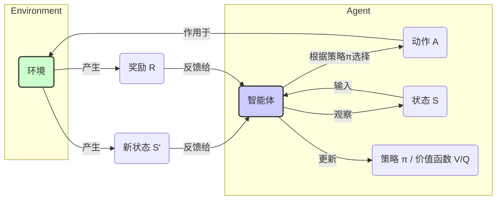
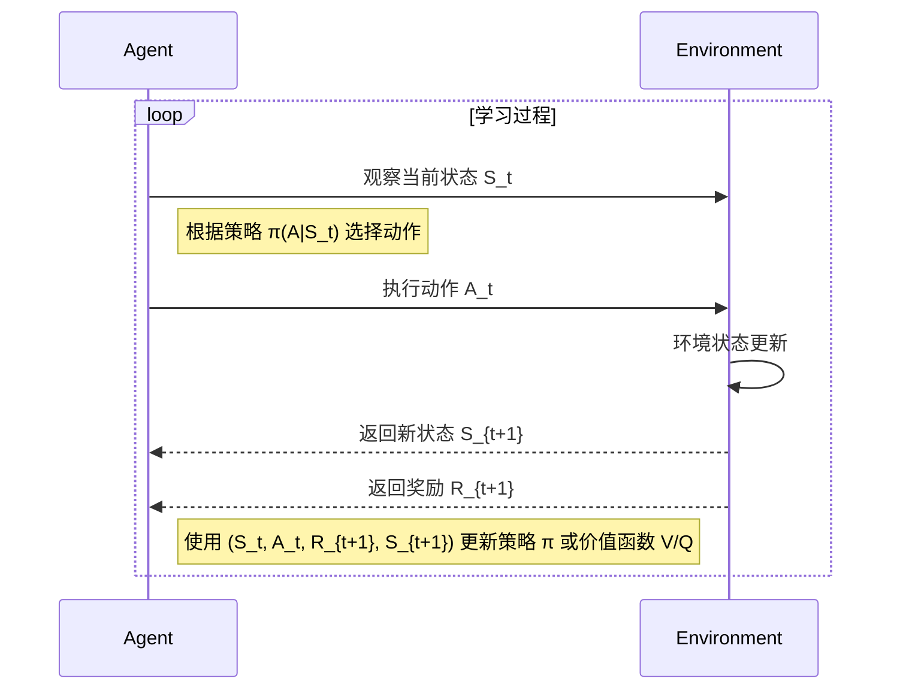

<h1 align="center" id="强化学习(RL)">强化学习 (Reinforcement Learning, RL)</h1>

**概要：** 本章节将深入探讨强化学习（RL）的基本概念、核心要素、工作原理、主要算法、应用场景及其面临的挑战。

## 1. 什么是强化学习？

想象一下学习骑自行车的过程：你不会被明确告知每时每刻应该如何精确地转动车把或调整重心。相反，你通过不断尝试（动作），摔倒（负反馈/惩罚）或成功前进（正反馈/奖励），逐渐学会如何在各种情况下保持平衡并骑行（目标）。

**强化学习 (Reinforcement Learning, RL)** 正是这样一种受行为主义心理学启发的[机器学习](/AI/01a_机器学习基础)范式。它关注的是**[智能体 (Agent)](/AI/04_智能体(Agent))** 如何在一个**环境 (Environment)** 中通过**试错 (Trial-and-Error)** 来学习，目的是采取一系列**动作 (Actions)** 以最大化其获得的**累积奖励 (Cumulative Reward)**。

与[监督学习](/AI/01a_机器学习基础?id=_2-监督学习-supervised-learning)（需要带标签的数据）和[无监督学习](/AI/01a_机器学习基础?id=_3-无监督学习-unsupervised-learning)（寻找数据内在结构）不同，强化学习的核心在于**通过与环境的互动来学习最优行为策略**，其学习信号是环境反馈的奖励或惩罚。

## 2. 强化学习的核心要素

理解强化学习需要掌握以下几个关键组成部分：

-   **[智能体 (Agent)](/AI/04_智能体(Agent)):** 学习者和决策者。它可以是机器人、游戏角色、自动驾驶系统中的控制软件等。
-   **环境 (Environment):** Agent 互动和影响的外部世界。Agent 的动作会改变环境的状态。
-   **状态 (State, S):** 对环境当前状况的一种描述，是 Agent 做出决策所依据的信息。例如，棋盘的当前布局、机器人的传感器读数、游戏画面的像素。
-   **动作 (Action, A):** Agent 可以执行的操作。例如，在棋盘上落子、机器人移动手臂、游戏中按下一个按钮。
-   **奖励 (Reward, R):** 环境在 Agent 执行一个动作后反馈给 Agent 的标量信号，用于评价该动作在当前状态下的好坏。奖励可以是正的（鼓励）或负的（惩罚）。例如，赢得棋局获得 +1 奖励，输掉获得 -1；机器人成功抓取物体获得 +10。
-   **策略 (Policy, π):** Agent 的行为方式，即 Agent 根据当前状态选择动作的规则或概率分布。策略定义了 Agent 在特定状态下会采取什么动作。RL 的目标通常是找到最优策略 π*。
-   **价值函数 (Value Function, V(s) 或 Q(s, a)):** 用于评估一个状态或状态-动作对的长期价值（即从该状态或状态-动作对开始，遵循某个策略预期能获得的累积奖励）。
    -   *状态价值函数 V(s)*: 处于状态 s 的预期累积奖励。
    -   *动作价值函数 Q(s, a)*: 在状态 s 下执行动作 a 的预期累积奖励。
-   **模型 (Model，可选):** Agent 对环境工作方式的内部表示或预测。模型可以预测执行某个动作后环境会转换到哪个新状态，以及会获得什么奖励。基于模型的 RL 方法会学习或利用环境模型进行规划。

**核心要素关系图：**

## 3. 强化学习的目标：最大化累积奖励

Agent 的目标不是最大化眼前的单步奖励，而是最大化从当前时刻开始到未来的**累积奖励 (Cumulative Reward)**。这通常会引入一个**折扣因子 (Discount Factor, γ)**（0 ≤ γ ≤ 1），用于衡量未来奖励相对于当前奖励的重要性。γ 接近 0 表示更看重即时奖励，γ 接近 1 表示更看重长期回报。

**探索 (Exploration) vs. 利用 (Exploitation):**

为了找到最大化累积奖励的策略，Agent 面临一个经典的困境：

-   **利用 (Exploitation):** 执行当前已知的能够带来最高奖励的动作。
-   **探索 (Exploration):** 尝试新的、未知的动作，以发现可能带来更高奖励的潜在更优策略。

过多的利用可能导致 Agent 陷入局部最优解，而过多的探索则可能浪费时间在次优动作上。在学习过程中有效地平衡探索和利用是 RL 的一个核心挑战。

## 4. 强化学习的工作流程（Agent-环境交互循环）

强化学习的过程可以看作是 Agent 与环境之间持续交互的循环：

**步骤分解：**

1.  **观察:** Agent 观察环境的当前状态 S_t。
2.  **决策:** Agent 根据其当前的策略 π，选择一个动作 A_t。
3.  **执行:** Agent 执行选定的动作 A_t。
4.  **反馈:** 环境根据动作 A_t 转换到新的状态 S_{t+1}，并反馈一个即时奖励 R_{t+1} 给 Agent。
5.  **学习:** Agent 利用这次交互的经验 (S_t, A_t, R_{t+1}, S_{t+1}) 来更新其策略 π 或价值函数，以期在未来做出更好的决策。
6.  重复以上步骤。

**数学符号解释：**
-  S_t（State at time t）: 表示在时间 t 时的状态。
-  A_t（Action at time t）: 表示在时间 t 时的动作。
-  R_{t+1}（Reward at time t+1）: 表示在时间 t+1 时的奖励。
-  策略 π(A|S_t): 表示在状态 S_t 下选择动作 A 的概率分布。
-  价值函数 V(s): 表示从状态 s 开始遵循策略 π 获得的累积奖励的期望值。
-  动作价值函数 Q(s, a): 表示在状态 s 下执行动作 a 获得的累积奖励的期望值。

## 5. 主要的强化学习算法分类

RL 算法种类繁多，可以从不同维度进行分类：

-   **基于价值 (Value-Based):**
    *   **目标:** 学习价值函数（通常是 Q 函数），然后根据价值函数隐式地推导出最优策略（例如，总是选择 Q 值最大的动作）。
    *   **代表算法:** Q-Learning, SARSA, Deep Q-Network (DQN) - 将 Q-Learning 与深度神经网络结合。
    *   **特点:** 通常在离散动作空间中表现较好，相对稳定。
-   **基于策略 (Policy-Based):**
    *   **目标:** 直接学习策略函数 π(a|s)，即直接学习从状态到动作的映射或概率分布。
    *   **代表算法:** REINFORCE, Policy Gradients。
    *   **特点:** 可以处理连续动作空间，能够学习随机策略。
-   **演员-评论家 (Actor-Critic):**
    *   **目标:** 结合了基于价值和基于策略的方法。包含两个部分：**演员 (Actor)** 负责选择动作（策略部分），**评论家 (Critic)** 负责评估演员选择的动作的好坏（价值部分），并指导演员更新策略。
    *   **代表算法:** A2C (Advantage Actor-Critic), A3C (Asynchronous Advantage Actor-Critic), DDPG (Deep Deterministic Policy Gradient), PPO (Proximal Policy Optimization)。
    *   **特点:** 通常兼具两者的优点，是当前许多先进 RL 算法的基础。
-   **基于模型 (Model-Based) vs. 无模型 (Model-Free):**
    *   **无模型 (Model-Free):** 直接从与环境的交互经验中学习价值函数或策略，不试图学习环境的模型。上述提到的 Q-Learning, Policy Gradients, Actor-Critic 大多属于此类。更灵活，但通常需要更多样本。
    *   **基于模型 (Model-Based):** 学习环境的模型（状态转移概率和奖励函数），然后利用模型进行规划或生成模拟经验来辅助学习。可能样本效率更高，但依赖于模型的准确性。

**深度强化学习 (Deep Reinforcement Learning - DRL):**
这是将**深度学习**（特别是深度神经网络）与**强化学习**相结合的领域。深度神经网络强大的表示学习能力使得 RL 能够处理高维度的输入（如图像、原始传感器数据）和复杂的函数逼近（价值函数或策略），从而解决了许多传统 RL 难以处理的问题。DQN、A3C、PPO 等都是 DRL 的代表性算法。

## 6. 强化学习的应用

RL 在众多领域展现出强大的能力：

-   **游戏 AI:** 训练能达到甚至超越人类水平的游戏智能体（如 AlphaGo 下围棋、OpenAI Five 打 Dota 2、DeepMind 玩 Atari 游戏和星际争霸）。
-   **机器人控制:** 让机器人学习复杂的技能，如行走、跑步、抓取物体、装配任务。
-   **自动驾驶:** 车辆的决策系统（如变道、超车、路径规划）。
-   **推荐系统:** 根据用户反馈动态调整推荐策略，最大化用户参与度或满意度。
-   **自然语言处理:** 对话系统策略优化、文本生成风格控制。
-   **资源管理与调度:** 网络流量路由优化、数据中心能源管理、生产流程调度。
-   **金融:** 自动化交易策略、投资组合管理。
-   **科学研究:** 化学分子设计、材料发现。

## 7. 强化学习的挑战

尽管潜力巨大，RL 的应用仍面临一些挑战：

-   **样本效率 (Sample Efficiency):** RL 通常需要大量的与环境交互的样本（经验）才能学习到有效的策略，尤其是在复杂环境中，这可能非常耗时或成本高昂。
-   **奖励设计 (Reward Shaping):** 设计一个能够有效引导 Agent 学习期望行为的奖励函数非常困难。稀疏奖励（只有在任务最终完成时才有奖励）或设计不当的奖励可能导致学习缓慢或学到非预期行为。
-   **探索-利用的平衡:** 如何在探索未知可能性和利用已知最佳策略之间做出有效权衡，仍然是一个核心难题。
-   **安全性和稳定性:** 在现实世界（如自动驾驶、医疗）中部署 RL 系统时，如何确保其行为的安全、可靠和可预测性至关重要。
-   **泛化能力:** 在训练环境中学习到的策略能否很好地泛化到新的、未见过的环境或任务中。
-   **可解释性:** 理解 RL Agent 为何做出特定决策通常很困难。

## 8. 与监督/无监督学习的关系

-   **[监督学习](/AI/01a_机器学习基础?id=_2-监督学习-supervised-learning):** 需要明确的标签指导，学习输入到输出的映射。
-   **[无监督学习](/AI/01a_机器学习基础?id=_3-无监督学习-unsupervised-learning):** 无需标签，学习数据的内在结构或模式。
-   **强化学习:** 无需明确标签，通过环境反馈的奖励信号进行学习，学习的是序贯决策策略，涉及探索和延迟奖励。

三者是[机器学习](/AI/01a_机器学习基础)的不同分支，解决不同类型的问题，有时也会结合使用（例如，使用监督学习预训练模型的部分组件，再用 RL 进行微调）。

## 9. 总结与展望

强化学习作为一种强大的学习范式，使得机器能够通过与环境互动自主学习复杂行为，在众多领域取得了令人瞩目的成就。随着深度学习等技术的融合，深度强化学习（DRL）的能力不断增强。未来，克服样本效率、奖励设计、安全性等挑战，将是推动 RL 在更广泛现实世界应用的关键。结合其他 AI 技术（如模仿学习、自监督学习），强化学习有望在通往更通用人工智能的道路上扮演重要角色。

## 10. 参考资料

-   [Reinforcement Learning: An Introduction (Sutton & Barto)](http://incompleteideas.net/book/the-book-2nd.html) - 强化学习领域的经典教材
-   [DeepMind Reinforcement Learning Lectures](https://www.deepmind.com/learning-resources/reinforcement-learning-series-2021) - DeepMind 的 RL 教学系列
-   [OpenAI Spinning Up in Deep RL](https://spinningup.openai.com/en/latest/) - OpenAI 的深度强化学习入门资源
-   [强化学习 (Wikipedia)](https://zh.wikipedia.org/wiki/%E5%BC%BA%E5%8C%96%E5%AD%A6%E4%B9%A0)
