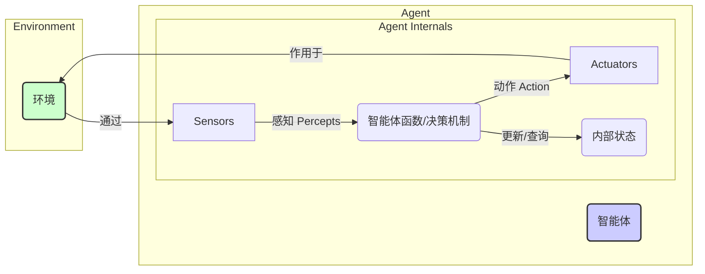

<h1 align="center" id="智能体(Agent)">AI 智能体 (Agent)</h1>

**概要：** 本章节将深入探讨 AI 智能体（Agent）的定义、核心特征、基本架构、不同类型、与环境的互动，以及其在现代 AI（特别是与强化学习和大型语言模型结合）中的关键作用。

## 1. 什么是 AI 智能体？

在人工智能领域，**智能体 (Agent)** 指的是任何能够**感知 (Perceive)** 其**环境 (Environment)** 并通过**执行器 (Actuators)** 在该环境中**行动 (Act)** 的事物。简单来说，智能体就是一个能够自主行动以达成目标的计算实体。

这个定义非常广泛，可以涵盖从简单的恒温器到复杂的机器人，再到先进的软件程序（如网络爬虫、对话机器人、游戏 AI）。关键在于它们都具备感知环境并据此做出行动的能力。

### 核心特征

理想的或理性的智能体通常被期望具备以下特征：

-   **自主性 (Autonomy):** 智能体能够在没有人类直接干预的情况下，根据自身的经验和内部状态进行决策和行动。
-   **反应性 (Reactivity):** 智能体能够及时感知环境的变化并做出响应。
-   **主动性 (Pro-activeness):** 智能体不仅仅是被动响应环境，还能主动发起行动以实现其内部目标或任务。
-   **社交能力 (Social ability):** 在多智能体系统中，智能体能够使用某种通信语言（例如遵循 [A2A 协议](/AI/06_A2A协议)）与其他智能体进行交互、协作或竞争。

## 2. 智能体的基本架构

一个通用的智能体可以抽象地看作由以下几个部分组成：

-   **传感器 (Sensors):** 用于感知外部环境的工具。例如，摄像机、麦克风、温度计、键盘输入、网络数据包等。传感器收集的信息构成了智能体对环境状态的**感知 (Percepts)**。
-   **执行器 (Actuators):** 用于对环境施加影响的工具。例如，机器人的手臂和轮子、屏幕上的显示输出、发送网络数据包、语音合成器等。执行器执行智能体选择的**动作 (Actions)**。
-   **智能体函数/决策机制 (Agent Function):** 这是智能体的“大脑”，它将感知序列映射到动作。即 `f: P* -> A`，其中 P* 是感知历史序列，A 是将要执行的动作。这个函数决定了智能体的行为。
-   **内部状态 (Internal State):** 智能体可能维护关于环境历史或当前状态的信息，用于辅助决策。

**通用智能体架构示意图：**

## 3. 智能体的类型（按能力分层）

根据智能体函数（决策机制）的复杂程度和能力，可以将智能体大致分为以下几类，从简单到复杂：

### 3.1 简单反射智能体 (Simple Reflex Agents)

-   **决策方式:** 完全基于当前的感知，忽略感知历史。使用预设的“条件-动作”规则 (Condition-Action Rules) 进行决策。
-   **例子:** 简单的恒温器（如果温度低于设定值，则开启加热）。
-   **优点:** 简单、快速响应。
-   **缺点:** 只能处理完全可观察的环境，无法应对需要记忆历史信息的情况，容易陷入无限循环。

### 3.2 基于模型的反射智能体 (Model-Based Reflex Agents)

-   **决策方式:** 维护一个关于世界如何运作的内部模型（描述了当前状态下执行某个动作后世界会变成什么样）。基于这个模型和当前感知来选择动作。能够处理部分可观察的环境。
-   **例子:** 自动驾驶中根据内部地图和当前传感器信息预测其他车辆可能的位置。
-   **优点:** 比简单反射智能体更能应对部分可观察性。
-   **缺点:** 需要构建和维护准确的环境模型。

### 3.3 基于目标的智能体 (Goal-Based Agents)

-   **决策方式:** 不仅知道环境如何运作，还拥有明确的**目标 (Goals)** 信息。选择动作是为了能够达到这些目标。通常需要搜索 (Search) 和规划 (Planning) 能力来找到达成目标的动作序列。
-   **例子:** 导航系统寻找从 A 点到 B 点的最短路径；机器人规划一系列动作来组装一个零件。
-   **优点:** 行为更灵活，能够通过规划实现长远目标。
-   **缺点:** 目标达成可能涉及复杂的搜索和规划过程，计算成本较高。

### 3.4 基于效用的智能体 (Utility-Based Agents)

-   **决策方式:** 当有多个目标或多个达成目标的途径时，基于目标的智能体可能难以抉择。基于效用的智能体引入了**效用函数 (Utility Function)**，用于量化不同状态或结果的“满意度”或“期望值”。智能体选择能够最大化预期效用的动作。
-   **例子:** 投资机器人不仅要考虑盈利目标，还要考虑风险（效用可能是收益与风险的平衡）；自动驾驶在多条可行路径中选择最快且最安全（效用最高）的一条。
-   **优点:** 能够在不确定性和目标冲突的情况下做出更理性的决策。
-   **缺点:** 设计准确的效用函数可能很困难。

### 3.5 学习智能体 (Learning Agents)

-   **决策方式:** 上述所有类型的智能体都可以通过学习来改进其性能。学习智能体包含一个**学习元件 (Learning Element)**，它利用环境的反馈（如 [强化学习](/AI/03_强化学习(RL)) 中的奖励）来修改智能体的决策机制（**性能元件 Performance Element**）。
-   **内部组件:**
    *   **性能元件 (Performance Element):** 负责选择外部动作，相当于前面讨论的某种类型的智能体（如基于目标或效用的）。
    *   **学习元件 (Learning Element):** 负责根据反馈进行改进。
    *   **评判器 (Critic):** 提供关于 Agent 行为好坏的反馈（例如，与外部奖励信号比较）。
    *   **问题生成器 (Problem Generator):** 负责建议可能产生新信息和有益经验的探索性动作。
-   **例子:** AlphaGo 通过自我对弈（强化学习）不断改进棋艺；推荐系统根据用户点击行为（反馈）调整推荐策略。
-   **优点:** 能够适应未知环境，不断提升性能。
-   **缺点:** 学习过程可能需要大量数据和时间。

## 4. 智能体与环境

环境的特性对智能体的设计至关重要。常见的环境属性包括：

-   **可观察性 (Observability):** 完全可观察 vs. 部分可观察（Agent 能否感知到完整状态）。
-   **确定性 (Determinism):** 确定性 vs. 随机性（下一状态是否完全由当前状态和动作决定）。
-   **周期性 (Episodicity):** 周期性 vs. 序贯性（Agent 的经验是否分为独立的片段/周期）。
-   **静态性 (Staticness):** 静态 vs. 动态（环境在 Agent 决策时是否会发生变化）。
-   **离散性 (Discreteness):** 离散 vs. 连续（状态、时间、动作是离散的还是连续的）。
-   **智能体数量 (Agent Number):** 单智能体 vs. 多智能体。

环境越复杂（如部分可观察、随机、动态、连续、多智能体），对智能体的设计要求就越高。

## 5. 智能体与现代 AI 技术 (RL & LLMs)

现代 AI 的发展极大地增强了智能体的能力：

-   **[强化学习 (RL)](/AI/03_强化学习(RL)) 与智能体:** RL 是训练**学习智能体**（特别是需要通过试错学习复杂策略的智能体）的核心方法论。RL 框架中的 Agent 定义与本章讨论的智能体概念高度一致。DRL 的发展使得智能体能够处理高维感知输入（如图像）并学习复杂的控制策略。
-   **大型语言模型 (LLMs) 与智能体:** LLM 的出现为构建更强大的智能体提供了新的可能性，尤其是在需要理解、推理和规划的场景下：
    *   **作为“大脑”:** LLM 可以作为智能体的核心决策组件（智能体函数），负责理解自然语言指令、分析环境信息（可能需要多模态能力）、进行常识推理、制定计划。
    *   **结合工具使用 (Tool Use):** LLM 本身有局限（如计算能力弱、知识可能过时）。现代 Agent 框架（如 LangChain, AutoGPT）允许 LLM 调用外部工具（计算器、搜索引擎、API、代码执行器等），这通常需要标准化的协议支持（如 [MCP 协议](/AI/05_MCP协议)），极大地扩展了智能体的能力边界，使其能够执行更复杂的现实世界任务。这种结合 LLM 和工具的范式有时被称为 **LLM-based Agents** 或 **Agentic AI**。

## 6. 应用场景

AI 智能体的应用极其广泛：

-   **虚拟助手:** Siri, Alexa, Google Assistant 等，理解用户指令并执行任务。
-   **游戏 AI:** 游戏中的 NPC（非玩家角色）、对手 AI（如 AlphaGo, AlphaStar）。
-   **机器人学:** 工业机器人、服务机器人、自动驾驶汽车、无人机。
-   **软件代理:** 网络爬虫、自动化测试工具、金融交易机器人、推荐系统。
-   **模拟与仿真:** 在经济学、社会科学、交通流等领域模拟复杂系统中的个体行为。
-   **多智能体系统 (MAS):** 电网管理、供应链优化、协作机器人团队（通常需要 [A2A 协议](/AI/06_A2A协议) 支持）。

## 7. 挑战与未来展望

构建通用、鲁棒、安全的 AI 智能体仍然面临诸多挑战：

-   **常识推理与世界模型:** 让智能体拥有更接近人类的常识和对世界运作方式的深刻理解。
-   **长期规划与复杂决策:** 在复杂、动态、不确定的环境中进行长期规划和决策。
-   **学习效率与泛化:** 提高学习速度，并将在特定环境中学习到的知识泛化到新环境。
-   **安全性与对齐:** 确保智能体的行为符合人类意图，避免产生有害后果。
-   **多智能体协作:** 设计有效的机制（如 [A2A 协议](/AI/06_A2A协议)）让多个智能体高效、可靠地协作。
-   **人机交互:** 让智能体能够更自然、更有效地与人类协作。

未来，随着 LLM、RL、多模态学习等技术的进一步发展，AI 智能体将在更多领域扮演核心角色，变得更加自主、智能和普遍。Agentic AI 被认为是实现更通用人工智能（AGI）的关键路径之一。

## 8. 总结

AI 智能体是人工智能领域的核心概念，代表了能够感知环境并自主行动以达成目标的计算实体。从简单的反射机制到复杂的学习和规划能力，智能体的设计和能力不断演进。现代技术如 [强化学习](/AI/03_强化学习(RL)) 和大型语言模型极大地推动了智能体的发展，使其在游戏、机器人、自动化任务等众多领域展现出巨大潜力。理解智能体的基本原理、类型、挑战，以及它们如何通过 [MCP](/AI/05_MCP协议) 和 [A2A](/AI/06_A2A协议) 等协议进行交互，对于把握当前 AI 发展的前沿至关重要。

## 9. 参考资料

-   [Artificial Intelligence: A Modern Approach (Russell & Norvig)](http://aima.cs.berkeley.edu/) - AI 领域的权威教材，对智能体有详细论述。
-   [智能体 (Wikipedia)](https://en.wikipedia.org/wiki/Intelligent_agent)
-   [LLM Powered Autonomous Agents (Blog Post by Lilian Weng)](https://lilianweng.github.io/posts/2023-06-23-agent/) - 关于基于 LLM 的智能体的优秀综述。
