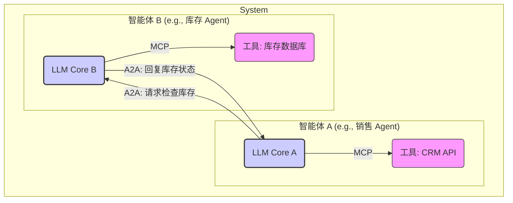

<h1 align="center" id="A2A协议">智能体间协议 (Agent-to-Agent, A2A)</h1>

**概要：** 本章节将探讨多智能体系统（MAS）中智能体间协作的需求、面临的挑战，并重点介绍旨在实现这种协作的 Agent-to-Agent (A2A) 协议的概念、关键要素、应用场景以及与 MCP 的关系。

## 1. 引言：从单智能体到多智能体系统 (MAS)

在前面的章节中，我们了解了单个 [AI 智能体（Agent）](/AI/04_智能体(Agent))如何通过感知环境、决策和行动来完成任务。然而，现实世界中的许多复杂问题，例如管理一个繁忙的交通网络、协调一条全球供应链、或者让不同部门的软件系统协同工作，往往超出了单个[智能体](/AI/04_智能体(Agent))的能力范围。

这些场景需要多个[智能体](/AI/04_智能体(Agent))共同参与、相互交互、分工协作。这就引出了**多智能体系统 (Multi-Agent Systems, MAS)** 的概念：一个由多个自主[智能体](/AI/04_智能体(Agent))组成的系统，它们存在于同一个环境中，并通过相互之间的交互（通信、协调、协商）来共同解决问题或达成系统目标。

## 2. 多智能体协作的挑战

要让多个[智能体](/AI/04_智能体(Agent))有效协作，面临着一系列严峻的挑战：

-   **通信障碍 (Communication Barrier):** 如果[智能体](/AI/04_智能体(Agent))由不同的开发者使用不同的技术和数据格式构建，它们如何相互理解对方发送的信息？就像人与人之间需要共同的语言一样，[智能体](/AI/04_智能体(Agent))之间也需要标准的通信方式和语义理解。
-   **协调困难 (Coordination Difficulty):** 即使能够通信，[智能体](/AI/04_智能体(Agent))如何协调各自的行为以避免冲突（如两个机器人都想通过同一扇门），或者如何有效地分工合作以最高效地完成共同任务？
-   **发现机制 (Discovery Mechanism):** 在一个动态的环境中，一个[智能体](/AI/04_智能体(Agent))如何知道存在哪些其他[智能体](/AI/04_智能体(Agent))，以及这些[智能体](/AI/04_智能体(Agent))具备哪些能力可以帮助自己？
-   **安全与信任 (Security & Trust):** 当[智能体](/AI/04_智能体(Agent))跨越组织边界或与不完全可信的[智能体](/AI/04_智能体(Agent))交互时，如何保证通信的机密性、数据的完整性，以及如何建立信任关系？

## 3. 什么是 A2A 协议？

为了应对上述挑战，特别是解决异构智能体之间的互操作性问题，**Agent-to-Agent (A2A) 协议**应运而生。

**A2A 协议**是一类旨在**标准化不同 [AI 智能体](/AI/04_智能体(Agent))之间通信、协调和协作方式**的协议、规范或框架。其核心目标是提供一套通用的“游戏规则”，让来自不同背景、拥有不同能力的[智能体](/AI/04_智能体(Agent))能够相互“理解”、安全地交换信息，并协同完成任务。

**Google 的 Agent2Agent 倡议:**

A2A 的概念并非全新，多智能体系统领域早有研究。但随着现代 [AI Agent](/AI/04_智能体(Agent))（尤其是基于 LLM 的 [Agent](/AI/04_智能体(Agent))）能力的增强和应用需求的增长，对标准化 A2A 协议的需求变得更加迫切。

一个显著的行业推动是 **Google 在 2024 年 4 月的 Cloud Next 大会上宣布的 Agent2Agent (A2A) 倡议**。Google 联合了 Atlassian, Box, Salesforce, SAP, Accenture, Deloitte, KPMG 等超过 50 家技术和咨询伙伴，共同推动这一协议。

该倡议的目标非常明确：**让企业中越来越多用于自动化任务的 AI 代理（[Agent](/AI/04_智能体(Agent))）能够跨越孤立的系统和应用，实现跨供应商、跨框架的安全通信和协作**，从而最大化 AI 代理的效益，完成更复杂的跨平台任务。这标志着业界对解决[智能体](/AI/04_智能体(Agent))互操作性问题的重视，并试图建立一个事实上的标准。

## 4. A2A 协议的关键要素（设想）

一个完善的 A2A 协议通常需要定义以下关键方面：

-   **消息格式与语义 (Message Format & Semantics):** 规定[智能体](/AI/04_智能体(Agent))之间交换信息的数据结构（如使用 JSON、XML 或 Protobuf）以及消息中各个字段的确切含义。例如，定义一个标准的“任务请求”消息格式。
-   **通信传输 (Transport Protocol):** 指定消息如何在网络上传输（如基于 HTTP/S、gRPC、WebSockets 或消息队列）。
-   **智能体身份、注册与发现 (Agent Identity, Registration & Discovery):**
    *   如何为每个[智能体](/AI/04_智能体(Agent))分配唯一的身份标识。
    *   可能需要一个**注册中心 (Registry)**，[智能体](/AI/04_智能体(Agent))可以在此注册自己的身份、地址和能力。
    *   其他[智能体](/AI/04_智能体(Agent))可以通过查询注册中心来发现可以与之交互的伙伴。
-   **能力描述与协商 (Capability Description & Negotiation):**
    *   [智能体](/AI/04_智能体(Agent))如何以标准化的方式描述自己能做什么（提供的服务、能执行的任务等）。
    *   在协作开始前，[智能体](/AI/04_智能体(Agent))之间可能需要进行协商，以确定协作的具体方式、参数和期望。
-   **交互协议/协作模式 (Interaction Protocols / Collaboration Patterns):** 定义常见的[智能体](/AI/04_智能体(Agent))交互流程，例如：
    *   简单的请求/响应模式。
    *   发布/订阅模式（用于事件通知）。
    *   更复杂的协商协议（如合同网协议 Contract Net Protocol，用于任务分配）。
    *   拍卖机制（用于资源分配）。
-   **安全与认证 (Security & Authentication):**
    *   确保通信信道的加密。
    *   验证交互[智能体](/AI/04_智能体(Agent))的身份。
    *   实施访问控制策略，限制[智能体](/AI/04_智能体(Agent))可以执行的操作或访问的数据。

## 5. A2A 与 MCP 的关系

理解 A2A 和 [MCP（模型上下文协议）](/AI/05_MCP协议)之间的区别与联系很重要：

-   **[MCP (Model Context Protocol)](/AI/05_MCP协议):** 主要关注**单个** AI 模型/[智能体](/AI/04_智能体(Agent))与其**外部的、非智能体性质的能力（工具和资源）**之间的交互。它解决了模型如何调用 API、运行代码、访问文件等问题。可以看作是[智能体](/AI/04_智能体(Agent))**“使用工具”**的协议。（**纵向连接：Agent -> Tool/Resource**）
-   **A2A (Agent-to-Agent Protocol):** 主要关注**多个**自主[智能体](/AI/04_智能体(Agent))之间的**相互通信和协作**。它解决了[智能体](/AI/04_智能体(Agent))之间如何对话、协调、分配任务等问题。可以看作是[智能体](/AI/04_智能体(Agent))**“团队合作”**的协议。（**横向连接：Agent <-> Agent**）

**两者是互补的：**

-   一个复杂的任务可能需要多个[智能体](/AI/04_智能体(Agent))通过 **A2A** 协议进行协调和分工。
-   而每个参与协作的[智能体](/AI/04_智能体(Agent))，在执行自己负责的那部分任务时，可能需要通过 **[MCP](/AI/05_MCP协议)** 协议来调用其自身的外部工具或访问所需资源。

**关系示意图：**

*上图中，销售 [Agent](/AI/04_智能体(Agent)) A 和库存 [Agent](/AI/04_智能体(Agent)) B 通过 A2A 协议通信，而它们各自又通过 [MCP](/AI/05_MCP协议) 协议使用自己的工具（CRM API 和库存数据库）。*

## 6. A2A 的应用场景

标准化的 A2A 协议将极大地促进以下应用的发展：

-   **企业流程自动化:** 实现跨部门、跨软件系统（如 CRM, ERP, SCM）的无缝自动化工作流。销售 [Agent](/AI/04_智能体(Agent)) 自动通过 A2A 通知生产 [Agent](/AI/04_智能体(Agent)) 下单。
-   **智能客服中心:** 用户请求由总控 [Agent](/AI/04_智能体(Agent)) 接收，然后根据问题性质通过 A2A 分配给最合适的专家 [Agent](/AI/04_智能体(Agent))（如账单查询 [Agent](/AI/04_智能体(Agent))、技术支持 [Agent](/AI/04_智能体(Agent))、退货处理 [Agent](/AI/04_智能体(Agent))）协同处理。
-   **物联网 (IoT) 与智能环境:** 大量智能设备（传感器、执行器、控制器）作为 [Agent](/AI/04_智能体(Agent))，通过 A2A 协议相互通信、协调行为，实现智能楼宇、智能交通、智能电网等。
-   **供应链管理与物流:** 供应链各环节（供应商、制造商、物流商、零售商）的 [Agent](/AI/04_智能体(Agent)) 通过 A2A 实时共享信息、协商订单、优化库存和运输。
-   **分布式计算与科学研究:** 将大型计算任务或模拟实验分解，由多个计算 [Agent](/AI/04_智能体(Agent)) 通过 A2A 协同完成。
-   **虚拟世界与游戏:** 游戏中的大量 NPC 或玩家控制的 [Agent](/AI/04_智能体(Agent)) 之间通过 A2A 进行更复杂、更真实的社交互动和协作。

## 7. 现状、挑战与展望

-   **现状:** A2A 协议的标准化目前仍处于**非常早期**的阶段。虽然多智能体系统领域已有数十年的研究积累（如 FIPA 标准），但尚未形成被现代 [AI Agent](/AI/04_智能体(Agent)) 开发者广泛采纳的统一标准。Google 的 Agent2Agent 倡议是近期最引人注目的推动力量，但其具体技术规范、开放程度和最终的行业接受度还有待观察。
-   **挑战:**
    *   **标准化的难度:** 要设计一个既通用（能适应各种场景）又高效（通信开销低）且易于实施的标准非常困难。不同厂商可能有各自的利益考量。
    *   **协调的复杂性:** 随着[智能体](/AI/04_智能体(Agent))数量增加，协调它们行为的复杂性呈指数级增长，可能出现死锁、资源竞争、信息不一致等问题。
    *   **安全与隐私:** 跨组织边界的[智能体](/AI/04_智能体(Agent))交互引发了严重的安全和数据隐私担忧。
    *   **激励机制:** 在开放环境中，如何设计机制激励自利的[智能体](/AI/04_智能体(Agent))进行诚实、有效的协作？
-   **展望:** 尽管挑战重重，但标准化的 A2A 协议对于释放多智能体系统的巨大潜力至关重要。未来，我们可能会看到：
    *   更多类似 Google Agent2Agent 的标准化尝试出现，可能围绕特定领域或行业形成标准。
    *   [Agent](/AI/04_智能体(Agent)) 框架（如 LangChain, CrewAI 等）将集成对 A2A 协议的支持。
    *   出现更复杂的、能够自主协商、适应和演化的多智能体协作策略。

A2A 协议的发展将是 AI 从单打独斗走向团队协作，解决更宏大、更复杂现实世界问题的关键一步。

## 8. 总结

Agent-to-Agent (A2A) 协议旨在为多智能体系统（MAS）中异构[智能体](/AI/04_智能体(Agent))之间的通信和协作提供标准化框架。面对通信、协调、发现和安全等挑战，A2A 协议力求实现互操作性，让不同的 [AI 智能体](/AI/04_智能体(Agent))能够有效协同工作。Google 的 Agent2Agent 倡议是推动这一方向的重要行业力量。A2A 与关注[智能体](/AI/04_智能体(Agent))与工具交互的 [MCP 协议](/AI/05_MCP协议)互补，共同构成了构建更强大、更具协作能力的 AI 应用的基础设施。虽然仍处于早期阶段并面临诸多挑战，但 A2A 协议的发展对 AI 的未来至关重要。

## 9. 参考资料

-   [Google Cloud Blog: Announcing new AI agents to accelerate enterprise workflows](https://cloud.google.com/blog/products/ai-machine-learning/introducing-new-ai-agents-in-google-cloud) (提及 Agent2Agent 协议)
-   [Multiagent Systems: Algorithmic, Game-Theoretic, and Logical Foundations (Shoham & Leyton-Brown)](https://www.masfoundations.org/) - 多智能体系统领域的经典教材
-   [FIPA Standards](http://www.fipa.org/repository/standardspecs.html) - 早期多智能体系统通信标准（Foundation for Intelligent Physical Agents）
-   *(关于 Google Agent2Agent 协议的具体技术细节，可能需要关注 Google 后续发布的文档)*
