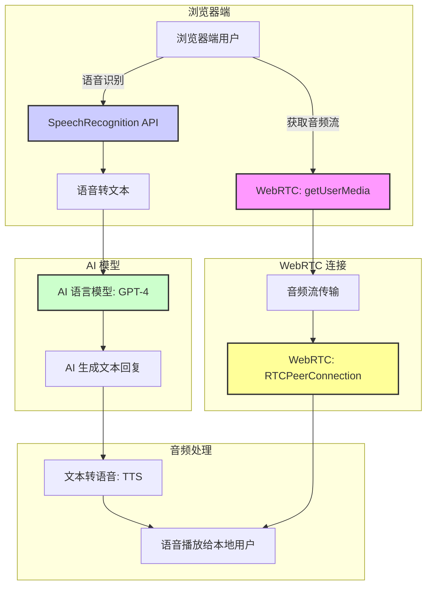

<h1 align="center" id="数据结AI技术&工具的演变构演变">AI技术&工具的演变</h1>

**概要：** 任何技术或者工具的出现一定是为了解决某种问题，本文将从工具和技术的演变来详细介绍AI对话的流程以及演变历程。


## **聊天（Chat）**

假设你是一名开发者，领导要你开发一款AI聊天应用。以此为背景，来一场AI进化之旅吧！

我们看了下当下主流的聊天模型：[OpenAI Chat](https://platform.openai.com/docs/guides/text?api-mode=responses) 、Anthropic Chat 、Deepseek Chat ，决定使用成名已久的`OpenAI API `，事实上大部分厂商都是兼容OpenAI的格式的。


### 情景演绎(故事纯属虚构)

#### a.基本对话

**客户端发送结构：**

```js
// 手动 fetch
async function callChatGPT(userInfo) {
  const apiKey = 'your-openai-api-key';  // OpenAI API 密钥
  const apiUrl = 'https://api.openai.com/v1/chat/completions';

  const headers = {
    'Content-Type': 'application/json',
    'Authorization': `Bearer ${apiKey}`
  };

  // 构造请求体
  const data = {
    model: 'gpt-4',  // 设置模型
    messages: [
      {
        role: 'user',
        content: userInfo  // 传入用户信息
      }
    ]
  };

  try {
    // 发送请求
    const response = await fetch(apiUrl, {
      method: 'POST',
      headers: headers,
      body: JSON.stringify(data)
    });

    const responseData = await response.json();

    if (response.ok) {
      return responseData.choices[0].message.content;
    } else {
    }
  } catch (error) {
    throw new Error('网络请求失败');
  }
}
// SDK方式
import OpenAI from "openai";
const client = new OpenAI();

const response = await client.responses.create({
    model: "gpt-4.1",
    input: "Write a one-sentence bedtime story about a unicorn."
});

console.log(response.output_text);
```

**扩展：**SDK是软件开发工具包，一组适合于开发人员的平台特定构建工具集。您需要调试器、编译器和库等组件来创建在特定平台、操作系统或编程语言上运行的代码。SDK将开发和运行软件所需的一切都集中在一处。此外，它们还包含文档、教程和指南之类资源，以及用于加快应用程序开发的 API 和框架。


参数简洁明了，model选择模型，input输入内容，这是最基本的参数，我们也可以通过instructions 参数为模型提供了生成响应时应如何操作的高级指令，包括语气、目标以及正确响应的示例。以这种方式提供的任何指令都将优先于 `input` 参数中的提示。

```js
const response = await client.responses.create({
    model: "gpt-4.1",
    instructions: "Talk like a pirate.",
    input: "Are semicolons optional in JavaScript?",
});

// 大致相当于
const response = await client.responses.create({
    model: "gpt-4.1",
    input: [
        {
            role: "developer",
            content: "Talk like a pirate."
        },
        {
            role: "user",
            content: "Are semicolons optional in JavaScript?",
        },
    ],
});
```

**扩展：**不同角色的消息赋予不同级别的优先级`user` 消息是最终用户提供的指令，优先级低于 `developer` 消息。权限级别的排序如下：

1. **Platform**: Model Spec "platform" sections and system messages
   **平台** ：模型规范“平台”部分和系统消息
2. **Developer**: Model Spec "developer" sections and developer messages
   **开发人员** ：模型规范“开发人员”部分和开发人员消息
3. **User**: Model Spec "user" sections and user messages
   **用户** ：模型规范“用户”部分和用户消息
4. **Guideline**: Model Spec "guideline" sections
   **指南** ：模型规范“指南”部分
5. *No Authority*: assistant and tool messages; quoted/untrusted text and multimodal data in other messages
   *无权限* ：助手和工具消息；其他消息中的引用/不受信任的文本和多模态数据


**服务端返回的结构化数据：**

```json
[
    {
        "id": "msg_67b73f697ba4819183a15cc17d011509",
        "type": "message",
        "role": "assistant",
        "content": [
            {
                "type": "output_text",
                "text": "Under the soft glow of the moon, Luna the unicorn danced through fields of twinkling stardust, leaving trails of dreams for every child asleep.",
                "annotations": []
            }
        ]
    }
]
```

至此，我们也是完成了一个简单的对话应用。


#### b.长对话

那么问题来了，该如何将对话历史传给大模型呢? 简单保存历史信息然后再后续请求时发给大模型就好：

```js
// 存储历史对话
let conversationHistory = [];

async function callChatGPTWithHistory(userInfo) {
  const apiKey = 'your-openai-api-key';  // 替换为你的 OpenAI API 密钥
  const apiUrl = 'https://api.openai.com/v1/chat/completions';

  const headers = {
    'Content-Type': 'application/json',
    'Authorization': `Bearer ${apiKey}`
  };

  // 组装历史对话消息
  const messages = [
    { role: 'system', content: 'You are a helpful assistant.' },
    ...conversationHistory,  // 将历史对话放入消息中
    { role: 'user', content: userInfo }  // 当前用户输入的内容
  ];

  // 请求体
  const data = {
    model: 'gpt-4',  // 设置为 GPT-4 模型
    messages: messages
  };

    const response = await fetch(apiUrl, {
      method: 'POST',
      headers: headers,
      body: JSON.stringify(data)
    });
}
```


#### c.流式传输

老板看了看你做的AI对话，说：老弟你这等太久了吧，不能边生成边输出吗？

能说啥，改吧（摸鱼小秘籍：要假装这个功能点很复杂，多要些时间）

```js
async function callChatGPTWithStream(userInfo) {
  const apiKey = 'your-openai-api-key';  // 替换为你的 OpenAI API 密钥
  const apiUrl = 'https://api.openai.com/v1/chat/completions';

  const headers = {
    'Content-Type': 'application/json',
    'Authorization': `Bearer ${apiKey}`
  };

  // 组装历史对话消息
  const messages = [
    { role: 'system', content: 'You are a helpful assistant.' },
    ...conversationHistory,  // 将历史对话放入消息中
    { role: 'user', content: userInfo }  // 当前用户输入的内容
  ];

  // 请求体
  const data = {
    model: 'gpt-4',  // 设置为 GPT-4 模型
    messages: messages,
    stream: true  // 启用流式输出
  };

  try {
    const response = await fetch(apiUrl, {
      method: 'POST',
      headers: headers,
      body: JSON.stringify(data)
    });

    if (!response.ok) {
      throw new Error('请求失败');
    }

    const reader = response.body.getReader();
    const decoder = new TextDecoder();
    let done = false;
    let text = '';

    // 流式读取数据
    while (!done) {
      const { value, done: readerDone } = await reader.read();
      done = readerDone;

      // 解码当前块的内容
      const chunk = decoder.decode(value, { stream: true });
      text += chunk;

      // 实时输出
      console.log(chunk);  // 可以实时显示这些内容
    }

    // 最终完整响应
    console.log('最终回复:', text);
  } catch (error) {
    console.error('请求失败:', error);
  }
}

```

**扩展：**这背后的原理是基于 **HTTP/1.1** 或 **HTTP/2** 中的 **流式传输**（streaming）或 **分块传输编码**（chunked transfer encoding）机制。

当你发起一个流式请求时：

- **请求发起**：客户端向 OpenAI 服务器发出一个 HTTP 请求，携带所需的消息内容（包括 `stream: true` 这个参数），并等待数据流返回。
- **连接保持**：服务器在接收到请求后会开始生成响应内容，但它不会立刻返回完整的响应，而是按块（chunk）逐步返回数据。HTTP 连接保持打开，直到所有数据块都被返回。
- **数据流动**：每当服务器生成新的数据块（模型生成的部分内容），它就通过保持连接的方式将该数据块发送给客户端。客户端通过读取流（`getReader()`）接收这些数据块并进行处理。
- **结束连接**：当所有数据块都传输完毕，服务器会发送一个结束标志（在 HTTP 中是通过一个特殊的标志来告知客户端数据传输已经完成），此时客户端可以关闭连接并处理完整的响应。


#### d.实时对话

老板看了看拥有流式输出的AI应用，很满意。给了你1w奖金。但是第二天又把你拉到会议室，说：xxx家的怎么有实时对话，我也要，给你两天时间做出来，做好了5w奖金！

刚准备骂出去的的脏话瞬间收回：老板！你妈...妈身体还好吧。

实时对话不仅仅是指流式输出，还包括实时处理用户的输入、保持对话上下文、并且能够迅速响应每次用户输入的请求。我们来看看官方文档：通过 [WebRTC](https://platform.openai.com/docs/guides/realtime-webrtc) 或 [WebSocket](https://platform.openai.com/docs/guides/realtime-websocket) 连接到 Realtime API 后，您可以调用 Realtime 模型（例如 [gpt-4o-realtime-preview](https://platform.openai.com/docs/models/gpt-4o-realtime-preview) ）进行语音对话。这样做需要您**发送客户端事件**来启动操作，并**监听服务器事件**以响应 Realtime API 执行的操作。



1. **获取用户音频流**：

首先，我们需要通过 `getUserMedia` 获取用户的音频流。

```js
javascript复制编辑// 获取用户的音频流（麦克风）
async function getAudioStream() {
  try {
    const stream = await navigator.mediaDevices.getUserMedia({
      audio: true,
      video: false,
    });
    const audioElement = document.getElementById('localAudio');
    audioElement.srcObject = stream;
    return stream;
  } catch (err) {
    console.error('获取音频流失败:', err);
  }
}
```

1. **语音转文本（Speech-to-Text）**：

这里我们使用浏览器内建的 `SpeechRecognition` API，将音频流转换为文本。注意：`SpeechRecognition` API 在某些浏览器（如 Chrome）中是可用的。

```js
javascript复制编辑// 使用 Web Speech API 将语音转为文本
const recognition = new (window.SpeechRecognition || window.webkitSpeechRecognition)();
recognition.lang = 'zh-CN';  // 设置为中文
recognition.continuous = true;  // 连续识别
recognition.interimResults = true;  // 获取临时结果

recognition.onresult = async (event) => {
  let transcript = '';
  for (let i = event.resultIndex; i < event.results.length; i++) {
    transcript += event.results[i][0].transcript;
  }

  // 实时打印识别的文本
  console.log('用户语音:', transcript);

  // 将文本发送到 AI 模型
  const response = await getAIResponse(transcript);
  speakText(response);
};

// 开始语音识别
recognition.start();
```

1. **调用 AI 模型生成对话**：

我们将把语音转为文本后，发送到 OpenAI GPT 模型（假设你已经获得了 OpenAI API 密钥），生成对应的文本回应。

```js
javascript复制编辑// 调用 OpenAI GPT-4 生成响应
async function getAIResponse(userInput) {
  const apiKey = 'your-openai-api-key';
  const apiUrl = 'https://api.openai.com/v1/chat/completions';

  const headers = {
    'Content-Type': 'application/json',
    'Authorization': `Bearer ${apiKey}`,
  };

  const data = {
    model: 'gpt-4',
    messages: [{ role: 'user', content: userInput }],
  };

  const response = await fetch(apiUrl, {
    method: 'POST',
    headers: headers,
    body: JSON.stringify(data),
  });

  const responseBody = await response.json();
  const aiText = responseBody.choices[0].message.content;

  console.log('AI 回复:', aiText);
  return aiText;
}
```

1. **文本转语音（Text-to-Speech, TTS）**：

使用 `SpeechSynthesis` API 将 AI 的响应文本转为语音，播放给用户。

```js
javascript复制编辑// 使用 TTS 播放 AI 的文本回复
function speakText(text) {
  const utterance = new SpeechSynthesisUtterance(text);
  utterance.lang = 'zh-CN';  // 设置为中文
  window.speechSynthesis.speak(utterance);
}
```

1. **播放音频给远程用户（WebRTC）**：

假设已经有一个 WebRTC 的连接，你可以通过 `RTCPeerConnection` 将本地音频流发送到远程端。

```js
javascript复制编辑// 将音频流发送到远程用户
async function sendAudioToPeer(localStream) {
  const peerConnection = new RTCPeerConnection();
  localStream.getTracks().forEach(track => {
    peerConnection.addTrack(track, localStream);
  });

  // 处理远程音频流
  peerConnection.ontrack = (event) => {
    const remoteStream = event.streams[0];
    const remoteAudio = document.getElementById('remoteAudio');
    remoteAudio.srcObject = remoteStream;
  };

  // 创建 offer 并通过信令交换
  const offer = await peerConnection.createOffer();
  await peerConnection.setLocalDescription(offer);
  // 发送 offer 到信令服务器
  sendSignal({ type: 'offer', offer });
}
```


#### e.内置工具/Function calling

老板停下摸劳力士的手，笑着拍了拍你的肩膀，说：我果然没看错你，好好努力后面给你分红，就是吧，这个AI工具不能联网可不行啊，要不你再加加班，努力下。

老板，你可真是早晨的太阳啊。要怎样才能联网呢？模型本身肯定是不具备这个功能的，是我可以调用外部工具来联网。那模型可以告诉我什么时候需要用到互联网，我去查询后把结果告诉它，它在回复用户。有了，我可以提前植入特殊指令，引导生成指定格式，我再用正则去匹配，要是匹配到就调用外部接口。

```js
// user：获取iPhone 15的价格
// 可以定义一个结构化的数据格式，类似这样：
{
  "action": "get_price",
  "product": "iPhone 15",
  "currency": "USD"
}
// 通过正则表达式来识别该数据，并触发外部接口查询价格，并返回结果
{
  "status": "success",
  "price": 999.99,
  "currency": "USD"
}
// AI:根据最新的信息，iPhone 15 的价格为 999.99 USD。
```

虽然这个方案看着还不错，但是不可靠AI不会百分比遵循的指令，而且如果出现复杂数据（转义字符串等），正则是不好匹配的。

官方也意识到了这个问题，于是 **2023年3月内置工具的正式发布**，**2023年10月函数调用（Function Calling）正式发布**。


**步骤如下：**

**GPT 生成回答并判断需要调用工具/函数**：

- 假设用户问 GPT：“What’s the weather like in Paris today?”
- GPT 会识别出这是一个天气查询的问题，自动决定调用天气查询的外部 API 函数。

**AI 自动调用工具/函数**：

- GPT 会通过其函数调用机制（如 `get_weather`）自动发起请求，带上必要的参数（如 `location`）。

**处理返回结果**：

- 当天气信息返回后，GPT 会将返回的结果整合进回答中（例如：“The weather in Paris is 18°C with light rain.”）。
- 开发者只需接收这个完整的响应，处理显示或后续的逻辑。

```js
// SDK
import OpenAI from "openai";
const client = new OpenAI();

const response = await client.responses.create({
    model: "gpt-4.1",
    tools: [ { type: "web_search_preview" } ],
    input: "What was a positive news story from today?",
});

console.log(response.output_text);

// fetch

async function callGPTWithFunction() {
    const apiKey = 'your-openai-api-key';
    const apiUrl = 'https://api.openai.com/v1/chat/completions';

    const headers = {
        'Content-Type': 'application/json',
        'Authorization': `Bearer ${apiKey}`
    };

    const requestBody = {
        model: 'gpt-4',
        messages: [{
            role: 'user',
            content: 'What is the current temperature in Bogotá, Colombia?'
        }],
        functions: [{
            name: 'get_weather',
            description: 'Get current temperature for a given location.',
            parameters: {
                type: 'object',
                properties: {
                    location: {
                        type: 'string',
                        description: 'City and country e.g. Bogotá, Colombia'
                    }
                },
                required: ['location'],
                additionalProperties: false
            }
        }],
        function_call: {
            name: 'get_weather',
            parameters: {
                location: 'Bogotá, Colombia'
            }
        }
    };

    try {
        const response = await fetch(apiUrl, {
            method: 'POST',
            headers: headers,
            body: JSON.stringify(requestBody)
        });

        const data = await response.json();
        console.log('Response:', data);
    } catch (error) {
        console.error('Error:', error);
    }
}
```

扩展：为了让开发者发挥自己的创造性（白嫖），OpenAI推出了自己的插件系统，描述文件长下面这样。与Function calling需要本地调用不同，插件就是API接口，通过互联网调用外部服务。

```json
{
  "schema_version": "v1",
  "name_for_human": "天气查询插件",
  "name_for_model": "weather_plugin",
  "description_for_human": "提供实时天气查询服务。",
  "description_for_model": "提供实时天气查询服务，支持获取指定城市的当前天气情况。",
  "auth": {
    "type": "none"
  },
  "api": {
    "type": "openapi",
    "url": "https://yourdomain.com/.well-known/openapi.yaml",
    "is_user_authenticated": false
  },
  "logo_url": "https://yourdomain.com/logo.png",
  "contact_email": "support@yourdomain.com",
  "legal_info_url": "https://yourdomain.com/legal"
}
```

所以，要是有一个标准协议，让所有模型都能用相同方式去访问工具就好了。当然有！那就是[MCP协议](/AI/05_MCP协议)

|                | 函数调用（Function Calling）                     | 插件（Plugin）                               | 内置工具（Built-in Tools）                           | MCP 服务器（Managed Context Protocol Server）                |
| -------------- | ------------------------------------------------ | -------------------------------------------- | ---------------------------------------------------- | ------------------------------------------------------------ |
| **定义**       | 模型生成结构化的函数调用请求，宿主执行并返回结果 | 第三方服务提供的扩展功能，模型可自动调用     | 模型内置的功能，如计算器、搜索等，直接调用无外部依赖 | 遵循标准协议的服务端，提供多工具协作和上下文管理功能，支持多步推理流程 |
| **交互方式**   | 模型主动生成调用请求，宿主执行并返回结果         | 模型根据上下文自动选择并调用插件             | 模型直接调用，无需外部服务                           | 模型通过标准协议与服务器交互，获取工具列表并执行操作         |
| **上下文管理** | 由宿主负责管理上下文，模型仅生成调用请求         | 插件自身管理上下文，模型通过插件获取所需信息 | 模型内置上下文管理，功能简单直接                     | 服务器负责上下文管理，支持多步推理和复杂任务处理             |
| **适用场景**   | 实时数据查询、简单任务处理                       | 访问外部服务、增强模型功能                   | 基础功能扩展，如计算、搜索等                         | 复杂任务处理、跨系统协作、上下文管理                         |
| **安全性**     | 由开发者控制函数定义和调用，安全性取决于实现     | 插件可能涉及外部服务，需注意安全和权限管理   | 内置功能，安全性由模型提供商控制                     | 标准协议，安全性取决于服务器实现和配置                       |
| **可扩展性**   | 需手动定义和更新函数，扩展性有限                 | 插件数量受限于平台支持，扩展性有限           | 功能扩展受限于模型内置功能                           | 高度可扩展，支持添加新工具和服务                             |
| **协议标准化** | 无统一标准，厂商自定义协议                       | 插件协议可能不同，缺乏统一标准               | 无统一标准，依赖模型实现                             | 遵循标准协议（如 JSON-RPC 2.0），实现统一标准化              |
| **性能**       | 结构化输出，响应速度快                           | 依赖插件性能，可能存在延迟                   | 内置功能，响应速度快                                 | 依赖服务器性能，可能存在延迟                                 |
| **开发复杂度** | 需要定义函数接口和参数，开发相对简单             | 需要开发插件和接口，开发复杂度中等           | 开发简单，直接调用内置功能                           | 开发复杂，需要实现标准协议和上下文管理                       |

无论是插件还是MCP 工具最终都会被转成LLM的Function Call格式的。

#### f.实现MCP工具

老板摸着劳斯莱斯-幻影的车钥匙，笑呵呵的对你说：很好，再实现一个自家的MCP工具，今年就有希望长薪啦。


安装依赖，用于构建 MCP 服务器和进行输入验证。

```
npm install @modelcontextprotocol/sdk zod
```

创建一个名为 `mcp-server.js` 的文件，内容如下：

```js
import { McpServer } from '@modelcontextprotocol/sdk/server/mcp.js';
import { StdioServerTransport } from '@modelcontextprotocol/sdk/server/stdio.js';
import { z } from 'zod';
import os from 'os';

const server = new McpServer({
  name: 'OS Interaction Server',
  version: '1.0.0',
});

server.addTool({
  name: 'tools/list',
  description: '列出系统的所有工具',
  inputSchema: z.object({}),
  handler: () => {
    return [
      { name: 'tools/call', description: '调用系统命令' },
    ];
  },
});

server.addTool({
  name: 'tools/call',
  description: '执行系统命令',
  inputSchema: z.object({
    command: z.string(),
  }),
  handler: async ({ command }) => {
    try {
      const result = await executeCommand(command);
      return { result };
    } catch (error) {
      return { error: error.message };
    }
  },
});

async function executeCommand(command) {
  return new Promise((resolve, reject) => {
    const exec = require('child_process').exec;
    exec(command, (error, stdout, stderr) => {
      if (error || stderr) {
        reject(new Error(stderr || error.message));
      } else {
        resolve(stdout);
      }
    });
  });
}

server.listen(new StdioServerTransport());

```

我们定义了两个工具：

- `tools/list`：列出可用的工具。
- `tools/call`：执行指定的系统命令。[GitHub](https://github.com/cyanheads/model-context-protocol-resources/blob/main/guides/mcp-server-development-guide.md?utm_source=chatgpt.com)

`executeCommand` 函数使用 Node.js 的 `child_process` 模块执行系统命令，并返回结果或错误。

启动 MCP 服务器：

```js
node mcp-server.js
```

使用 Postman （任何支持 JSON-RPC 的客户端都行）测试 `tools/list` 和 `tools/call` 方法：

**1.获取工具列表（调用 `tools/list`）**

- **请求类型**：POST
- **请求 URL**：`http://localhost:3000`（假设 MCP 服务器运行在本地的 3000 端口）
- **请求头**：
  - `Content-Type`: `application/json`
- **请求体**：

```
{
    "jsonrpc": "2.0",
    "method": "tools/list",
    "params": {},
    "id": 1
  }
```


- **发送请求**：点击 Postman 中的 "Send" 按钮。
- **预期响应**：返回可用工具的列表，例如：

```
 {
    "jsonrpc": "2.0",
    "result": [
      { "name": "tools/call", "description": "执行系统命令" }
    ],
    "id": 1
  }
```

**2. 执行系统命令（调用 `tools/call`）**

- **请求类型**：POST
- **请求 URL**：`http://localhost:3000`
- **请求头**：
  - `Content-Type`: `application/json`
- **请求体**：

```
{
    "jsonrpc": "2.0",
    "method": "tools/call",
    "params": {
      "command": "echo Hello, MCP!"
    },
    "id": 2
  }
```

- **发送请求**：点击 Postman 中的 "Send" 按钮。
- **预期响应**：返回命令执行的结果，例如：

```
{
    "jsonrpc": "2.0",
    "result": "Hello, MCP!\n",
    "id": 2
  }
```


### 总结

经历过上面的情景演绎，我们现在知道了为什么MCP协议会存在了吧。本质就是一个基于[SON-RPC](https://wiki.geekdream.com/Specification/json-rpc_2.0.html)的Function Call加了标准化协议。

无论是OpenAI 的插件还是MCP工具最终都会转换成LLM的Function Call格式


#### **转换步骤**

1. 客户端向MCP服务器请求工具列表
2. 将MCP工具定义转换为Function Call格式
3. 发送Function Call定义给LLM
4. 接收LLM生成的Function Call
5. 将Function Call转为MCP工具调用
6. 发送工具调用结果给LLM


## **重排序（Rerank）**

Jina AI Rerank 是一个强大的文本重排序模型，可以根据查询对文档列表进行相关性排序。该模型支持多语言，可以处理不同语言的文本内容，并为每个文档分配相关性分数。

TODO


## **图像（Image）**

TODO


## **音频（Audio）**

TODO


## **音乐（Music）**

TODO
