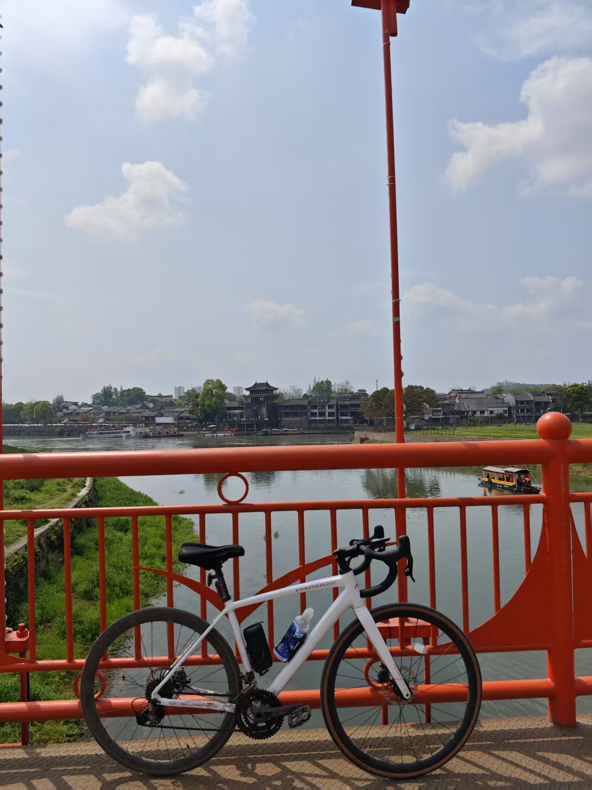
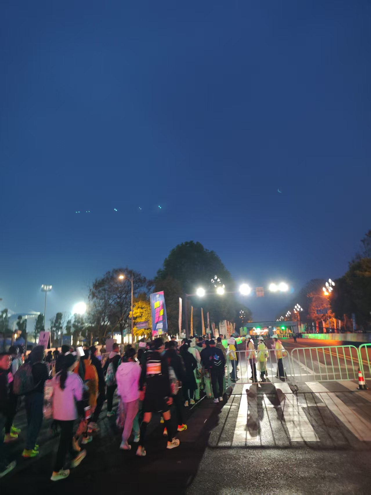

<style>
  @keyframes bounce {
    0%,
    100% {
      transform: translateY(0);
    }
    50% {
      transform: translateY(-10px);
    }
  }
  @keyframes bounce-color {
    0%,
    100% {
      transform: translateY(0) scale(1);
    }
    30% {
      transform: translateY(-30px) scale(1.2);
    }
    50% {
      background: #4ecdc4;
    }
    70% {
      transform: translateY(0) scale(0.9);
    }
  }
  @keyframes node-float {
  0%, 100% { transform: translateY(0); }
  50% { transform: translateY(-10px); }
}
  .split-box {
    display: flex;
    justify-content: center;
    gap: 15px;
    margin: 50px 0;
  }

  .bounce-ball {
    width: 30px;
    height: 30px;
    background: #ff6b6b;
    border-radius: 50%;
    animation: bounce-color 1.2s ease-in-out infinite;
    animation-delay: calc(0.2s * var(--i));
  }

  .timeline-container {
  position: relative;
  margin: 40px 0;
}

.timeline-path {
  width: 82%;
  height: 3px;
  background: linear-gradient(90deg, #4facfe, #00f2fe);
  margin: 0 auto;
  position: relative;
}

.timeline-node {
  position: absolute;
  left: calc(var(--pos) * 80%);
  top: -10px;
  animation: node-float 2s infinite;
}

.node-badge {
  background: #fff;
  padding: 8px 15px;
  border-radius: 20px;
  box-shadow: 0 4px 15px rgba(79,172,254,0.3);
  cursor: pointer;
  transition: transform 0.3s;
}

.node-popup {
  position: absolute;
  top: 40px;
  white-space: nowrap;
  opacity: 0;
  transition: opacity 0.3s;
}

.timeline-node:hover .node-popup {
  opacity: 1;
}

  /* 媒体查询：兼容移动端 */
  @media (max-width: 768px) {
    .start-img {
      width: 60% !important;
      margin-right: 8px!important;
    }
    #line-gif {
      width: 100% !important;
      height: 80px !important;
    }
    .site-png {
      height: auto !important;
      object-fit: contain !important;
    }
    .bounce-ball {
    width: 18px;
    height: 18px;
  }
  }
</style>

<h1 align="center">coderpeng 的笔记</h1>

<p align="center">
    <span>
        我是coderpeng，一位喜欢探索的开发者，目前专注于AI+可视化开发。
    </span>
    <br>
    <span>
        欢迎来到我的二进制世界！
    </span>
    <br>
    <span>
        愿君生活愉快，四季如春！:smile: :partying_face:
    </span>
</p>

<!-- <p align="center">
  
</p> -->

<div class="parallax-grid">
  <div class="card-layer" style="--depth:1">
    
        <div>喜欢摄影、骑车、跑步，保存记忆，直到永远</div>
  </div>
  <div class="card-layer" style="--depth:2">
    
        <div>喜欢摄影、骑车、跑步，保存记忆，直到永远</div>
  </div>
  <div class="card-layer" style="--depth:3">
    
    <div>喜欢摄影、骑车、跑步，保存记忆，直到永远</div>
  </div>
</div>

<style>
.parallax-grid {
  position: relative;
  height: 40vh;
  transform-style: preserve-3d;
  margin-bottom: 80px;
}

.card-layer {
  position: absolute;
  padding: 20px;
  width: 100%;
  transition: 0.3s all ease-out;
  transform: translateZ(calc(var(--depth) * -50px));
  box-shadow: 0 15px 30px rgba(0,0,0,0.2);

  display: flex;
  justify-content: space-between;
  align-items: center;
}

.card-layer:hover {
  transform: translateZ(calc(var(--depth) * 30px)) rotateZ(calc(var(--depth) * 2deg));
  z-index: 5;
}

.card-layer:nth-child(odd):hover {
  transform: translateZ(calc(var(--depth) * 30px)) rotateZ(calc(var(--depth) * -2deg));
}

/* 悬停时其他卡片退场 */
.parallax-grid:hover .card-layer:not(:hover) {
  filter: brightness(0.8);
  transform: translateZ(calc(var(--depth) * -100px));
}
</style>


<!-- <p align="center">
  
</p> -->

### 成就树

<div class="timeline-container">
  <div class="timeline-path"></div>
  
  <div class="timeline-node" style="--pos:0">
    <div class="node-badge">🎓 2023</div>
    <div class="node-popup">走进计算机世界的大门</div>
  </div>

  <div class="timeline-node" style="--pos:0.4">
    <div class="node-badge">💻 2024</div>
    <div class="node-popup">第一个人项目上线</div>
  </div>

  <div class="timeline-node" style="--pos:0.8">
    <div class="node-badge">🚀 2025</div>
    <div class="node-popup">AI可视化系统研发中</div>
  </div>
</div>

<p align="left">
已解锁：1，待解锁：3
</p>

<div class="achievement-system">
  <!-- 技能树主干 -->
  <div class="skill-tree">
    <div class="tree-trunk"></div>
    <div class="skill-node unlocked" data-skill="one">
      <div class="progress-bar" style="--progress:100%"></div>
      <div class="tooltip">10K+ 代码行</div>
    </div>
    <div class="skill-node locked" data-skill="two">
      <div class="progress-bar" style="--progress:45%"></div>
      <div class="tooltip">3D游戏项目</div>
    </div>
    <div class="skill-node locked" data-skill="three">
      <div class="progress-bar" style="--progress:30%"></div>
      <div class="tooltip">全栈项目</div>
    </div>
    <div class="skill-node locked" data-skill="four">
      <div class="progress-bar" style="--progress:50%"></div>
      <div class="tooltip">数据可视化专家</div>
    </div>
  </div>
  <!-- 成就展示区 -->
  <div class="achievement-wall">
    <div class="badge earned" data-badge="python-master">
      <div class="badge-icon">🔓</div>
      <span>10K+ 代码行</span>
    </div>
    <div class="badge locked" data-badge="threejs">
      <div class="badge-icon">🔒</div>
      <span>3D游戏项目</span>
    </div>
    <div class="badge locked" data-badge="threejs">
      <div class="lock-icon">🔒</div>
      <span>全栈项目</span>
    </div>
    <div class="badge locked" data-badge="python-master">
      <div class="lock-icon">🔒</div>
      <span>数据可视化专家</span>
    </div>
  </div>
</div>

<style>
.achievement-system {
  display: grid;
  grid-template-columns: 1fr 300px;
  gap: 40px;
  padding: 30px;
  background: rgba(255,255,255,0.9);
  border-radius: 20px;
  box-shadow: 0 10px 30px rgba(0,0,0,0.1);
}

.skill-tree {
  position: relative;
  min-height: 400px;
}

.tree-trunk {
  width: 8px;
  height: 100%;
  background: linear-gradient(to bottom, #4facfe, #00f2fe);
  position: absolute;
  left: 50%;
  transform: translateX(-50%);
}

.skill-node {
  position: absolute;
  width: 80px;
  height: 80px;
  background: white;
  border-radius: 50%;
  display: flex;
  align-items: center;
  justify-content: center;
  box-shadow: 0 5px 15px rgba(79,172,254,0.3);
  cursor: pointer;
  transition: transform 0.3s;
}

/* .skill-node.unlocked {
  border: 3px solid #42b983;
} */

.skill-node.locked {
  filter: grayscale(0.8);
  opacity: 0.6;
}

.progress-bar {
  width: 100%;
  height: 4px;
  background: #eee;
  position: absolute;
  bottom: -20px;
  border-radius: 2px;
}

.progress-bar::after {
  content: '';
  display: block;
  width: var(--progress);
  height: 100%;
  background: #4facfe;
  border-radius: 2px;
  transition: width 0.5s ease;
}

.tooltip {
  /* 悬浮提示样式 */
}

.achievement-wall {
  display: grid;
  grid-template-columns: repeat(2, 1fr);
  gap: 15px;
  align-content: start;
}

.badge {
  padding: 15px;
  border-radius: 10px;
  text-align: center;
  background: white;
  position: relative;
}

.badge.earned {
  border: 2px solid #ffd700;
  animation: glow 2s infinite alternate;
}

.badge.locked {
  background: #f5f5f5;
}

@keyframes glow {
  from { box-shadow: 0 0 5px #ffd700; }
  to { box-shadow: 0 0 20px #ffd700; }
}

/* 动态布局技能节点位置 */
.skill-node[data-skill="one"] { left: 18%; top: 10%; }
.skill-node[data-skill="two"] { left: 60%; top: 20%; }
.skill-node[data-skill="three"] { left: 18%; top: 40%; }
.skill-node[data-skill="four"] { left: 60%; top: 50%; }

  @media (max-width: 768px) {
    .achievement-system {
      grid-template-columns: 1fr;
      gap: 20px;
    }
    .skill-node {
      width: 60px;
      height: 60px;

    }
  }

</style>

<div class="split-box">
  <div class="bounce-ball" style="--i:1"></div>
  <div class="bounce-ball" style="--i:2"></div>
  <div class="bounce-ball" style="--i:3"></div>
  <div class="bounce-ball" style="--i:4"></div>
</div>

### 目录结构

<p align="left" style="text-align:center;">
 内容涵盖：
<a href="#/AI/01_检索内容增强(RAG)"></a>
<a href="#/前端/threejs/01_Introduction"></a>


</p>
<p align="center">

<details>
<summary>点击展开目录结构</summary>

```tex
├─.gitlab-ci.yml | Gitee自动化部署脚本
├─.nojekyll  | 阻止 GitHub Pages 忽略掉下划线开头的文件
├─favicon.ico | 图标
├─guide.md | 本站帮助文件
├─index.html | 入口文件
├─README.md | 主页
├─_navbar.md | 顶部导航配置
├─_sidebar.md | 侧边导航配置
├─AI+
| ├─01_检索内容增强(RAG).md
| ...
├─算法
| ├─01_两数之和.md
| ...
├─爬虫
| ├─01_京东抢购脚本.md
| ...
├─工具
| ├─01_自定义路径复制脚本.md
| ...
├─后端
| ├─01_请求中的MIME类型.md
| ...
├─前端
| ├─_sidebar.md | 下钻菜单配置页面
| ├─vue
| ├─threejs
| ├─safety | 前端安全相关
| ├─minProgram | 小程序相关
| ├─js
| ├─html
| ├─css
| ├─capability | 性能优化相关
├─其他
| ├─01_计算机网络知识汇总.md
| ...
├─_media | 存放静态资源的地方
| ├─icon.png
| ...
```

</details>

### 其他个人站点

- [blog-coderpeng](https://pengpen1.github.io/)
  coderpeng 的博客网站，热爱生活，热爱自己。

  59+文章，涵盖前端、后端、工具、算法、爬虫、AI 等多个领域。

<p align="center">
  
</p>

- [three-coderpeng](https://pengpen1.github.io/three-demo-site/#/)
  coderpeng 的 3D 项目展示网站，代码是艺术，编程是创造。

  3D 项目展示网站，6+项目，12+笔记

<p align="center">
  
</p>

### 公司级项目

- 重庆移动 | 营业厅监测大屏

  三级下钻，处理十万级数据，维持 FPS 50+

<p align="center">
  
  
</p>

- 陕西移动 | 数据管理系统

  100+页面，多级弹窗，业务逻辑复杂

<p align="center">
  
  
</p>

### 关于我

<div style="border-left: 3px solid #42b983; padding-left: 15px;">
3年系统建设经验，专注于数据可视化和AI工程化。
<br>

主导过 1 个大型项⽬的落地实施，参与过 8+项目的核心开发。
<br>

成功推动公司前端 AI ⼯程化能⼒的运用，RAG 知识
库系统的建设，可视化技术的升级(ECharts > Three.js)。

<p align="center">


</p>
</div>

<h2 align="center">coding...</h2>
