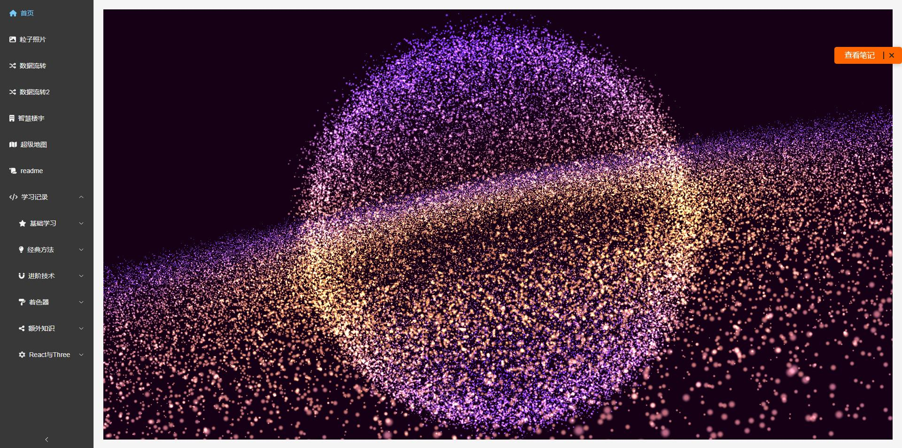

<h1 align="center">docs-coderpeng</h1>

<p align="center">
    <span>
        欢迎来到<a href="https://pengpen1.github.io/" style="text-decoration: none;">CoderPeng</a>的文档
    </span>
        
    <br>
    <span>
        愿君生活愉快，四季如春！:smile: :partying_face:
    </span>
</p>

<style>
    @keyframes bounce {
        0%, 100% { transform: translateY(0); }
        50% { transform: translateY(-10px); }
    }
</style>

<p align="center">


</p>

<p align="center">
  
</p>

<!-- TODO: 动画增强 -->
<!-- <p align="center" style="position: relative; overflow: hidden;">
  
</p>

<style>
  @keyframes float {
    0% { transform: translateY(0px); }
    50% { transform: translateY(-10px); }
    100% { transform: translateY(0px); }
  }

  @keyframes scale {
    0% { transform: scale(1); }
    100% { transform: scale(1.05); }
  }
</style> -->

<p align="center">
  
</p>

## 目录结构

<p align="left" style="text-align:center;">
 内容涵盖：
<a href="#/AI/01_检索内容增强(RAG)"></a>
<a href="#/前端/threejs/01_Introduction"></a>


</p>
<p align="center">

```tex
├─.gitlab-ci.yml | Gitee自动化部署脚本
├─.nojekyll  | 阻止 GitHub Pages 忽略掉下划线开头的文件
├─favicon.ico | 图标
├─guide.md | 本站帮助文件
├─index.html | 入口文件
├─README.md | 主页
├─_navbar.md | 顶部导航配置
├─_sidebar.md | 侧边导航配置
├─AI+
| ├─01_检索内容增强(RAG).md
| ...
├─算法
| ├─01_两数之和.md
| ...
├─爬虫
| ├─01_京东抢购脚本.md
| ...
├─工具
| ├─01_自定义路径复制脚本.md
| ...
├─后端
| ├─01_请求中的MIME类型.md
| ...
├─前端
| ├─_sidebar.md | 下钻菜单配置页面
| ├─vue
| ├─threejs
| ├─safety | 前端安全相关
| ├─minProgram | 小程序相关
| ├─js
| ├─html
| ├─css
| ├─capability | 性能优化相关
├─其他
| ├─01_计算机网络知识汇总.md
| ...
├─_media | 存放静态资源的地方
| ├─icon.png
| ...
```

## 其他站点

- [blog-coderpeng](https://pengpen1.github.io/)
coderpeng 的博客网站，热爱生活，热爱自己。
<p align="center">
  
</p>

- [three-coderpeng](https://pengpen1.github.io/three-demo-site/#/)
coderpeng 的 3D 项目展示网站，代码是艺术，编程是创造。
<p align="center">
  
</p>

<h2 align="center">coding...</h2>
