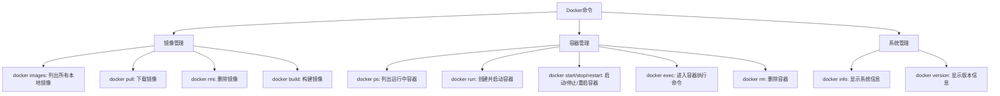
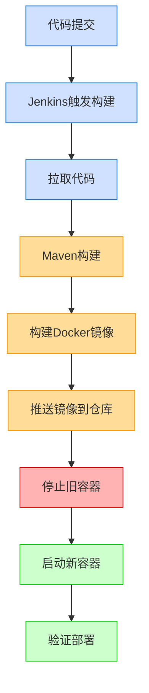

# 云服务器部署 Docker 与 MySQL

## 前言

在现代云原生应用开发中，容器化部署已成为标准实践。本文将详细介绍如何在云服务器上安装 Docker 及部署 MySQL 数据库，并提供 CI/CD 环境搭建参考，帮助开发者快速构建开发和部署环境。

<blockquote>代码来自@GarbageGodM</blockquote>

## 目录

- [Docker 安装与配置](#docker安装与配置)
- [Docker 常用命令](#docker常用命令)
- [MySQL 部署与配置](#mysql部署与配置)
- [Jenkins CI/CD 环境搭建](#jenkins-cicd环境搭建)

## Docker 安装与配置

### 安装 Docker

Docker 的安装过程在 CentOS 系统上相对简单，以下是详细步骤：

```bash
# 1. 安装必要的依赖包
yum install -y yum-utils

# 2. 设置Docker镜像仓库（推荐使用国内镜像源）
yum-config-manager --add-repo https://mirrors.aliyun.com/docker-ce/linux/centos/docker-ce.repo

# 3. 更新yum软件包索引
yum makecache fast

# 4. 安装Docker相关组件（ce为社区版，ee为企业版）
yum install docker-ce docker-ce-cli containerd.io

# 5. 启动Docker服务
systemctl start docker

# 6. 设置Docker开机自启
systemctl enable docker

# 7. 验证安装是否成功
docker version
```

### 使用 Docker 镜像加速

在国内使用 Docker 时，建议配置镜像加速器来提高 Docker 镜像下载速度：

```bash
# 创建Docker配置目录
mkdir -p /etc/docker

# 配置加速器
cat > /etc/docker/daemon.json <<EOF
{
  "registry-mirrors": [
    "https://hub-mirror.c.163.com",
    "https://mirror.baidubce.com",
    "https://docker.mirrors.ustc.edu.cn"
  ]
}
EOF

# 重启Docker服务
systemctl daemon-reload
systemctl restart docker
```

### 地址恢复教程

如果因为仓库地址错误导致安装失败，可以通过以下步骤重置仓库：

```bash
# 切换到yum仓库配置目录
cd /etc/yum.repos.d/

# 删除所有repo文件
rm *.repo

# 重新下载CentOS基础仓库配置
curl -o /etc/yum.repos.d/CentOS-Base.repo https://mirrors.aliyun.com/repo/Centos-vault-8.5.2111.repo

# 或使用wget下载
wget -O /etc/yum.repos.d/CentOS-Base.repo https://mirrors.aliyun.com/repo/Centos-vault-8.5.2111.repo

# 重建缓存
yum makecache
```

## Docker 常用命令

Docker 提供了丰富的命令行工具，以下是最常用的命令：



### 镜像相关命令

```bash
# 查看所有本地镜像
docker images

# 下载镜像
docker pull [镜像名称]:[标签]

# 删除指定镜像
docker rmi -f [镜像ID]

# 删除多个镜像
docker rmi -f [镜像ID1] [镜像ID2] [镜像ID3]
```

### 容器相关命令

```bash
# 列出正在运行的容器
docker ps

# 列出所有容器（包括已停止的）
docker ps -a

# 仅列出最近创建的n个容器
docker ps -n [数量]

# 只显示容器的ID
docker ps -q

# 创建并启动容器
docker run [选项] [镜像名]:[标签]

# 常用选项：
# -d: 后台运行容器
# -p 主机端口:容器端口: 端口映射
# -v 主机目录:容器目录: 挂载数据卷
# --name: 指定容器名称
# -e: 设置环境变量

# 启动/重启/停止容器
docker start [容器ID或名称]
docker restart [容器ID或名称]
docker stop [容器ID或名称]

# 强制停止容器
docker kill [容器ID或名称]

# 进入正在运行的容器
docker exec -it [容器ID或名称] /bin/bash

# 退出容器但不停止容器
Ctrl+P+Q

# 删除已停止的容器
docker rm [容器ID或名称]

# 查看容器日志
docker logs -t --tail [行数] [容器ID或名称]

# 实时查看日志
docker logs -ft [容器ID或名称]
```

## MySQL 部署与配置

使用 Docker 部署 MySQL 是快速获得数据库环境的有效方式，下面介绍详细步骤：

### 部署 MySQL 容器

```bash
# 拉取MySQL 5.7镜像
docker pull mysql:5.7

# 创建挂载目录
mkdir -p /usr/local/mysql/{log,data,conf}

# 运行MySQL容器
docker run -d -p 3306:3306 --privileged=true \
-v /usr/local/mysql/log:/var/log/mysql \
-v /usr/local/mysql/data:/var/lib/mysql \
-v /usr/local/mysql/conf:/etc/mysql/conf.d \
-e MYSQL_ROOT_PASSWORD=123456 \
--name mysql mysql:5.7
```

### MySQL 配置

配置 MySQL 的字符集，确保正确支持中文：

```bash
# 进入配置目录
cd /usr/local/mysql/conf

# 创建配置文件
cat > my.cnf <<EOF
[client]
default_character_set=utf8

[mysqld]
collation_server=utf8_general_ci
character_set_server=utf8
EOF

# 重启MySQL容器使配置生效
docker restart mysql
```

### 设置 MySQL 访问权限

为了能够远程连接 MySQL，需要配置适当的访问权限：

```bash
# 进入MySQL容器
docker exec -it mysql /bin/bash

# 登录MySQL
mysql -u root -p
# 输入之前设置的密码：123456

# 执行以下SQL命令配置远程访问
mysql> GRANT ALL PRIVILEGES ON *.* TO root@'%' WITH GRANT OPTION;
mysql> USE mysql;
mysql> UPDATE user SET host='%' WHERE user='root';

# 修改密码并应用安全策略
mysql> ALTER USER 'root'@'%' IDENTIFIED BY '123456' PASSWORD EXPIRE NEVER;
mysql> ALTER USER 'root'@'%' IDENTIFIED WITH mysql_native_password BY '123456';
mysql> FLUSH PRIVILEGES;

# 退出MySQL
mysql> exit
```

## Jenkins CI/CD 环境搭建

Jenkins 是流行的 CI/CD 工具，可以帮助自动化构建、测试和部署过程。

### 部署 Jenkins 容器

```bash
# 拉取Jenkins镜像
docker pull jenkins/jenkins:lts

# 创建Jenkins工作目录
mkdir -p /home/jenkins/workspace

# 运行Jenkins容器
docker run -u root -d --restart=always --privileged=true \
-p 8080:8080 -p 50000:50000 \
-v /home/jenkins/workspace/:/var/jenkins_home/workspace \
-v /var/run/docker.sock:/var/run/docker.sock \
-v /usr/bin/docker:/usr/bin/docker \
--name jenkins jenkins/jenkins:lts
```

### 初始化 Jenkins

1. 在浏览器中访问 `http://<服务器IP>:8080`

2. 获取初始管理员密码：

   ```bash
   docker exec -it jenkins cat /var/jenkins_home/secrets/initialAdminPassword
   ```

3. 完成初始化向导并安装推荐插件

### 安装额外的 Jenkins 插件

为了支持 Maven 项目和 SSH 部署，需要安装以下插件：

1. Maven Integration Plugin
2. SSH Agent

### Java 应用部署脚本

以下是用于启动和停止 Java 应用的脚本示例：

#### 启动脚本 (start_java.sh)

```bash
#!/bin/bash
TIME=$(date +"%Y-%m-%d %H:%M:%S")
JAVA_PATH=/home/jenkins/workspace/css-practice-game/target
JAVA_LOG=/log/logs/trace.log

JavaStart() {
    echo "
>>>>>>>>>>>>>>>>>Java Starting:${TIME}<<<<<<<<<<<<<<<<<<<
" >> ${JAVA_LOG}

    PID_NUM=$(ps -ef|grep ${JAVA_PATH}/*.jar|grep java|grep -v grep|awk '{print $2}'|wc -l)
    if [ ${PID_NUM} -gt 0 ]; then
        PID=$(ps -ef|grep ${JAVA_PATH}/*.jar|grep java|grep -v grep|awk '{print $2}')
        echo "[WARNING] 已经存在JAVA进程$PID，退出本次操作!!"
        echo "
[WARNING] 已经存在JAVA进程:$PID，退出本次操作!!
" >> ${JAVA_LOG}
        exit
    else
        java -jar ${JAVA_PATH}/*.jar >>${JAVA_LOG} 2>>${JAVA_LOG} &
        sleep 3
        PID_NUM=$(ps -ef|grep ${JAVA_PATH}/*.jar|grep java|grep -v grep|awk '{print $2}'|wc -l)
        if [ ${PID_NUM} -eq 0 ]; then
            echo "[ERROR] JAVA Fail To Start!!!"
            echo "
[ERROR] JAVA Fail To Start!!!
" >> ${JAVA_LOG}
        else
            PID=$(ps -ef|grep ${JAVA_PATH}/*.jar|grep java|grep -v grep|awk '{print $2}')
            echo "[INFO] JAVA-PID:${PID} Successfully Running!!!"
            echo "[INFO] JAVA-PID:${PID} Successfully Running!!!" >> ${JAVA_LOG}
        fi
    fi
}
JavaStart
```

#### 停止脚本 (stop_java.sh)

```bash
#!/bin/bash
TIME=$(date +"%Y-%m-%d %H:%M:%S")
JAVA_PATH=/home/jenkins/workspace/css-practice-game/target
JAVA_LOG=/log/logs/trace.log

Main() {
    PID_NUM=$(ps -ef|grep ${JAVA_PATH}/*.jar|grep java|grep -v grep|wc -l)
    if [ ${PID_NUM} -gt 0 ]; then
        PID=$(ps -ef|grep ${JAVA_PATH}/*.jar|grep java|grep -v grep|awk '{print $2}')
        kill -9 ${PID}
        echo "[INFO] JAVA-PID:${PID} Java Has Been Stopped!!!"
        if [ $? -eq 0 ]; then
            echo "
>>>>>>>>>>>>>>>>>Java Has Been Stopped:${TIME}<<<<<<<<<<<<<<<<<<<
" >> ${JAVA_LOG}
        fi
    fi
}
Main
```

### Jenkins Pipeline 示例

下面是一个简单的 Jenkins Pipeline 示例，用于构建和部署 Java 应用：

```groovy
pipeline {
    agent any

    tools {
        maven 'Maven' // 使用Jenkins中配置的Maven
    }

    stages {
        stage('拉取代码') {
            steps {
                checkout scmGit(branches: [[name: '*/master']],
                          extensions: [],
                          userRemoteConfigs: [[url: 'https://github.com/yourusername/yourproject.git']])
            }
        }

        stage('Maven构建') {
            steps {
                sh 'mvn clean package -DskipTests'
            }
        }

        stage('部署应用') {
            steps {
                sh '''
                chmod +x /opt/devops/test/java/stop_java.sh
                /opt/devops/test/java/stop_java.sh

                chmod +x /opt/devops/test/java/start_java.sh
                /opt/devops/test/java/start_java.sh
                '''
            }
        }
    }

    post {
        success {
            echo '部署成功!'
        }
        failure {
            echo '部署失败!'
        }
    }
}
```

## CI/CD 流程图



## 常见问题与解决方案

### 1. 权限问题

如果遇到脚本执行权限问题，可以通过以下方式解决：

```bash
# 给脚本添加执行权限
chmod +x /path/to/your/script.sh

# 如果是Docker内权限问题，可能需要以root用户运行
docker exec -u 0 -it container_name /bin/bash
```

### 2. 网络连接问题

如果容器无法连接外网或相互通信：

```bash
# 检查Docker网络
docker network ls

# 创建自定义网络
docker network create my-network

# 将容器连接到网络
docker network connect my-network container_name
```

### 3. 数据持久化问题

确保重要数据已挂载到主机目录：

```bash
# 查看容器的挂载情况
docker inspect container_name | grep Mounts -A 20
```

## 总结

通过本文的指导，您应该能够在云服务器上成功部署 Docker 环境、MySQL 数据库以及 Jenkins CI/CD 系统。这些工具的组合为现代应用开发提供了强大的支持，帮助开发团队实现自动化构建和部署，提高开发效率和产品质量。

在实际使用过程中，建议根据项目需求和安全考虑，对配置进行适当调整，特别是密码、网络设置和访问权限等敏感配置。
