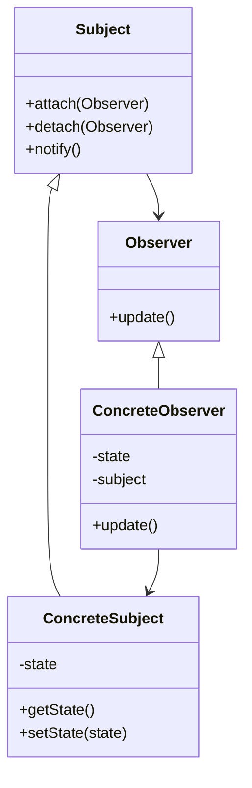

# 行为型：观察者模式 (Observer)

观察者模式定义对象间的一种一对多的依赖关系，当一个对象的状态发生改变时，所有依赖于它的对象都得到通知并被自动更新。也称为发布-订阅（Publish-Subscribe）模式。

**核心思想：**

- 存在一个主题（Subject）对象和多个观察者（Observer）对象。
- 主题对象维护一个观察者列表。
- 当主题对象的状态发生变化时，它会通知所有注册的观察者。
- 观察者对象接收到通知后，会进行相应的更新操作。

**应用场景：**

- 当一个抽象模型有两个方面, 其中一个方面依赖于另一个方面。将这二者封装在独立的对象中以使它们可以各自独立地改变和复用。
- 当对一个对象的改变需要同时改变其他对象, 而不知道具体有多少对象有待改变。
- 当一个对象必须通知其他对象，而它又不能假定其他对象是谁。换言之, 你不希望这些对象是紧密耦合的。
- 常见的应用如：事件监听系统、消息推送系统、数据变更通知机制等。

**结构：**

- Subject（目标，主题）：知道它的观察者。可以有任意多个观察者观察同一个目标；提供注册和删除观察者对象的接口。
- Observer（观察者）：为那些在目标发生改变时需获得通知的对象定义一个更新接口。
- ConcreteSubject（具体目标）：将有关状态存入 ConcreteObserver 对象；当它的状态发生改变时, 向它的各个观察者发出通知。
- ConcreteObserver（具体观察者）：维护一个指向 ConcreteSubject 对象的引用；存储有关状态，这些状态应与目标的状态保持一致；实现 Observer 的更新接口以使自身状态与目标的状态保持一致。

## 类图



## 优缺点

**优点：**

1. **松耦合**：主题和观察者之间是松散耦合的，主题只知道观察者实现了 Observer 接口，不需要了解观察者的具体类。
2. **支持广播通信**：主题可以向所有感兴趣的观察者发送通知。
3. **开闭原则**：可以在不改变主题的情况下引入新的观察者。

**缺点：**

1. **意外的通知**：观察者很容易引起意外的通知更新，可能导致性能问题。
2. **循环引用**：如果观察者和主题之间存在循环依赖，可能导致系统崩溃。
3. **观察者顺序**：对观察者的通知顺序是随机的，不能依赖特定的调用顺序。

## 实现步骤

1. **创建观察者接口**：定义一个 update 方法，供主题调用以通知观察者。
2. **创建主题接口**：定义添加、删除和通知观察者的方法。
3. **实现具体的主题类**：维护观察者列表并在状态变化时通知它们。
4. **实现具体的观察者类**：实现 update 方法以响应主题状态的变化。

## 代码示例

### Java 实现

```java
// 观察者接口
interface Observer {
    void update(String message);
}

// 具体观察者
class User implements Observer {
    private String name;

    public User(String name) {
        this.name = name;
    }

    @Override
    public void update(String message) {
        System.out.println(name + " 收到消息: " + message);
    }
}

// 主题接口
interface Subject {
    void attach(Observer observer);
    void detach(Observer observer);
    void notifyObservers();
}

// 具体主题
class MessagePublisher implements Subject {
    private List<Observer> observers = new ArrayList<>();
    private String message;

    @Override
    public void attach(Observer observer) {
        observers.add(observer);
    }

    @Override
    public void detach(Observer observer) {
        observers.remove(observer);
    }

    @Override
    public void notifyObservers() {
        for (Observer observer : observers) {
            observer.update(message);
        }
    }

    public void publishMessage(String message) {
        this.message = message;
        notifyObservers();
    }
}

// 客户端代码
public class ObserverDemo {
    public static void main(String[] args) {
        MessagePublisher publisher = new MessagePublisher();

        Observer user1 = new User("张三");
        Observer user2 = new User("李四");
        Observer user3 = new User("王五");

        publisher.attach(user1);
        publisher.attach(user2);
        publisher.attach(user3);

        publisher.publishMessage("Hello World!");

        publisher.detach(user2);

        publisher.publishMessage("Hello Again!");
    }
}
```

### JavaScript 实现

```javascript
// 主题（发布者）
class Publisher {
  constructor() {
    this.observers = [];
  }

  subscribe(observer) {
    this.observers.push(observer);
  }

  unsubscribe(observer) {
    this.observers = this.observers.filter((obs) => obs !== observer);
  }

  notify(data) {
    this.observers.forEach((observer) => observer.update(data));
  }
}

// 观察者（订阅者）
class Subscriber {
  constructor(name) {
    this.name = name;
  }

  update(data) {
    console.log(`${this.name} 收到更新: ${data}`);
  }
}

// 使用示例
const publisher = new Publisher();

const subscriber1 = new Subscriber("订阅者A");
const subscriber2 = new Subscriber("订阅者B");
const subscriber3 = new Subscriber("订阅者C");

publisher.subscribe(subscriber1);
publisher.subscribe(subscriber2);
publisher.subscribe(subscriber3);

publisher.notify("第一条消息");

publisher.unsubscribe(subscriber2);

publisher.notify("第二条消息");
```

## 与发布-订阅模式的区别

虽然观察者模式和发布-订阅模式经常被混为一谈，但它们有一些关键区别：

1. **直接通信 vs 中介者**：

   - 观察者模式中，主题直接通知观察者。
   - 发布-订阅模式中，发布者和订阅者之间通常有一个事件通道或中介者。

2. **耦合程度**：
   - 观察者模式中，观察者和主题之间存在一定程度的耦合，观察者知道主题的存在。
   - 发布-订阅模式中，发布者和订阅者完全解耦，彼此不知道对方的存在。

## 实际应用场景

1. **GUI 系统中的事件处理**：如按钮点击、鼠标移动等事件的监听机制。
2. **MVC 架构**：Model 层作为主题，View 层作为观察者，当 Model 数据变化时通知 View 更新。
3. **消息通知系统**：如即时通讯软件中的新消息通知。
4. **数据库触发器**：当数据发生变化时自动执行特定操作。
5. **社交媒体订阅**：用户关注特定内容发布者，当有新内容发布时收到通知。

## 总结

观察者模式是一种强大的行为设计模式，适用于需要建立对象之间一对多依赖关系的场景。它促进了松耦合设计，使得主题和观察者可以独立变化而不相互影响。在现代软件开发中，观察者模式的思想已经被广泛应用，特别是在事件驱动架构和响应式编程中。
