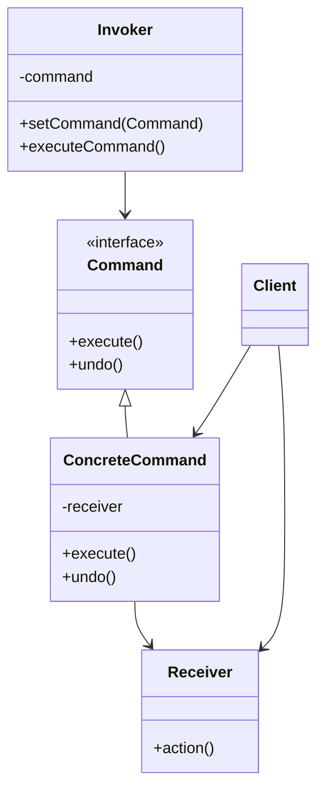

# 行为型：命令模式 (Command)

命令模式将一个请求封装为一个对象，从而使你可用不同的请求对客户进行参数化；对请求排队或记录请求日志，以及支持可撤销的操作。

**核心思想：**

- 将请求的发起者（Invoker）和接收者（Receiver）解耦。
- 引入命令对象（Command），封装了接收者和要执行的操作。
- Invoker 持有 Command 对象，并在需要时调用其执行方法。
- Command 对象知道如何调用 Receiver 的方法来完成请求。

**应用场景：**

- 需要将请求调用者和请求接收者解耦，使得调用者和接收者不直接交互。
- 需要将请求排队处理、记录日志、撤销/重做操作等。
- 抽象出待执行的动作以参数化某对象。
- 需要支持事务性操作，可以将一组操作组合为一个命令，统一执行、回滚或撤销。

**结构：**

- Command（抽象命令类）：声明执行操作的接口。
- ConcreteCommand（具体命令类）：将一个接收者对象绑定于一个动作；调用接收者相应的操作，以实现 Execute。
- Client（客户）：创建一个 ConcreteCommand 对象并设定它的接收者。
- Invoker（调用者）：要求该命令执行这个请求。
- Receiver（接收者）：知道如何实施与执行一个请求相关的操作。任何类都可能作为一个接收者。

## 类图



## 优缺点

**优点：**

1. **解耦**：命令模式将请求的发送者与接收者解耦，降低系统的耦合度。
2. **扩展性**：可以很方便地添加新的命令，无需修改现有代码。
3. **组合命令**：可以将多个命令组合成一个复合命令（宏命令），支持更复杂的操作。
4. **撤销/重做**：通过在命令中实现撤销方法，可以实现操作的撤销和重做功能。
5. **请求队列**：可以很容易实现命令队列，支持请求的延迟处理或调度。

**缺点：**

1. **类数量增加**：每个具体命令都需要一个单独的类，可能导致类的数量增加。
2. **复杂性增加**：在某些简单场景下，使用命令模式可能会使代码结构变得复杂。

## 实现步骤

1. **定义命令接口**：创建一个抽象命令接口，通常包含 execute()方法，如果需要支持撤销操作，还可以添加 undo()方法。
2. **实现具体命令类**：实现命令接口，将请求接收者与特定操作绑定起来。
3. **创建接收者类**：实现实际执行操作的逻辑。
4. **创建调用者类**：持有命令对象，并在需要时调用其 execute()方法。
5. **客户端代码**：创建具体命令对象，设置接收者，并将命令对象传递给调用者。

## 代码示例

### Java 实现

```java
// 命令接口
interface Command {
    void execute();
    void undo();
}

// 接收者
class Light {
    private boolean isOn = false;
    private String location;

    public Light(String location) {
        this.location = location;
    }

    public void turnOn() {
        isOn = true;
        System.out.println(location + " 灯打开了");
    }

    public void turnOff() {
        isOn = false;
        System.out.println(location + " 灯关闭了");
    }
}

// 具体命令：开灯
class LightOnCommand implements Command {
    private Light light;

    public LightOnCommand(Light light) {
        this.light = light;
    }

    @Override
    public void execute() {
        light.turnOn();
    }

    @Override
    public void undo() {
        light.turnOff();
    }
}

// 具体命令：关灯
class LightOffCommand implements Command {
    private Light light;

    public LightOffCommand(Light light) {
        this.light = light;
    }

    @Override
    public void execute() {
        light.turnOff();
    }

    @Override
    public void undo() {
        light.turnOn();
    }
}

// 调用者：遥控器
class RemoteControl {
    private Command command;
    private Command lastCommand; // 用于撤销操作

    public void setCommand(Command command) {
        this.command = command;
    }

    public void pressButton() {
        command.execute();
        lastCommand = command;
    }

    public void pressUndoButton() {
        if (lastCommand != null) {
            lastCommand.undo();
        }
    }
}

// 宏命令：同时执行多个命令
class MacroCommand implements Command {
    private List<Command> commands;

    public MacroCommand(List<Command> commands) {
        this.commands = commands;
    }

    @Override
    public void execute() {
        for (Command command : commands) {
            command.execute();
        }
    }

    @Override
    public void undo() {
        // 反向遍历，撤销执行的命令
        for (int i = commands.size() - 1; i >= 0; i--) {
            commands.get(i).undo();
        }
    }
}

// 客户端代码
public class CommandPatternDemo {
    public static void main(String[] args) {
        // 创建接收者
        Light livingRoomLight = new Light("客厅");
        Light kitchenLight = new Light("厨房");

        // 创建具体命令
        Command livingRoomLightOn = new LightOnCommand(livingRoomLight);
        Command livingRoomLightOff = new LightOffCommand(livingRoomLight);
        Command kitchenLightOn = new LightOnCommand(kitchenLight);
        Command kitchenLightOff = new LightOffCommand(kitchenLight);

        // 创建调用者
        RemoteControl remote = new RemoteControl();

        // 使用遥控器
        remote.setCommand(livingRoomLightOn);
        remote.pressButton(); // 开客厅灯

        remote.setCommand(kitchenLightOn);
        remote.pressButton(); // 开厨房灯

        remote.setCommand(livingRoomLightOff);
        remote.pressButton(); // 关客厅灯

        remote.pressUndoButton(); // 撤销，再开客厅灯

        // 创建并使用宏命令：同时关闭所有灯
        List<Command> allLightsOff = new ArrayList<>();
        allLightsOff.add(livingRoomLightOff);
        allLightsOff.add(kitchenLightOff);
        MacroCommand allLightsOffCommand = new MacroCommand(allLightsOff);

        remote.setCommand(allLightsOffCommand);
        remote.pressButton(); // 关闭所有灯
        remote.pressUndoButton(); // 撤销，再开所有灯
    }
}
```

### JavaScript 实现

```javascript
// 接收者
class Light {
  constructor(location) {
    this.location = location;
    this.isOn = false;
  }

  turnOn() {
    this.isOn = true;
    console.log(`${this.location} 灯打开了`);
  }

  turnOff() {
    this.isOn = false;
    console.log(`${this.location} 灯关闭了`);
  }
}

// 命令接口通过类的形式实现
class Command {
  execute() {}
  undo() {}
}

// 具体命令：开灯
class LightOnCommand extends Command {
  constructor(light) {
    super();
    this.light = light;
  }

  execute() {
    this.light.turnOn();
  }

  undo() {
    this.light.turnOff();
  }
}

// 具体命令：关灯
class LightOffCommand extends Command {
  constructor(light) {
    super();
    this.light = light;
  }

  execute() {
    this.light.turnOff();
  }

  undo() {
    this.light.turnOn();
  }
}

// 调用者：遥控器
class RemoteControl {
  constructor() {
    this.command = null;
    this.lastCommand = null;
  }

  setCommand(command) {
    this.command = command;
  }

  pressButton() {
    this.command.execute();
    this.lastCommand = this.command;
  }

  pressUndoButton() {
    if (this.lastCommand) {
      this.lastCommand.undo();
    }
  }
}

// 宏命令
class MacroCommand extends Command {
  constructor(commands) {
    super();
    this.commands = commands;
  }

  execute() {
    this.commands.forEach((command) => command.execute());
  }

  undo() {
    this.commands
      .slice()
      .reverse()
      .forEach((command) => command.undo());
  }
}

// 客户端代码
function run() {
  // 创建接收者
  const livingRoomLight = new Light("客厅");
  const kitchenLight = new Light("厨房");

  // 创建具体命令
  const livingRoomLightOn = new LightOnCommand(livingRoomLight);
  const livingRoomLightOff = new LightOffCommand(livingRoomLight);
  const kitchenLightOn = new LightOnCommand(kitchenLight);
  const kitchenLightOff = new LightOffCommand(kitchenLight);

  // 创建调用者
  const remote = new RemoteControl();

  // 使用遥控器
  remote.setCommand(livingRoomLightOn);
  remote.pressButton(); // 开客厅灯

  remote.setCommand(kitchenLightOn);
  remote.pressButton(); // 开厨房灯

  remote.setCommand(livingRoomLightOff);
  remote.pressButton(); // 关客厅灯

  remote.pressUndoButton(); // 撤销，再开客厅灯

  // 创建并使用宏命令：同时关闭所有灯
  const allLightsOff = new MacroCommand([livingRoomLightOff, kitchenLightOff]);
  remote.setCommand(allLightsOff);
  remote.pressButton(); // 关闭所有灯
  remote.pressUndoButton(); // 撤销，再开所有灯
}

run();
```

## 实际应用场景

1. **GUI 界面中的菜单功能**：每个菜单项是一个命令对象，可以执行特定操作，且支持撤销/重做。
2. **事务处理系统**：将一组操作封装为一个命令，可以统一提交或回滚。
3. **任务队列系统**：将命令对象放入队列中，由单独的线程或进程按顺序执行。
4. **智能家居控制**：如上面的遥控器示例，可以通过命令模式控制各种家电设备。
5. **游戏开发**：玩家的操作可以封装为命令对象，支持回放、撤销等功能。

## 相关模式

1. **组合模式**：可以与命令模式结合使用，创建宏命令（MacroCommand）。
2. **备忘录模式**：可以与命令模式结合，实现更复杂的撤销/重做功能。
3. **责任链模式**：命令处理可以组合成一个责任链。
4. **策略模式**：命令模式可以看作是一种回调的面向对象实现。

## 总结

命令模式是一种行为设计模式，通过将请求封装成对象，实现了请求发送者和接收者之间的解耦。它的主要优势在于支持命令的队列化、日志记录、撤销恢复等高级功能，同时提高了系统的灵活性和可扩展性。虽然在简单场景下可能显得有些复杂，但在需要支持复杂操作序列和事务处理的情况下，命令模式是一个非常有用的工具。
