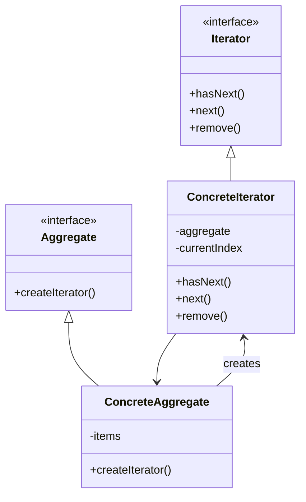

# 行为型：迭代器模式 (Iterator)

迭代器模式提供一种方法顺序访问一个聚合对象中各个元素, 而又无须暴露该对象的内部表示。

**核心思想：**

- 将遍历聚合对象（如列表、数组、集合）的责任从聚合对象本身分离出来，交给迭代器对象。
- 客户端通过统一的迭代器接口来遍历不同的聚合对象，无需关心其内部结构。

**应用场景：**

- 访问一个聚合对象的内容而无须暴露它的内部表示。
- 支持对聚合对象的多种遍历。
- 为遍历不同的聚合结构提供一个统一的接口(即, 支持多态迭代)。
- 需要在不同的时刻或者多种方式遍历同一个聚合对象。

**结构：**

- Iterator（抽象迭代器）：定义访问和遍历元素的接口。
- ConcreteIterator（具体迭代器）：实现 Iterator 接口；对该聚合遍历时跟踪当前位置。
- Aggregate（抽象聚合类）：定义创建相应迭代器对象的接口。
- ConcreteAggregate（具体聚合类）：实现 Aggregate 接口，返回一个恰当的 ConcreteIterator 实例。

## 类图



## 优缺点

**优点：**

1. **单一职责原则**：将集合元素的遍历责任从集合对象中分离出来，放入专门的迭代器类中。
2. **开闭原则**：可以在不修改聚合对象的前提下，为其添加新的遍历方式。
3. **简化接口**：客户端使用统一的迭代器接口，无需了解聚合类的内部结构。
4. **支持并发遍历**：通过不同的迭代器对象，可以同时对同一个聚合进行多个遍历。

**缺点：**

1. **增加类数量**：引入迭代器会增加系统的类和对象的个数。
2. **对于简单聚合可能过度设计**：如果聚合结构简单，使用迭代器模式可能显得繁琐。

## 实现步骤

1. **定义迭代器接口**：通常包含 hasNext()、next()和 remove()等方法。
2. **定义聚合接口**：通常包含创建迭代器的方法 createIterator()。
3. **实现具体迭代器类**：实现迭代器接口，负责遍历聚合对象。
4. **实现具体聚合类**：实现聚合接口，创建对应的迭代器对象。
5. **客户端代码**：使用迭代器接口访问和遍历聚合对象。

## 代码示例

### Java 实现

```java
import java.util.ArrayList;
import java.util.List;

// 迭代器接口
interface Iterator<T> {
    boolean hasNext();
    T next();
    void remove();
}

// 聚合接口
interface Aggregate<T> {
    Iterator<T> createIterator();
}

// 具体聚合类：自定义集合
class CustomCollection<T> implements Aggregate<T> {
    private List<T> items = new ArrayList<>();

    public void addItem(T item) {
        items.add(item);
    }

    public int size() {
        return items.size();
    }

    public T getItem(int index) {
        return items.get(index);
    }

    @Override
    public Iterator<T> createIterator() {
        return new CustomIterator<>(this);
    }
}

// 具体迭代器
class CustomIterator<T> implements Iterator<T> {
    private CustomCollection<T> collection;
    private int currentIndex = 0;
    private int lastIndex = -1;

    public CustomIterator(CustomCollection<T> collection) {
        this.collection = collection;
    }

    @Override
    public boolean hasNext() {
        return currentIndex < collection.size();
    }

    @Override
    public T next() {
        if (!hasNext()) {
            throw new IndexOutOfBoundsException("没有更多元素");
        }
        T item = collection.getItem(currentIndex);
        lastIndex = currentIndex;
        currentIndex++;
        return item;
    }

    @Override
    public void remove() {
        // 这里简化实现，实际上需要修改底层集合
        if (lastIndex < 0) {
            throw new IllegalStateException("在调用remove()前必须先调用next()");
        }
        // 假设我们有移除方法
        System.out.println("移除索引为 " + lastIndex + " 的元素");
        lastIndex = -1;
    }
}

// 逆序迭代器 - 展示不同的遍历方式
class ReverseIterator<T> implements Iterator<T> {
    private CustomCollection<T> collection;
    private int currentIndex;
    private int lastIndex = -1;

    public ReverseIterator(CustomCollection<T> collection) {
        this.collection = collection;
        this.currentIndex = collection.size() - 1;
    }

    @Override
    public boolean hasNext() {
        return currentIndex >= 0;
    }

    @Override
    public T next() {
        if (!hasNext()) {
            throw new IndexOutOfBoundsException("没有更多元素");
        }
        T item = collection.getItem(currentIndex);
        lastIndex = currentIndex;
        currentIndex--;
        return item;
    }

    @Override
    public void remove() {
        if (lastIndex < 0) {
            throw new IllegalStateException("在调用remove()前必须先调用next()");
        }
        System.out.println("移除索引为 " + lastIndex + " 的元素");
        lastIndex = -1;
    }
}

// 扩展聚合类：支持正序和逆序迭代
class EnhancedCollection<T> extends CustomCollection<T> {
    public Iterator<T> createReverseIterator() {
        return new ReverseIterator<>(this);
    }
}

// 客户端代码
public class IteratorPatternDemo {
    public static void main(String[] args) {
        // 创建集合并添加元素
        EnhancedCollection<String> names = new EnhancedCollection<>();
        names.addItem("张三");
        names.addItem("李四");
        names.addItem("王五");
        names.addItem("赵六");

        // 使用正向迭代器
        System.out.println("正向遍历：");
        Iterator<String> iterator = names.createIterator();
        while (iterator.hasNext()) {
            System.out.println(iterator.next());
        }

        // 使用逆向迭代器
        System.out.println("\n逆向遍历：");
        Iterator<String> reverseIterator = names.createReverseIterator();
        while (reverseIterator.hasNext()) {
            System.out.println(reverseIterator.next());
        }
    }
}
```

### JavaScript 实现

```javascript
// 迭代器接口通过共同方法实现
class Iterator {
  constructor(collection) {
    this.collection = collection;
    this.position = 0;
  }

  first() {
    this.position = 0;
  }

  next() {
    this.position += 1;
  }

  hasNext() {
    return this.position < this.collection.getItems().length;
  }

  currentItem() {
    return this.hasNext() ? this.collection.getItems()[this.position] : null;
  }
}

// 反向迭代器
class ReverseIterator {
  constructor(collection) {
    this.collection = collection;
    this.position = collection.getItems().length - 1;
  }

  first() {
    this.position = this.collection.getItems().length - 1;
  }

  next() {
    this.position -= 1;
  }

  hasNext() {
    return this.position >= 0;
  }

  currentItem() {
    return this.hasNext() ? this.collection.getItems()[this.position] : null;
  }
}

// 集合类
class Collection {
  constructor() {
    this.items = [];
  }

  addItem(item) {
    this.items.push(item);
  }

  getItems() {
    return this.items;
  }

  createIterator() {
    return new Iterator(this);
  }

  createReverseIterator() {
    return new ReverseIterator(this);
  }
}

// 客户端代码
function run() {
  const collection = new Collection();
  collection.addItem("张三");
  collection.addItem("李四");
  collection.addItem("王五");
  collection.addItem("赵六");

  // 使用正向迭代器
  console.log("正向遍历：");
  const iterator = collection.createIterator();
  while (iterator.hasNext()) {
    console.log(iterator.currentItem());
    iterator.next();
  }

  // 使用反向迭代器
  console.log("\n反向遍历：");
  const reverseIterator = collection.createReverseIterator();
  while (reverseIterator.hasNext()) {
    console.log(reverseIterator.currentItem());
    reverseIterator.next();
  }
}

run();
```

## 内部迭代器与外部迭代器

迭代器可以分为内部迭代器和外部迭代器两种：

1. **内部迭代器**：

   - 迭代逻辑封装在迭代器内部，客户端仅需初始化迭代即可。
   - 简化客户端代码，但灵活性较低。
   - 例如：JavaScript 的 Array.forEach()方法。

2. **外部迭代器**：
   - 由客户端控制迭代过程，需要显式调用迭代器的相关方法。
   - 更加灵活，能支持比较复杂的迭代行为。
   - 例如：Java 的 Iterator 接口实现、上面的代码示例。

## 实际应用场景

1. **集合类库实现**：几乎所有的编程语言都提供了集合类库，其中都使用了迭代器模式。
2. **不同数据结构的统一访问**：使用迭代器可以提供对数组、链表、树等不同数据结构的统一访问方式。
3. **数据库查询结果的遍历**：数据库查询返回的结果集通常使用迭代器模式封装，统一处理大量数据。
4. **文件系统遍历**：遍历目录和文件时，可以使用迭代器模式。
5. **复合对象遍历**：组合模式中的树形结构遍历可以使用迭代器模式实现。

## 相关模式

1. **组合模式**：迭代器常用于遍历组合模式中的复杂对象结构。
2. **工厂方法模式**：聚合对象通常使用工厂方法来创建相应的迭代器。
3. **备忘录模式**：可以用迭代器来存储备忘录对象，实现状态回溯功能。

## 与 Java 中的迭代器实现

Java 标准库中的 Iterator 接口和实现是迭代器模式的经典应用：

```java
public interface Iterator<E> {
    boolean hasNext();
    E next();
    default void remove() {
        throw new UnsupportedOperationException("remove");
    }
    // Java 8添加的默认方法
    default void forEachRemaining(Consumer<? super E> action) {
        while (hasNext())
            action.accept(next());
    }
}
```

Java 集合框架中的所有集合类（ArrayList、LinkedList、HashSet 等）都实现了 Iterable 接口，提供了创建 Iterator 的方法。

## 总结

迭代器模式是一种行为设计模式，它将集合的遍历行为从集合本身分离出来，封装到专门的迭代器对象中。这种分离使得客户端代码可以通过统一的接口遍历不同类型的集合，而无需了解其内部结构。虽然在某些简单场景下可能显得繁琐，但在涉及复杂集合结构或需要多种遍历方式的情况下，迭代器模式是一个非常实用的设计模式。
