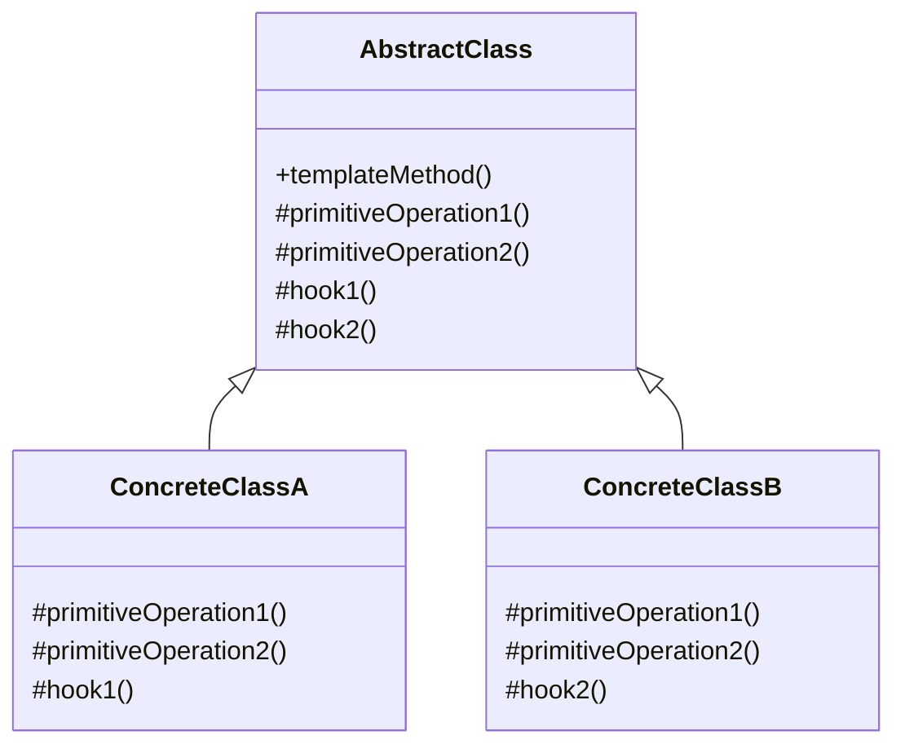

# 行为型：模板方法模式 (Template Method)

模板方法模式定义一个操作中的算法的骨架，而将一些步骤延迟到子类中。TemplateMethod 使得子类可以不改变一个算法的结构即可重定义该算法的某些特定步骤。

**核心思想：**

- 在一个抽象类中定义一个算法的框架（模板方法），该框架由一系列抽象方法（由子类实现）和具体方法（可被子类继承或覆盖）组成。
- 子类通过实现抽象方法来填充算法框架中的特定步骤。

**应用场景：**

- 一次性实现一个算法的不变的部分，并将可变的行为留给子类来实现。
- 各子类中公共的行为应被提取出来并集中到一个公共父类中以避免代码重复。
- 控制子类扩展。模板方法只在特定点调用"钩子"操作，这样就只允许在这些点进行扩展。
- 当希望通过一个统一的算法框架来约束子类的行为，但又希望子类能够在特定的环节实现自己的行为。

**结构：**

- AbstractClass（抽象类）：定义一个模板方法，该方法定义了一个算法的骨架。模板方法调用原始操作(primitive operation)以及钩子操作(hook operation)。定义抽象的原始操作，具体的子类将重定义它们以实现一个算法的步骤。实现一个模板方法, 它作为算法的骨架。
- ConcreteClass（具体类）：实现原始操作以完成算法中与特定子类相关的步骤。

## 类图



## 优缺点

**优点：**

1. **代码复用**：将不变的行为移到父类，去除子类中的重复代码。
2. **扩展性**：子类可以通过覆盖钩子方法来改变父类的行为。
3. **控制力**：父类可以控制算法的整体结构，子类只能修改特定部分。
4. **遵循"好莱坞原则"**：父类调用子类的方法，而不是子类调用父类的方法，即"别调用我们，我们会调用你"。

**缺点：**

1. **限制性**：子类的行为受到了算法框架的限制。
2. **违反里氏替换原则**：子类实现的抽象方法可能会改变算法的预期行为。
3. **维护困难**：当算法步骤较多或发生变化时，维护模板方法可能变得困难。

## 实现步骤

1. **分析算法**：分析算法，确定哪些部分是固定的，哪些部分是变化的。
2. **创建抽象类**：定义一个包含模板方法的抽象类，该方法包含算法的框架。
3. **定义抽象方法**：在抽象类中定义算法中变化的部分为抽象方法。
4. **定义钩子方法**：如果需要，定义钩子方法，允许子类在特定点扩展算法。
5. **实现具体子类**：创建具体子类，实现抽象方法，可选地覆盖钩子方法。

## 代码示例

### Java 实现

```java
// 抽象类：定义饮料制作的算法框架
abstract class BeverageTemplate {

    // 模板方法：定义了制作饮料的算法骨架
    public final void prepareBeverage() {
        boilWater();
        brew();
        pourInCup();

        // 根据钩子方法判断是否添加调料
        if (customerWantsCondiments()) {
            addCondiments();
        }

        System.out.println("饮料制作完成！\n");
    }

    // 具体方法，固定步骤
    private void boilWater() {
        System.out.println("将水煮沸");
    }

    // 具体方法，固定步骤
    private void pourInCup() {
        System.out.println("倒入杯中");
    }

    // 抽象方法，由子类实现
    protected abstract void brew();

    // 抽象方法，由子类实现
    protected abstract void addCondiments();

    // 钩子方法，子类可以覆盖
    protected boolean customerWantsCondiments() {
        return true; // 默认添加调料
    }
}

// 具体子类：咖啡
class CoffeeTemplate extends BeverageTemplate {

    @Override
    protected void brew() {
        System.out.println("用沸水冲泡咖啡粉");
    }

    @Override
    protected void addCondiments() {
        System.out.println("加入糖和牛奶");
    }
}

// 具体子类：茶
class TeaTemplate extends BeverageTemplate {

    private boolean wantsLemon;

    public TeaTemplate(boolean wantsLemon) {
        this.wantsLemon = wantsLemon;
    }

    @Override
    protected void brew() {
        System.out.println("用沸水浸泡茶叶");
    }

    @Override
    protected void addCondiments() {
        System.out.println("加入柠檬");
    }

    // 覆盖钩子方法
    @Override
    protected boolean customerWantsCondiments() {
        return wantsLemon;
    }
}

// 客户端代码
public class TemplateMethodDemo {
    public static void main(String[] args) {
        System.out.println("制作咖啡：");
        BeverageTemplate coffee = new CoffeeTemplate();
        coffee.prepareBeverage();

        System.out.println("制作加柠檬的茶：");
        BeverageTemplate teaWithLemon = new TeaTemplate(true);
        teaWithLemon.prepareBeverage();

        System.out.println("制作不加柠檬的茶：");
        BeverageTemplate teaWithoutLemon = new TeaTemplate(false);
        teaWithoutLemon.prepareBeverage();
    }
}
```

### JavaScript 实现

```javascript
// 抽象类（在JavaScript中通过基类模拟）
class BeverageTemplate {
  // 模板方法
  prepareBeverage() {
    this.boilWater();
    this.brew();
    this.pourInCup();

    if (this.customerWantsCondiments()) {
      this.addCondiments();
    }

    console.log("饮料制作完成！\n");
  }

  // 具体方法
  boilWater() {
    console.log("将水煮沸");
  }

  // 具体方法
  pourInCup() {
    console.log("倒入杯中");
  }

  // 抽象方法（需要子类实现）
  brew() {
    throw new Error("子类必须实现brew方法");
  }

  // 抽象方法（需要子类实现）
  addCondiments() {
    throw new Error("子类必须实现addCondiments方法");
  }

  // 钩子方法
  customerWantsCondiments() {
    return true; // 默认返回true
  }
}

// 具体子类：咖啡
class CoffeeTemplate extends BeverageTemplate {
  brew() {
    console.log("用沸水冲泡咖啡粉");
  }

  addCondiments() {
    console.log("加入糖和牛奶");
  }
}

// 具体子类：茶
class TeaTemplate extends BeverageTemplate {
  constructor(wantsLemon) {
    super();
    this.wantsLemon = wantsLemon;
  }

  brew() {
    console.log("用沸水浸泡茶叶");
  }

  addCondiments() {
    console.log("加入柠檬");
  }

  customerWantsCondiments() {
    return this.wantsLemon;
  }
}

// 客户端代码
function run() {
  console.log("制作咖啡：");
  const coffee = new CoffeeTemplate();
  coffee.prepareBeverage();

  console.log("制作加柠檬的茶：");
  const teaWithLemon = new TeaTemplate(true);
  teaWithLemon.prepareBeverage();

  console.log("制作不加柠檬的茶：");
  const teaWithoutLemon = new TeaTemplate(false);
  teaWithoutLemon.prepareBeverage();
}

run();
```

## 模板方法模式的变体

### 1. 使用接口替代抽象类

在某些不支持多继承的语言中，如果类已经继承了另一个类，可以使用接口来实现模板方法模式：

```java
interface BeverageTemplate {
    default void prepareBeverage() {
        boilWater();
        brew();
        pourInCup();

        if (customerWantsCondiments()) {
            addCondiments();
        }
    }

    void boilWater();
    void brew();
    void pourInCup();
    void addCondiments();
    boolean customerWantsCondiments();
}
```

### 2. 使用组合替代继承

通过组合关系而非继承关系来实现模板方法模式：

```java
class BeverageTemplate {
    private final BeverageSteps steps;

    public BeverageTemplate(BeverageSteps steps) {
        this.steps = steps;
    }

    public void prepareBeverage() {
        boilWater();
        steps.brew();
        pourInCup();

        if (steps.customerWantsCondiments()) {
            steps.addCondiments();
        }
    }

    private void boilWater() { /* ... */ }
    private void pourInCup() { /* ... */ }
}

interface BeverageSteps {
    void brew();
    void addCondiments();
    boolean customerWantsCondiments();
}
```

## 实际应用场景

1. **框架设计**：许多框架使用模板方法模式来定义默认行为，允许用户通过子类化来自定义行为。
2. **Web 应用开发**：如 Spring MVC 的 DispatcherServlet 使用模板方法处理 HTTP 请求。
3. **数据库操作**：JDBC 的模板类提供了处理连接、执行查询和处理结果的算法框架。
4. **测试框架**：JUnit 等测试框架使用模板方法定义测试执行的生命周期。
5. **UI 库**：许多 UI 库使用模板方法让开发者在特定的渲染阶段插入自定义行为。

## 相关模式

1. **工厂方法模式**：工厂方法是模板方法的一种特殊形式，专注于对象创建。
2. **策略模式**：策略模式通过组合使行为可变，而模板方法通过继承。
3. **钩子（Hook）模式**：钩子是模板方法模式的一部分，允许子类在算法的特定点扩展行为。

## 总结

模板方法模式是一种基于继承的行为设计模式，它通过在父类中定义算法的框架，并将一些步骤的实现延迟到子类中来实现代码复用和扩展。这种模式非常适合于需要定义一个算法骨架，但希望子类能够自定义算法中特定步骤的场景。通过使用模板方法模式，我们可以减少代码重复，提高代码的可维护性和可扩展性。
