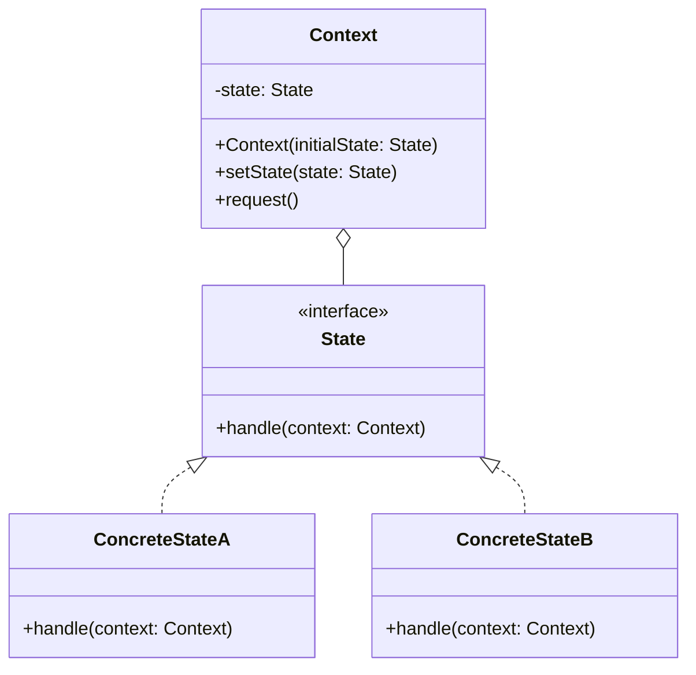

# 行为型：状态模式 (State)

状态模式允许一个对象在其内部状态改变时改变它的行为。对象看起来似乎修改了它的类。

**核心思想：**

- 将对象的每种状态封装成独立的类，这些状态类实现一个共同的状态接口。
- Context 类持有一个当前状态对象的引用。
- Context 类将与状态相关的行为委托给当前状态对象处理。
- 当对象的内部状态改变时，Context 对象会改变其持有的状态对象引用，从而改变其行为。

**与策略模式的区别：**

- 状态模式关注的是对象在不同状态下的行为变化，状态转换通常由 Context 或状态对象自身控制。
- 策略模式关注的是算法的选择和替换，策略的选择通常由客户端决定。

**应用场景：**

- 一个对象的行为取决于它的状态, 并且它必须在运行时刻根据状态改变它的行为。
- 一个操作中含有庞大的多分支的条件语句，且这些分支依赖于该对象的状态。状态模式将每一个条件分支放入一个独立的类中。这使得你可以根据对象自身的情况将对象的状态作为一个对象，这一对象可以不依赖于其他对象而独立变化。
- 当系统中有大量对象，这些对象的状态经常发生变化，且每个状态对应不同的行为时。
- 当一个对象的行为取决于它的状态，且必须在运行时根据状态改变行为时。

**结构：**

- Context（上下文）：定义客户感兴趣的接口；维护一个 ConcreteState 子类的实例，这个实例定义当前状态。
- State（抽象状态类）：定义一个接口以封装与 Context 的一个特定状态相关的行为。
- ConcreteState（具体状态类）：每一个子类实现一个与 Context 的一个状态相关的行为。

## 类图



## 优缺点

**优点：**

1. **单一职责原则**：将与特定状态相关的行为封装在单独的类中。
2. **开闭原则**：可以在不修改 Context 类的情况下添加新的状态。
3. **消除条件语句**：避免使用大量的 if-else 或 switch 语句来处理状态相关的行为。
4. **状态转换显式化**：状态转换的逻辑被明确定义在状态类中，使得状态转换更加清晰。

**缺点：**

1. **类数量增加**：状态模式会导致系统中类的数量增加。
2. **状态分散**：状态模式将状态逻辑分散到多个类中，可能增加理解和维护的难度。
3. **状态转换复杂性**：如果状态转换逻辑复杂，可能导致状态类之间的依赖关系变得复杂。

## 实现步骤

1. **确定所有可能的状态**：分析对象可能处于的所有状态。
2. **定义状态接口**：创建一个包含状态相关行为的接口。
3. **实现具体状态类**：为每个状态创建一个实现状态接口的类。
4. **创建上下文类**：定义一个包含状态引用的上下文类，将状态相关的行为委托给当前状态对象。
5. **实现状态转换**：在状态类或上下文类中实现状态转换逻辑。

## 代码示例

### Java 实现

```java
// 状态接口
interface State {
    void handle(Context context);
}

// 具体状态A
class ConcreteStateA implements State {
    @Override
    public void handle(Context context) {
        System.out.println("当前状态是 A");
        System.out.println("A 状态下的业务逻辑处理");
        // 状态转换
        context.setState(new ConcreteStateB());
    }
}

// 具体状态B
class ConcreteStateB implements State {
    @Override
    public void handle(Context context) {
        System.out.println("当前状态是 B");
        System.out.println("B 状态下的业务逻辑处理");
        // 状态转换
        context.setState(new ConcreteStateA());
    }
}

// 上下文类
class Context {
    private State state;

    public Context(State initialState) {
        this.state = initialState;
    }

    public void setState(State state) {
        this.state = state;
    }

    public void request() {
        state.handle(this);
    }
}

// 更具体的示例：自动售货机状态
interface VendingMachineState {
    void insertCoin(VendingMachine machine);
    void ejectCoin(VendingMachine machine);
    void selectProduct(VendingMachine machine);
    void dispense(VendingMachine machine);
}

// 没有硬币状态
class NoCoinState implements VendingMachineState {
    @Override
    public void insertCoin(VendingMachine machine) {
        System.out.println("硬币已插入");
        machine.setState(machine.getHasCoinState());
    }

    @Override
    public void ejectCoin(VendingMachine machine) {
        System.out.println("没有硬币可退");
    }

    @Override
    public void selectProduct(VendingMachine machine) {
        System.out.println("请先插入硬币");
    }

    @Override
    public void dispense(VendingMachine machine) {
        System.out.println("请先插入硬币并选择商品");
    }
}

// 有硬币状态
class HasCoinState implements VendingMachineState {
    @Override
    public void insertCoin(VendingMachine machine) {
        System.out.println("已经插入了硬币，不能再插入");
    }

    @Override
    public void ejectCoin(VendingMachine machine) {
        System.out.println("退回硬币");
        machine.setState(machine.getNoCoinState());
    }

    @Override
    public void selectProduct(VendingMachine machine) {
        System.out.println("已选择商品");
        machine.setState(machine.getSoldState());
    }

    @Override
    public void dispense(VendingMachine machine) {
        System.out.println("请先选择商品");
    }
}

// 售出状态
class SoldState implements VendingMachineState {
    @Override
    public void insertCoin(VendingMachine machine) {
        System.out.println("请等待商品发放");
    }

    @Override
    public void ejectCoin(VendingMachine machine) {
        System.out.println("已选择商品，不能退币");
    }

    @Override
    public void selectProduct(VendingMachine machine) {
        System.out.println("已选择商品，请等待");
    }

    @Override
    public void dispense(VendingMachine machine) {
        System.out.println("发放商品");
        machine.setCount(machine.getCount() - 1);
        if (machine.getCount() > 0) {
            machine.setState(machine.getNoCoinState());
        } else {
            System.out.println("商品已售罄");
            machine.setState(machine.getSoldOutState());
        }
    }
}

// 售罄状态
class SoldOutState implements VendingMachineState {
    @Override
    public void insertCoin(VendingMachine machine) {
        System.out.println("商品已售罄，不接受硬币");
    }

    @Override
    public void ejectCoin(VendingMachine machine) {
        System.out.println("没有插入硬币，无法退币");
    }

    @Override
    public void selectProduct(VendingMachine machine) {
        System.out.println("商品已售罄");
    }

    @Override
    public void dispense(VendingMachine machine) {
        System.out.println("商品已售罄，无法发放");
    }
}

// 自动售货机
class VendingMachine {
    private VendingMachineState noCoinState;
    private VendingMachineState hasCoinState;
    private VendingMachineState soldState;
    private VendingMachineState soldOutState;

    private VendingMachineState currentState;
    private int count;

    public VendingMachine(int count) {
        this.noCoinState = new NoCoinState();
        this.hasCoinState = new HasCoinState();
        this.soldState = new SoldState();
        this.soldOutState = new SoldOutState();

        this.count = count;
        if (count > 0) {
            this.currentState = noCoinState;
        } else {
            this.currentState = soldOutState;
        }
    }

    public void insertCoin() {
        currentState.insertCoin(this);
    }

    public void ejectCoin() {
        currentState.ejectCoin(this);
    }

    public void selectProduct() {
        currentState.selectProduct(this);
    }

    public void dispense() {
        currentState.dispense(this);
    }

    // 状态转换方法
    public void setState(VendingMachineState state) {
        this.currentState = state;
    }

    // getter方法
    public VendingMachineState getNoCoinState() {
        return noCoinState;
    }

    public VendingMachineState getHasCoinState() {
        return hasCoinState;
    }

    public VendingMachineState getSoldState() {
        return soldState;
    }

    public VendingMachineState getSoldOutState() {
        return soldOutState;
    }

    public int getCount() {
        return count;
    }

    public void setCount(int count) {
        this.count = count;
    }
}

// 客户端代码
public class StatePatternDemo {
    public static void main(String[] args) {
        // 简单示例
        Context context = new Context(new ConcreteStateA());
        context.request();  // A -> B
        context.request();  // B -> A

        // 自动售货机示例
        System.out.println("\n自动售货机示例：");
        VendingMachine vendingMachine = new VendingMachine(2);

        vendingMachine.insertCoin();
        vendingMachine.selectProduct();
        vendingMachine.dispense();

        System.out.println("\n第二次购买：");
        vendingMachine.insertCoin();
        vendingMachine.selectProduct();
        vendingMachine.dispense();

        System.out.println("\n商品已售罄：");
        vendingMachine.insertCoin();
    }
}
```

### JavaScript 实现

```javascript
// 状态接口（在JavaScript中通过约定实现）
class State {
  handle(context) {
    throw new Error("子类必须实现handle方法");
  }
}

// 具体状态A
class ConcreteStateA extends State {
  handle(context) {
    console.log("当前状态是 A");
    console.log("A 状态下的业务逻辑处理");
    // 转换到状态B
    context.setState(new ConcreteStateB());
  }
}

// 具体状态B
class ConcreteStateB extends State {
  handle(context) {
    console.log("当前状态是 B");
    console.log("B 状态下的业务逻辑处理");
    // 转换到状态A
    context.setState(new ConcreteStateA());
  }
}

// 上下文类
class Context {
  constructor(initialState) {
    this.state = initialState;
  }

  setState(state) {
    this.state = state;
  }

  request() {
    this.state.handle(this);
  }
}

// 交通信号灯示例
class TrafficLightState {
  handle(light) {
    throw new Error("子类必须实现handle方法");
  }
}

class RedLightState extends TrafficLightState {
  handle(light) {
    console.log("红灯亮起 - 禁止通行");
    // 设置定时器，模拟60秒后切换到绿灯
    console.log("60秒后切换到绿灯");
    light.setState(new GreenLightState());
  }
}

class GreenLightState extends TrafficLightState {
  handle(light) {
    console.log("绿灯亮起 - 允许通行");
    // 设置定时器，模拟30秒后切换到黄灯
    console.log("30秒后切换到黄灯");
    light.setState(new YellowLightState());
  }
}

class YellowLightState extends TrafficLightState {
  handle(light) {
    console.log("黄灯亮起 - 准备停车");
    // 设置定时器，模拟10秒后切换到红灯
    console.log("10秒后切换到红灯");
    light.setState(new RedLightState());
  }
}

class TrafficLight {
  constructor() {
    this.state = new RedLightState();
  }

  setState(state) {
    this.state = state;
  }

  change() {
    this.state.handle(this);
  }
}

// 客户端代码
function run() {
  // 简单示例
  const context = new Context(new ConcreteStateA());
  context.request(); // A -> B
  context.request(); // B -> A

  // 交通信号灯示例
  console.log("\n交通信号灯示例：");
  const trafficLight = new TrafficLight();
  trafficLight.change(); // 红灯
  trafficLight.change(); // 绿灯
  trafficLight.change(); // 黄灯
  trafficLight.change(); // 红灯
}

run();
```

## 实现方式的变体

### 1. 状态机实现

有时可以使用状态机的方式来简化状态模式的实现：

```java
enum State {
    NO_COIN, HAS_COIN, SOLD, SOLD_OUT
}

class VendingMachineStateMachine {
    private State currentState = State.NO_COIN;
    private int count;

    public VendingMachineStateMachine(int count) {
        this.count = count;
        if (count <= 0) {
            currentState = State.SOLD_OUT;
        }
    }

    public void insertCoin() {
        switch (currentState) {
            case NO_COIN:
                currentState = State.HAS_COIN;
                System.out.println("硬币已插入");
                break;
            case HAS_COIN:
                System.out.println("已经插入了硬币，不能再插入");
                break;
            case SOLD:
                System.out.println("请等待商品发放");
                break;
            case SOLD_OUT:
                System.out.println("商品已售罄，不接受硬币");
                break;
        }
    }

    // 类似地实现其他操作...
}
```

### 2. 上下文控制状态转换

在某些实现中，状态转换逻辑放在上下文类中，而不是状态类中：

```java
class Context {
    private State stateA = new ConcreteStateA();
    private State stateB = new ConcreteStateB();
    private State currentState = stateA;

    public void request() {
        currentState.handle(this);
        // 状态转换逻辑
        if (currentState == stateA) {
            currentState = stateB;
        } else {
            currentState = stateA;
        }
    }
}
```

## 实际应用场景

1. **UI 控件**：按钮在不同状态（正常、悬停、按下、禁用）下表现不同。
2. **工作流或订单处理系统**：订单在不同状态（已创建、已付款、已发货、已完成）下有不同的处理逻辑。
3. **游戏开发**：游戏角色在不同状态（站立、行走、跳跃、攻击）下有不同的行为和动画。
4. **网络连接**：TCP 连接在不同状态（已关闭、监听、已建立）下有不同的处理方式。
5. **电商系统**：商品在不同状态（上架、下架、促销、缺货）下有不同的显示和处理逻辑。

## 相关模式

1. **策略模式**：状态模式和策略模式的结构很相似，但意图不同。状态模式关注对象状态的转换，策略模式关注算法的选择。
2. **单例模式**：状态对象通常是无状态的，可以实现为单例。
3. **享元模式**：如果状态对象没有实例变量，可以使用享元模式共享状态对象。
4. **状态机框架**：许多状态机框架使用状态模式作为其核心实现。

## 总结

状态模式是一种行为设计模式，允许对象在内部状态改变时改变其行为。通过将状态相关的代码封装到独立的类中，状态模式消除了大量条件语句，使得代码更易于维护和扩展。这种模式特别适合那些行为随状态变化而变化，且状态转换逻辑复杂的场景。虽然状态模式会导致类的数量增加，但它带来的代码组织和维护优势通常大于这一缺点。
