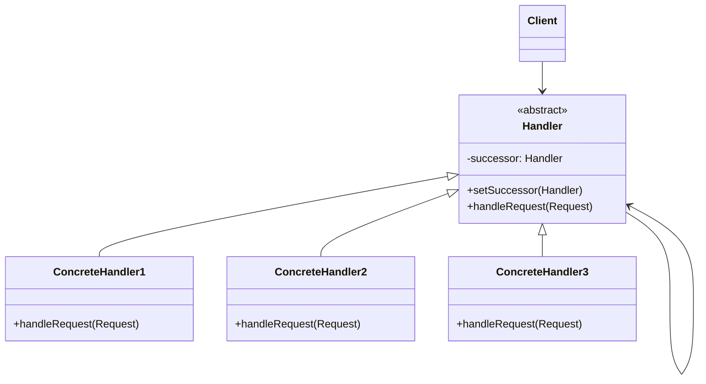

# 行为型：责任链模式 (Chain of Responsibility)

责任链模式为解除请求的发送者和接收者之间耦合，而使多个对象都有机会处理这个请求。将这些对象连成一条链，并沿着这条链传递该请求，直到有一个对象处理它为止。

**核心思想：**

- 将请求的处理者组织成一条链。
- 请求沿着链传递，每个处理者都有机会处理该请求。
- 处理者可以选择处理请求、将请求传递给下一个处理者，或者两者都做。

**应用场景：**

- 有多个的对象可以处理一个请求，哪个对象处理该请求运行时刻自动确定。
- 你想在不明确指定接收者的情况下，向多个对象中的一个提交一个请求。
- 可处理一个请求的对象集合应被动态指定。
- 当需要按照顺序执行多个处理者，或者希望动态改变处理者的顺序时。
- 当处理者的类型和数量在编译时不确定，需要在运行时动态设置时。

**结构：**

- Handler（抽象处理者）：定义一个处理请求的接口；（可选）实现后继链。
- ConcreteHandler（具体处理者）：处理它所负责的请求；可访问它的后继者；如果可处理该请求，就处理之；否则将该请求转发给它的后继者。
- Client（客户端）：向链上的具体处理者(ConcreteHandler)对象提交请求。

## 类图



## 优缺点

**优点：**

1. **解耦**：发送者和接收者之间没有强耦合关系，发送者不需要知道请求最终由谁处理。
2. **灵活性**：可以动态地改变链中的处理者，或者改变它们的顺序。
3. **责任分配**：允许多个对象对请求进行处理，而不需要显式指定接收者。
4. **增加和删除方便**：可以动态地增加或删除责任。

**缺点：**

1. **性能问题**：请求可能需要遍历很长的处理链才能被处理，影响性能。
2. **处理保证**：不保证请求一定会被处理，可能到达链尾都没有被处理。
3. **调试复杂性**：链式结构使得调试变得困难，难以跟踪请求的处理流程。

## 实现步骤

1. **定义处理者接口或抽象类**：创建包含处理请求方法和设置后继者方法的接口或抽象类。
2. **实现具体处理者类**：实现处理特定请求的具体处理者类，可以选择处理请求或将其传递给下一个处理者。
3. **构建责任链**：将处理者组织成一条链，设置每个处理者的后继者。
4. **提交请求**：将请求提交给链中的第一个处理者，让请求沿着链传递。

## 代码示例

### Java 实现

```java
// 请求类
class Request {
    private String type;
    private String content;
    private int amount;

    public Request(String type, String content, int amount) {
        this.type = type;
        this.content = content;
        this.amount = amount;
    }

    public String getType() {
        return type;
    }

    public String getContent() {
        return content;
    }

    public int getAmount() {
        return amount;
    }
}

// 抽象处理者
abstract class Handler {
    protected Handler successor;

    public void setSuccessor(Handler successor) {
        this.successor = successor;
    }

    public abstract void handleRequest(Request request);
}

// 具体处理者：部门经理
class DepartmentManager extends Handler {
    @Override
    public void handleRequest(Request request) {
        if ("请假".equals(request.getType()) && request.getAmount() <= 3) {
            System.out.println("部门经理批准了" + request.getContent() + "，天数：" + request.getAmount());
        } else if ("报销".equals(request.getType()) && request.getAmount() <= 1000) {
            System.out.println("部门经理批准了" + request.getContent() + "，金额：" + request.getAmount());
        } else if (successor != null) {
            System.out.println("部门经理无权处理，转交给上级");
            successor.handleRequest(request);
        } else {
            System.out.println("请求无法处理");
        }
    }
}

// 具体处理者：总监
class Director extends Handler {
    @Override
    public void handleRequest(Request request) {
        if ("请假".equals(request.getType()) && request.getAmount() <= 7) {
            System.out.println("总监批准了" + request.getContent() + "，天数：" + request.getAmount());
        } else if ("报销".equals(request.getType()) && request.getAmount() <= 5000) {
            System.out.println("总监批准了" + request.getContent() + "，金额：" + request.getAmount());
        } else if (successor != null) {
            System.out.println("总监无权处理，转交给上级");
            successor.handleRequest(request);
        } else {
            System.out.println("请求无法处理");
        }
    }
}

// 具体处理者：CEO
class CEO extends Handler {
    @Override
    public void handleRequest(Request request) {
        if ("请假".equals(request.getType()) && request.getAmount() <= 30) {
            System.out.println("CEO批准了" + request.getContent() + "，天数：" + request.getAmount());
        } else if ("报销".equals(request.getType()) && request.getAmount() <= 50000) {
            System.out.println("CEO批准了" + request.getContent() + "，金额：" + request.getAmount());
        } else {
            System.out.println("CEO拒绝了请求");
        }
    }
}

// 客户端代码
public class ChainOfResponsibilityDemo {
    public static void main(String[] args) {
        // 创建处理者
        Handler departmentManager = new DepartmentManager();
        Handler director = new Director();
        Handler ceo = new CEO();

        // 设置责任链
        departmentManager.setSuccessor(director);
        director.setSuccessor(ceo);

        // 创建请求
        Request leaveRequest1 = new Request("请假", "小张请假", 2);
        Request leaveRequest2 = new Request("请假", "小王请假", 5);
        Request leaveRequest3 = new Request("请假", "老李请假", 15);
        Request leaveRequest4 = new Request("请假", "小明请假", 40);

        Request expenseRequest1 = new Request("报销", "小张报销", 800);
        Request expenseRequest2 = new Request("报销", "小王报销", 3000);
        Request expenseRequest3 = new Request("报销", "老李报销", 25000);
        Request expenseRequest4 = new Request("报销", "小明报销", 80000);

        // 处理请求
        System.out.println("===== 请假请求 =====");
        departmentManager.handleRequest(leaveRequest1);
        departmentManager.handleRequest(leaveRequest2);
        departmentManager.handleRequest(leaveRequest3);
        departmentManager.handleRequest(leaveRequest4);

        System.out.println("\n===== 报销请求 =====");
        departmentManager.handleRequest(expenseRequest1);
        departmentManager.handleRequest(expenseRequest2);
        departmentManager.handleRequest(expenseRequest3);
        departmentManager.handleRequest(expenseRequest4);
    }
}
```

### JavaScript 实现

```javascript
// 请求类
class Request {
  constructor(type, content, amount) {
    this.type = type;
    this.content = content;
    this.amount = amount;
  }
}

// 处理者基类
class Handler {
  constructor() {
    this.successor = null;
  }

  setSuccessor(successor) {
    this.successor = successor;
  }

  handleRequest(request) {
    throw new Error("子类必须实现handleRequest方法");
  }
}

// 具体处理者：部门经理
class DepartmentManager extends Handler {
  handleRequest(request) {
    if (request.type === "请假" && request.amount <= 3) {
      console.log(`部门经理批准了${request.content}，天数：${request.amount}`);
    } else if (request.type === "报销" && request.amount <= 1000) {
      console.log(`部门经理批准了${request.content}，金额：${request.amount}`);
    } else if (this.successor) {
      console.log("部门经理无权处理，转交给上级");
      this.successor.handleRequest(request);
    } else {
      console.log("请求无法处理");
    }
  }
}

// 具体处理者：总监
class Director extends Handler {
  handleRequest(request) {
    if (request.type === "请假" && request.amount <= 7) {
      console.log(`总监批准了${request.content}，天数：${request.amount}`);
    } else if (request.type === "报销" && request.amount <= 5000) {
      console.log(`总监批准了${request.content}，金额：${request.amount}`);
    } else if (this.successor) {
      console.log("总监无权处理，转交给上级");
      this.successor.handleRequest(request);
    } else {
      console.log("请求无法处理");
    }
  }
}

// 具体处理者：CEO
class CEO extends Handler {
  handleRequest(request) {
    if (request.type === "请假" && request.amount <= 30) {
      console.log(`CEO批准了${request.content}，天数：${request.amount}`);
    } else if (request.type === "报销" && request.amount <= 50000) {
      console.log(`CEO批准了${request.content}，金额：${request.amount}`);
    } else {
      console.log("CEO拒绝了请求");
    }
  }
}

// 客户端代码
function run() {
  // 创建处理者
  const departmentManager = new DepartmentManager();
  const director = new Director();
  const ceo = new CEO();

  // 设置责任链
  departmentManager.setSuccessor(director);
  director.setSuccessor(ceo);

  // 创建请求
  const leaveRequest1 = new Request("请假", "小张请假", 2);
  const leaveRequest2 = new Request("请假", "小王请假", 5);
  const leaveRequest3 = new Request("请假", "老李请假", 15);
  const leaveRequest4 = new Request("请假", "小明请假", 40);

  const expenseRequest1 = new Request("报销", "小张报销", 800);
  const expenseRequest2 = new Request("报销", "小王报销", 3000);
  const expenseRequest3 = new Request("报销", "老李报销", 25000);
  const expenseRequest4 = new Request("报销", "小明报销", 80000);

  // 处理请求
  console.log("===== 请假请求 =====");
  departmentManager.handleRequest(leaveRequest1);
  departmentManager.handleRequest(leaveRequest2);
  departmentManager.handleRequest(leaveRequest3);
  departmentManager.handleRequest(leaveRequest4);

  console.log("\n===== 报销请求 =====");
  departmentManager.handleRequest(expenseRequest1);
  departmentManager.handleRequest(expenseRequest2);
  departmentManager.handleRequest(expenseRequest3);
  departmentManager.handleRequest(expenseRequest4);
}

run();
```

## 责任链模式的变体

### 1. 纯的责任链模式

在纯的责任链模式中，请求要么被处理者处理，要么被传递给下一个处理者，不会同时做这两件事：

```java
@Override
public void handleRequest(Request request) {
    if (canHandle(request)) {
        // 处理请求
        processRequest(request);
    } else if (successor != null) {
        // 传递给下一个处理者
        successor.handleRequest(request);
    }
}
```

### 2. 带有查找表的责任链

有时候可以使用查找表（Map）来代替责任链，根据请求类型直接找到对应的处理者：

```java
Map<String, Handler> handlerMap = new HashMap<>();
handlerMap.put("请假", new LeaveRequestHandler());
handlerMap.put("报销", new ExpenseRequestHandler());

// 根据请求类型直接查找处理者
Handler handler = handlerMap.get(request.getType());
if (handler != null) {
    handler.handleRequest(request);
}
```

### 3. 责任链与命令模式结合

可以将责任链与命令模式结合，创建一个处理者链来处理命令对象：

```java
// 命令接口
interface Command {
    void execute();
}

// 抽象处理者
abstract class CommandHandler {
    protected CommandHandler successor;

    public void setSuccessor(CommandHandler successor) {
        this.successor = successor;
    }

    public abstract void handleCommand(Command command);
}
```

## 实际应用场景

1. **日志记录系统**：根据日志级别（Debug、Info、Warning、Error）选择不同的日志处理器。
2. **异常处理机制**：按照异常类型的层次结构依次尝试处理异常。
3. **Web 服务器中的过滤器和拦截器**：HTTP 请求按顺序通过一系列过滤器进行处理。
4. **UI 事件处理**：GUI 应用中的事件冒泡和捕获过程就是一种责任链模式。
5. **审批系统**：如上面示例中的请假和报销审批流程。
6. **过滤器链**：如在 Java Web 开发中的 Filter 链，对请求和响应进行预处理和后处理。

## 与其他模式的关系

1. **命令模式**：责任链的处理者可以实现为命令的接收者，而命令本身可以作为请求在责任链中传递。
2. **组合模式**：责任链通常与组合模式结合使用，父组件将请求传递给其子组件。
3. **装饰器模式**：责任链和装饰器模式都基于递归组合，但责任链上的处理者可以独自处理请求，而不像装饰器必须依赖于被装饰的组件。
4. **观察者模式**：责任链可以与观察者模式结合，当处理者处理完请求后，可以通知订阅者。

## 总结

责任链模式是一种行为设计模式，它通过将请求沿着处理者链进行传递，直到有一个处理者能够处理它为止，从而避免请求的发送者和接收者之间的直接耦合。这种模式在处理多种条件的判断场景中特别有用，可以避免大量的条件判断语句，使代码更加清晰和可维护。虽然责任链模式可能导致请求处理的性能下降，但在需要灵活处理请求、动态调整处理逻辑的场景中，它的优势是显而易见的。
