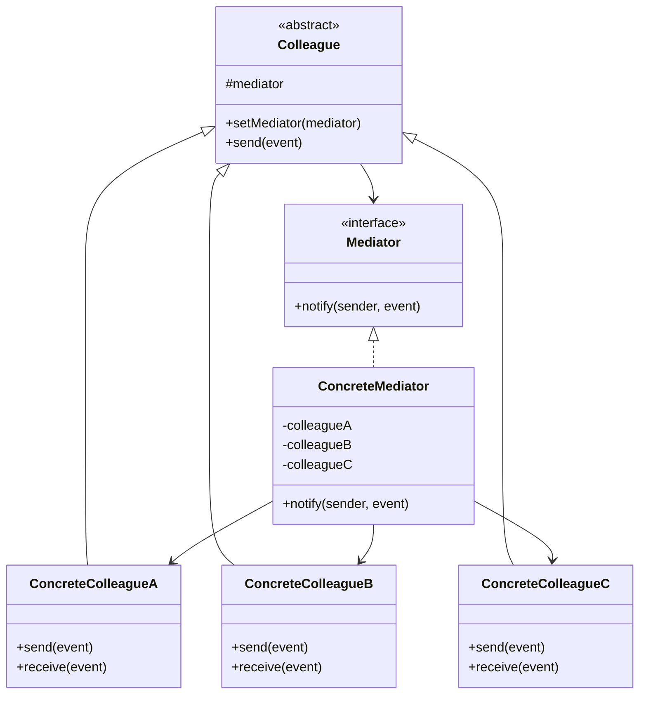

# 行为型：中介者模式 (Mediator)

中介者模式用一个中介对象来封装一系列的对象交互。中介者使各对象不需要显式地相互引用，从而使其耦合松散，而且可以独立地改变它们之间的交互。

**核心思想：**

- 引入一个中介者对象，所有的同事（Colleague）对象都只与中介者通信，而不是相互通信。
- 中介者协调各个同事对象之间的交互。
- 将网状的交互结构变为星型的交互结构。

**应用场景：**

- 一组对象以定义良好但是复杂的方式进行通信。产生的相互依赖关系结构混乱且难以理解。
- 一个对象引用其他很多对象并且直接与这些对象通信,导致难以复用该对象。
- 想定制一个分布在多个类中的行为，而又不想生成太多的子类。
- 对象之间的交互行为变化很大，不希望在抽象类中确定这些行为，而想在运行时动态配置它们。

**结构：**

- Mediator（抽象中介者）：定义一个接口用于与各 Colleague 对象通信。
- ConcreteMediator（具体中介者）：通过协调各 Colleague 对象实现协作行为；了解并维护它的各个 Colleague。
- Colleague（抽象同事类）：定义每个同事对象的接口。
- ConcreteColleague（具体同事类）：每一个同事类都知道它的中介者对象；每一个同事对象在需与其他的同事通信的时候，与它的中介者通信。

## 类图



## 优缺点

**优点：**

1. **松耦合**：降低了对象之间的直接耦合关系，使系统更易于维护。
2. **集中控制**：将对象交互的控制逻辑集中在中介者中，使逻辑更加清晰。
3. **扩展性**：可以通过增加新的中介者类来增加新的行为，而不需要修改已有代码。
4. **简化对象通信协议**：将多对多的通信转变为一对多的通信。

**缺点：**

1. **中介者复杂化**：中介者可能会变得非常复杂，承担了过多的功能，成为一个"上帝类"。
2. **维护困难**：如果系统组件数量过多，中介者可能会变得难以维护和调试。
3. **性能影响**：所有交互都需要经过中介者，可能会影响系统性能。

## 实现步骤

1. **确定对象间的交互**：分析系统中哪些对象需要交互，以及它们之间的交互方式。
2. **定义中介者接口**：创建一个中介者接口，包含处理对象间交互的方法。
3. **创建具体中介者**：实现中介者接口，负责协调各个对象之间的交互。
4. **定义同事类接口**：定义同事类的通用行为，通常包括与中介者交互的方法。
5. **实现具体同事类**：实现同事类接口，所有交互都通过中介者进行。
6. **组装系统**：将同事对象注册到中介者，让中介者管理它们之间的交互。

## 代码示例

### Java 实现

```java
// 抽象中介者
interface Mediator {
    void notify(Colleague sender, String event);
}

// 抽象同事类
abstract class Colleague {
    protected Mediator mediator;

    public void setMediator(Mediator mediator) {
        this.mediator = mediator;
    }

    public abstract void send(String event);
    public abstract void receive(String event);
}

// 具体同事类A
class ConcreteColleagueA extends Colleague {
    @Override
    public void send(String event) {
        System.out.println("同事A发送消息: " + event);
        mediator.notify(this, event);
    }

    @Override
    public void receive(String event) {
        System.out.println("同事A收到消息: " + event);
    }
}

// 具体同事类B
class ConcreteColleagueB extends Colleague {
    @Override
    public void send(String event) {
        System.out.println("同事B发送消息: " + event);
        mediator.notify(this, event);
    }

    @Override
    public void receive(String event) {
        System.out.println("同事B收到消息: " + event);
    }
}

// 具体同事类C
class ConcreteColleagueC extends Colleague {
    @Override
    public void send(String event) {
        System.out.println("同事C发送消息: " + event);
        mediator.notify(this, event);
    }

    @Override
    public void receive(String event) {
        System.out.println("同事C收到消息: " + event);
    }
}

// 具体中介者
class ConcreteMediator implements Mediator {
    private ConcreteColleagueA colleagueA;
    private ConcreteColleagueB colleagueB;
    private ConcreteColleagueC colleagueC;

    public void setColleagueA(ConcreteColleagueA colleagueA) {
        this.colleagueA = colleagueA;
        colleagueA.setMediator(this);
    }

    public void setColleagueB(ConcreteColleagueB colleagueB) {
        this.colleagueB = colleagueB;
        colleagueB.setMediator(this);
    }

    public void setColleagueC(ConcreteColleagueC colleagueC) {
        this.colleagueC = colleagueC;
        colleagueC.setMediator(this);
    }

    @Override
    public void notify(Colleague sender, String event) {
        if (sender == colleagueA) {
            // 同事A发送的消息，通知B和C
            colleagueB.receive(event);
            colleagueC.receive(event);
        } else if (sender == colleagueB) {
            // 同事B发送的消息，通知A和C
            colleagueA.receive(event);
            colleagueC.receive(event);
        } else if (sender == colleagueC) {
            // 同事C发送的消息，通知A和B
            colleagueA.receive(event);
            colleagueB.receive(event);
        }
    }
}

// 聊天室示例
interface ChatRoom {
    void sendMessage(String message, User user);
    void addUser(User user);
}

class User {
    private String name;
    private ChatRoom chatRoom;

    public User(String name) {
        this.name = name;
    }

    public void setChatRoom(ChatRoom chatRoom) {
        this.chatRoom = chatRoom;
    }

    public String getName() {
        return name;
    }

    public void send(String message) {
        System.out.println(name + " 发送消息: " + message);
        chatRoom.sendMessage(message, this);
    }

    public void receive(String message) {
        System.out.println(name + " 收到消息: " + message);
    }
}

class ChatRoomImpl implements ChatRoom {
    private List<User> users = new ArrayList<>();

    @Override
    public void addUser(User user) {
        users.add(user);
        user.setChatRoom(this);
        System.out.println(user.getName() + " 加入聊天室");
    }

    @Override
    public void sendMessage(String message, User sender) {
        for (User user : users) {
            // 消息不发送给发送者自己
            if (user != sender) {
                user.receive(message);
            }
        }
    }
}

// 客户端代码
public class MediatorPatternDemo {
    public static void main(String[] args) {
        // 基本示例
        ConcreteMediator mediator = new ConcreteMediator();

        ConcreteColleagueA colleagueA = new ConcreteColleagueA();
        ConcreteColleagueB colleagueB = new ConcreteColleagueB();
        ConcreteColleagueC colleagueC = new ConcreteColleagueC();

        mediator.setColleagueA(colleagueA);
        mediator.setColleagueB(colleagueB);
        mediator.setColleagueC(colleagueC);

        colleagueA.send("同事A的消息");
        System.out.println();

        colleagueB.send("同事B的消息");
        System.out.println();

        // 聊天室示例
        System.out.println("\n===== 聊天室示例 =====");
        ChatRoom chatRoom = new ChatRoomImpl();

        User user1 = new User("张三");
        User user2 = new User("李四");
        User user3 = new User("王五");

        chatRoom.addUser(user1);
        chatRoom.addUser(user2);
        chatRoom.addUser(user3);

        user1.send("大家好！");
        user2.send("你好，张三！");
    }
}
```

### JavaScript 实现

```javascript
// 中介者接口（在JavaScript中通过约定实现）
class Mediator {
  notify(sender, event) {
    throw new Error("子类必须实现notify方法");
  }
}

// 抽象同事类
class Colleague {
  constructor() {
    this.mediator = null;
  }

  setMediator(mediator) {
    this.mediator = mediator;
  }

  send(event) {
    throw new Error("子类必须实现send方法");
  }

  receive(event) {
    throw new Error("子类必须实现receive方法");
  }
}

// 具体同事类A
class ConcreteColleagueA extends Colleague {
  send(event) {
    console.log(`同事A发送消息: ${event}`);
    this.mediator.notify(this, event);
  }

  receive(event) {
    console.log(`同事A收到消息: ${event}`);
  }
}

// 具体同事类B
class ConcreteColleagueB extends Colleague {
  send(event) {
    console.log(`同事B发送消息: ${event}`);
    this.mediator.notify(this, event);
  }

  receive(event) {
    console.log(`同事B收到消息: ${event}`);
  }
}

// 具体同事类C
class ConcreteColleagueC extends Colleague {
  send(event) {
    console.log(`同事C发送消息: ${event}`);
    this.mediator.notify(this, event);
  }

  receive(event) {
    console.log(`同事C收到消息: ${event}`);
  }
}

// 具体中介者
class ConcreteMediator extends Mediator {
  constructor() {
    super();
    this.colleagueA = null;
    this.colleagueB = null;
    this.colleagueC = null;
  }

  setColleagueA(colleague) {
    this.colleagueA = colleague;
    colleague.setMediator(this);
  }

  setColleagueB(colleague) {
    this.colleagueB = colleague;
    colleague.setMediator(this);
  }

  setColleagueC(colleague) {
    this.colleagueC = colleague;
    colleague.setMediator(this);
  }

  notify(sender, event) {
    if (sender === this.colleagueA) {
      // 同事A发送的消息，通知B和C
      this.colleagueB.receive(event);
      this.colleagueC.receive(event);
    } else if (sender === this.colleagueB) {
      // 同事B发送的消息，通知A和C
      this.colleagueA.receive(event);
      this.colleagueC.receive(event);
    } else if (sender === this.colleagueC) {
      // 同事C发送的消息，通知A和B
      this.colleagueA.receive(event);
      this.colleagueB.receive(event);
    }
  }
}

// 聊天室示例
class ChatRoom {
  constructor() {
    this.users = [];
  }

  addUser(user) {
    this.users.push(user);
    user.setChatRoom(this);
    console.log(`${user.getName()} 加入聊天室`);
  }

  sendMessage(message, sender) {
    this.users.forEach((user) => {
      // 消息不发送给发送者自己
      if (user !== sender) {
        user.receive(message);
      }
    });
  }
}

class User {
  constructor(name) {
    this.name = name;
    this.chatRoom = null;
  }

  setChatRoom(chatRoom) {
    this.chatRoom = chatRoom;
  }

  getName() {
    return this.name;
  }

  send(message) {
    console.log(`${this.name} 发送消息: ${message}`);
    this.chatRoom.sendMessage(message, this);
  }

  receive(message) {
    console.log(`${this.name} 收到消息: ${message}`);
  }
}

// 客户端代码
function run() {
  // 基本示例
  const mediator = new ConcreteMediator();

  const colleagueA = new ConcreteColleagueA();
  const colleagueB = new ConcreteColleagueB();
  const colleagueC = new ConcreteColleagueC();

  mediator.setColleagueA(colleagueA);
  mediator.setColleagueB(colleagueB);
  mediator.setColleagueC(colleagueC);

  colleagueA.send("同事A的消息");
  console.log();

  colleagueB.send("同事B的消息");
  console.log();

  // 聊天室示例
  console.log("\n===== 聊天室示例 =====");
  const chatRoom = new ChatRoom();

  const user1 = new User("张三");
  const user2 = new User("李四");
  const user3 = new User("王五");

  chatRoom.addUser(user1);
  chatRoom.addUser(user2);
  chatRoom.addUser(user3);

  user1.send("大家好！");
  user2.send("你好，张三！");
}

run();
```

## 实际应用场景

1. **GUI 框架**：窗口、按钮、文本框等组件之间的交互通常通过中介者模式实现，如 MVC 架构中的控制器。
2. **聊天应用**：如上面示例中的聊天室，用户之间通过聊天室中介者进行通信。
3. **空中交通管制系统**：飞机之间不直接通信，而是通过塔台（中介者）进行协调。
4. **游戏引擎**：游戏对象之间的交互通常通过游戏引擎作为中介。
5. **中间件系统**：如消息队列、事件总线等，充当应用程序组件之间的中介者。
6. **前端框架**：如 Vue、React 等框架中的状态管理工具（Vuex、Redux）扮演着中介者的角色。

## 中介者模式与其他模式的关系

1. **外观模式**：两者都试图简化组件间的交互，但外观模式提供简化的接口访问子系统，而中介者模式改变子系统组件间的交互方式。
2. **观察者模式**：中介者可以用观察者模式实现，即各个同事对象作为中介者的观察者。
3. **命令模式**：中介者可以使用命令模式来封装对同事对象的请求。
4. **单例模式**：中介者通常实现为单例，确保系统中只有一个中介者实例。

## 变体和改进

### 1. 事件驱动型中介者

利用事件机制实现中介者模式：

```javascript
class EventMediator {
  constructor() {
    this.events = {};
  }

  subscribe(event, callback) {
    if (!this.events[event]) {
      this.events[event] = [];
    }
    this.events[event].push(callback);
  }

  publish(event, data) {
    if (this.events[event]) {
      this.events[event].forEach((callback) => callback(data));
    }
  }
}
```

### 2. 集中式中介者

将所有交互逻辑都集中在中介者中，同事对象变得非常轻量：

```java
class CentralizedMediator {
    private Map<String, Colleague> colleagues = new HashMap<>();

    public void register(String id, Colleague colleague) {
        colleagues.put(id, colleague);
        colleague.setMediator(this);
    }

    public void sendMessage(String fromId, String toId, String message) {
        Colleague receiver = colleagues.get(toId);
        if (receiver != null) {
            receiver.receive(message);
        }
    }

    public void broadcastMessage(String fromId, String message) {
        for (Map.Entry<String, Colleague> entry : colleagues.entrySet()) {
            if (!entry.getKey().equals(fromId)) {
                entry.getValue().receive(message);
            }
        }
    }
}
```

## 总结

中介者模式是一种行为设计模式，通过引入一个中介对象来集中处理对象之间的交互，从而减少对象之间的直接耦合。这种模式在处理复杂的对象交互关系时特别有用，可以将网状的交互结构转变为更容易管理的星型结构。

虽然中介者模式可能导致中介者本身变得复杂，但在系统对象之间存在复杂交互的场景中，使用中介者模式可以大大简化系统设计，提高代码的可维护性和可扩展性。在实际应用中，通常需要根据系统的具体需求，权衡使用中介者模式的利弊。
