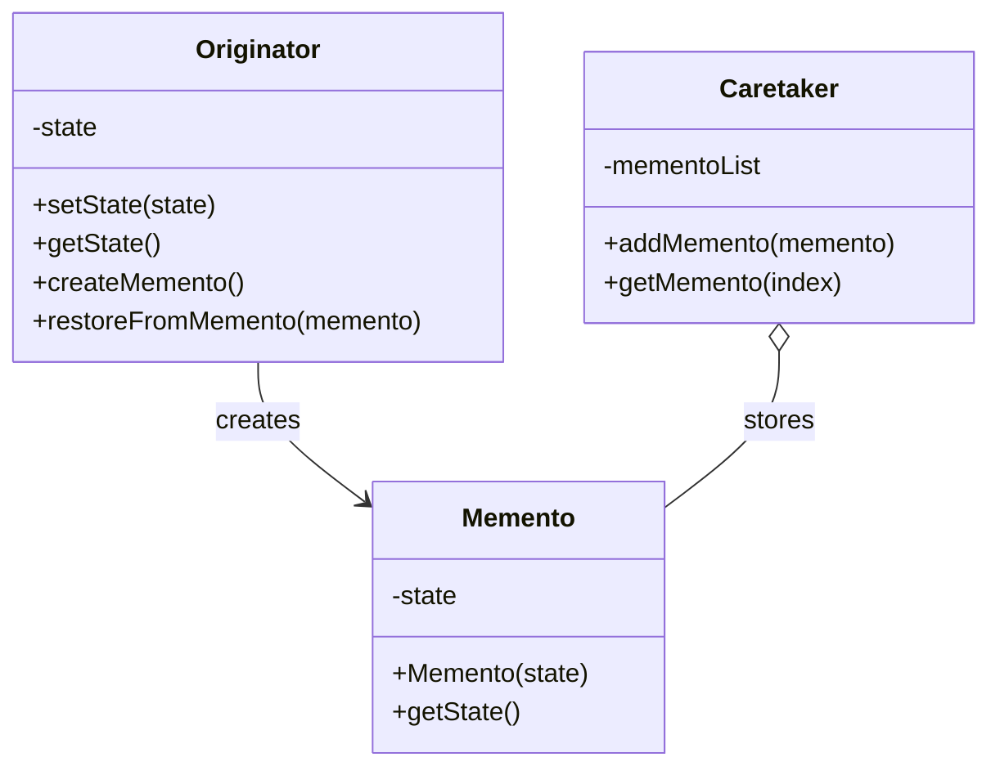

# 行为型：备忘录模式 (Memento)

备忘录模式在不破坏封装性的前提下，捕获一个对象的内部状态，并在该对象之外保存这个状态。这样以后就可将该对象恢复到原先保存的状态。

**核心思想：**

- **Originator (发起人):** 需要被保存状态的对象。它创建一个备忘录对象来记录其当前状态，并可以使用备忘录对象来恢复其之前的状态。
- **Memento (备忘录):** 存储 Originator 对象的内部状态。备忘录应保护其内容不被 Originator 以外的对象访问。通常备忘录有两个接口：一个宽接口供 Originator 访问（可以读取和写入状态），一个窄接口供 Caretaker 访问（只能传递备忘录）。
- **Caretaker (负责人):** 负责保存好备忘录对象，但不能对备忘录的内容进行操作或检查。

**应用场景：**

- 必须保存一个对象在某一个时刻的(部分)状态, 这样以后需要时它才能恢复到先前的状态。例如，实现撤销（Undo）操作。
- 如果一个用接口来让其它对象直接得到这些状态，将会暴露对象的实现细节并破坏对象的封装性。
- 需要创建对象状态的快照，用于支持回滚、恢复或历史记录功能。
- 对象的状态需要在不暴露其内部实现的情况下保存和恢复。

**结构：**

- Originator（发起人）：创建一个备忘录,用以记录当前时刻它的内部状态；使用备忘录恢复内部状态。
- Memento（备忘录）：存储发起人对象的内部状态；防止发起人以外的其他对象访问备忘录。
- Caretaker（负责人）：负责保存好备忘录；不能对备忘录的内容进行操作或检查。

## 类图



## 优缺点

**优点：**

1. **封装性**：保持对象的封装性，不暴露对象的内部实现。
2. **提供回滚机制**：允许对象的状态恢复到之前的状态，实现撤销、恢复功能。
3. **简化发起人**：发起人不需要关心状态的保存细节，状态管理由负责人负责。
4. **状态快照**：提供了一种可靠的方式来获取对象的状态快照。

**缺点：**

1. **资源消耗**：如果对象状态很大或者需要频繁创建备忘录，可能会消耗大量内存。
2. **维护成本**：Caretaker 需要知道什么时候应该保存或恢复 Originator 的状态，增加了系统的复杂性。
3. **可能破坏封装性**：如果备忘录需要存储大量的细节，可能会间接暴露发起人的实现细节。

## 实现步骤

1. **创建备忘录类**：定义一个备忘录类，用于存储发起人对象的状态。
2. **创建发起人类**：实现创建备忘录和从备忘录恢复状态的方法。
3. **创建负责人类**：负责存储和管理备忘录对象，但不能操作备忘录内容。
4. **客户端代码**：协调发起人和负责人来实现状态的保存和恢复。

## 代码示例

### Java 实现

```java
// 备忘录类 - 存储游戏角色的状态
class GameMemento {
    private int level;
    private int health;
    private int mana;

    public GameMemento(int level, int health, int mana) {
        this.level = level;
        this.health = health;
        this.mana = mana;
    }

    // 提供给Originator访问的方法（宽接口）
    public int getLevel() {
        return level;
    }

    public int getHealth() {
        return health;
    }

    public int getMana() {
        return mana;
    }
}

// 发起人类 - 游戏角色
class GameRole {
    private int level;
    private int health;
    private int mana;

    public void setAttributes(int level, int health, int mana) {
        this.level = level;
        this.health = health;
        this.mana = mana;
    }

    public void showAttributes() {
        System.out.println("当前状态 - 等级: " + level + ", 血量: " + health + ", 魔法值: " + mana);
    }

    // 创建备忘录，保存当前状态
    public GameMemento saveStateToMemento() {
        return new GameMemento(level, health, mana);
    }

    // 从备忘录恢复状态
    public void restoreStateFromMemento(GameMemento memento) {
        this.level = memento.getLevel();
        this.health = memento.getHealth();
        this.mana = memento.getMana();
    }

    // 模拟战斗，角色状态改变
    public void fight() {
        this.health -= 30;
        this.mana -= 20;
        System.out.println("战斗后 - 血量减少30，魔法值减少20");
    }

    // 模拟升级
    public void levelUp() {
        this.level += 1;
        this.health += 50;
        this.mana += 30;
        System.out.println("升级后 - 等级+1，血量+50，魔法值+30");
    }
}

// 负责人类 - 游戏存档管理
class GameCaretaker {
    private List<GameMemento> mementoList = new ArrayList<>();

    public void addMemento(GameMemento memento) {
        mementoList.add(memento);
    }

    public GameMemento getMemento(int index) {
        if (index >= 0 && index < mementoList.size()) {
            return mementoList.get(index);
        }
        return null;
    }
}

// 文本编辑器的备忘录模式实现
class EditorMemento {
    private String content;

    public EditorMemento(String content) {
        this.content = content;
    }

    public String getContent() {
        return content;
    }
}

class TextEditor {
    private String content;

    public void setContent(String content) {
        this.content = content;
    }

    public String getContent() {
        return content;
    }

    public void showContent() {
        System.out.println("编辑器内容: " + content);
    }

    // 创建备忘录
    public EditorMemento save() {
        return new EditorMemento(content);
    }

    // 从备忘录恢复
    public void restore(EditorMemento memento) {
        this.content = memento.getContent();
    }
}

class History {
    private Stack<EditorMemento> mementos = new Stack<>();

    public void push(EditorMemento memento) {
        mementos.push(memento);
    }

    public EditorMemento pop() {
        if (!mementos.isEmpty()) {
            return mementos.pop();
        }
        return null;
    }
}

// 客户端代码
public class MementoPatternDemo {
    public static void main(String[] args) {
        // 游戏角色示例
        System.out.println("===== 游戏角色状态管理 =====");
        GameRole gameRole = new GameRole();
        GameCaretaker caretaker = new GameCaretaker();

        // 初始状态
        gameRole.setAttributes(1, 100, 100);
        System.out.println("初始状态：");
        gameRole.showAttributes();

        // 保存初始状态
        caretaker.addMemento(gameRole.saveStateToMemento());

        // 战斗后状态改变
        gameRole.fight();
        gameRole.showAttributes();

        // 保存战斗后状态
        caretaker.addMemento(gameRole.saveStateToMemento());

        // 升级
        gameRole.levelUp();
        gameRole.showAttributes();

        // 保存升级后状态
        caretaker.addMemento(gameRole.saveStateToMemento());

        // 再次战斗
        gameRole.fight();
        gameRole.showAttributes();

        // 恢复到初始状态
        System.out.println("\n恢复到初始状态：");
        gameRole.restoreStateFromMemento(caretaker.getMemento(0));
        gameRole.showAttributes();

        // 恢复到战斗后状态
        System.out.println("\n恢复到战斗后状态：");
        gameRole.restoreStateFromMemento(caretaker.getMemento(1));
        gameRole.showAttributes();

        // 恢复到升级后状态
        System.out.println("\n恢复到升级后状态：");
        gameRole.restoreStateFromMemento(caretaker.getMemento(2));
        gameRole.showAttributes();

        // 文本编辑器示例
        System.out.println("\n\n===== 文本编辑器撤销功能 =====");
        TextEditor editor = new TextEditor();
        History history = new History();

        // 初始文本
        editor.setContent("Hello");
        history.push(editor.save());
        editor.showContent();

        // 编辑文本
        editor.setContent("Hello World");
        history.push(editor.save());
        editor.showContent();

        // 再次编辑
        editor.setContent("Hello World! How are you?");
        history.push(editor.save());
        editor.showContent();

        // 撤销操作 - 回到上一步
        System.out.println("\n撤销一次：");
        editor.restore(history.pop());
        editor.showContent();

        // 再次撤销 - 回到初始状态
        System.out.println("\n再次撤销：");
        editor.restore(history.pop());
        editor.showContent();
    }
}
```

### JavaScript 实现

```javascript
// 备忘录类
class Memento {
  constructor(state) {
    this.state = state;
  }

  getState() {
    return this.state;
  }
}

// 发起人类
class Originator {
  constructor() {
    this.state = null;
  }

  setState(state) {
    this.state = state;
    console.log(`设置状态: ${state}`);
  }

  getState() {
    return this.state;
  }

  saveStateToMemento() {
    console.log(`保存状态: ${this.state}`);
    return new Memento(this.state);
  }

  restoreFromMemento(memento) {
    this.state = memento.getState();
    console.log(`从备忘录恢复状态: ${this.state}`);
  }
}

// 负责人类
class Caretaker {
  constructor() {
    this.mementoList = [];
  }

  addMemento(memento) {
    this.mementoList.push(memento);
  }

  getMemento(index) {
    if (index >= 0 && index < this.mementoList.length) {
      return this.mementoList[index];
    }
    return null;
  }
}

// 画板应用示例
class DrawingState {
  constructor(shapes) {
    // 深拷贝形状数组
    this.shapes = JSON.parse(JSON.stringify(shapes));
  }

  getShapes() {
    return this.shapes;
  }
}

class DrawingApp {
  constructor() {
    this.shapes = [];
    this.history = [];
    this.currentIndex = -1;
  }

  addShape(shape) {
    this.shapes.push(shape);
    console.log(`添加形状: ${shape.type} at (${shape.x}, ${shape.y})`);
    this.saveState();
  }

  removeLastShape() {
    if (this.shapes.length > 0) {
      const removed = this.shapes.pop();
      console.log(`移除形状: ${removed.type}`);
      this.saveState();
    }
  }

  moveShape(index, newX, newY) {
    if (index >= 0 && index < this.shapes.length) {
      const shape = this.shapes[index];
      console.log(
        `移动形状: ${shape.type} 从 (${shape.x}, ${shape.y}) 到 (${newX}, ${newY})`
      );
      shape.x = newX;
      shape.y = newY;
      this.saveState();
    }
  }

  saveState() {
    // 保存当前状态，丢弃当前索引后的所有状态
    this.history = this.history.slice(0, this.currentIndex + 1);
    this.history.push(new DrawingState(this.shapes));
    this.currentIndex = this.history.length - 1;
    console.log(`保存状态 #${this.currentIndex}`);
  }

  undo() {
    if (this.currentIndex > 0) {
      this.currentIndex--;
      const memento = this.history[this.currentIndex];
      this.shapes = memento.getShapes();
      console.log(`撤销到状态 #${this.currentIndex}`);
      return true;
    }
    console.log("没有更多可撤销的操作");
    return false;
  }

  redo() {
    if (this.currentIndex < this.history.length - 1) {
      this.currentIndex++;
      const memento = this.history[this.currentIndex];
      this.shapes = memento.getShapes();
      console.log(`重做到状态 #${this.currentIndex}`);
      return true;
    }
    console.log("没有更多可重做的操作");
    return false;
  }

  printShapes() {
    console.log("当前画板状态:");
    if (this.shapes.length === 0) {
      console.log("  (空)");
    } else {
      this.shapes.forEach((shape, index) => {
        console.log(
          `  ${index + 1}. ${shape.type} at (${shape.x}, ${shape.y})`
        );
      });
    }
  }
}

// 客户端代码
function run() {
  // 基本示例
  console.log("===== 基本备忘录模式示例 =====");
  const originator = new Originator();
  const caretaker = new Caretaker();

  originator.setState("状态 #1");
  caretaker.addMemento(originator.saveStateToMemento());

  originator.setState("状态 #2");
  caretaker.addMemento(originator.saveStateToMemento());

  originator.setState("状态 #3");
  caretaker.addMemento(originator.saveStateToMemento());

  originator.setState("状态 #4");

  console.log("\n恢复到状态 #2");
  originator.restoreFromMemento(caretaker.getMemento(1));

  // 画板应用示例
  console.log("\n\n===== 画板应用示例 =====");
  const drawingApp = new DrawingApp();

  // 添加形状
  drawingApp.addShape({ type: "矩形", x: 10, y: 10 });
  drawingApp.addShape({ type: "圆形", x: 20, y: 20 });
  drawingApp.printShapes();

  // 移动形状
  drawingApp.moveShape(1, 30, 30);
  drawingApp.printShapes();

  // 添加另一个形状
  drawingApp.addShape({ type: "三角形", x: 40, y: 40 });
  drawingApp.printShapes();

  // 撤销操作
  console.log("\n撤销一次：");
  drawingApp.undo();
  drawingApp.printShapes();

  // 再次撤销
  console.log("\n再次撤销：");
  drawingApp.undo();
  drawingApp.printShapes();

  // 重做操作
  console.log("\n重做一次：");
  drawingApp.redo();
  drawingApp.printShapes();
}

run();
```

## 变体与改进

### 1. 多级撤销与重做

扩展备忘录模式以支持多级撤销和重做：

```java
class History {
    private Stack<Memento> undoStack = new Stack<>();
    private Stack<Memento> redoStack = new Stack<>();

    public void save(Memento memento) {
        undoStack.push(memento);
        // 清空重做栈
        redoStack.clear();
    }

    public Memento undo() {
        if (undoStack.isEmpty()) {
            return null;
        }
        Memento memento = undoStack.pop();
        redoStack.push(memento);
        return undoStack.isEmpty() ? null : undoStack.peek();
    }

    public Memento redo() {
        if (redoStack.isEmpty()) {
            return null;
        }
        Memento memento = redoStack.pop();
        undoStack.push(memento);
        return memento;
    }
}
```

### 2. 增量备忘录

仅保存发生变化的部分，而不是整个状态：

```java
class IncrementalMemento {
    private Map<String, Object> changedState;

    public IncrementalMemento(Map<String, Object> changedState) {
        this.changedState = changedState;
    }

    public Map<String, Object> getChangedState() {
        return changedState;
    }
}
```

### 3. 备忘录工厂

使用工厂模式创建和管理备忘录：

```java
class MementoFactory {
    public static Memento createMemento(Originator originator) {
        return originator.createMemento();
    }

    public static void restoreMemento(Originator originator, Memento memento) {
        originator.restoreFromMemento(memento);
    }
}
```

## 实际应用场景

1. **文本编辑器**：实现撤销/重做功能，可以恢复到之前的编辑状态。
2. **游戏存档**：记录游戏状态，允许玩家回到之前的游戏点。
3. **数据库事务**：在事务开始前保存数据状态，如果事务失败则回滚。
4. **画图应用**：记录图形操作，支持撤销和重做。
5. **表单填写**：在复杂表单中保存中间状态，允许用户返回到之前的步骤。
6. **配置管理**：记录系统配置的不同版本，支持配置回滚。

## 与其他模式的关系

1. **命令模式**：命令模式可以与备忘录模式结合，通过备忘录保存命令执行前的状态，实现可撤销的命令。
2. **原型模式**：创建备忘录时，可以使用原型模式来复制对象状态。
3. **状态模式**：备忘录可以用于保存状态模式中的状态对象，实现状态的恢复。
4. **迭代器模式**：迭代器可以用于遍历和管理多个备忘录对象。

## 总结

备忘录模式是一种行为设计模式，用于在不破坏封装性的前提下捕获、保存和恢复对象的内部状态。它通过将状态保存在外部的备忘录对象中，实现了对象状态的保存和恢复功能，同时保持了对象的封装性。

这种模式在需要实现撤销/重做功能、状态回滚或历史记录功能的场景中非常有用。虽然备忘录模式可能会消耗额外的内存资源，但在需要状态恢复功能的场景中，它提供了一种优雅且封装良好的解决方案。
