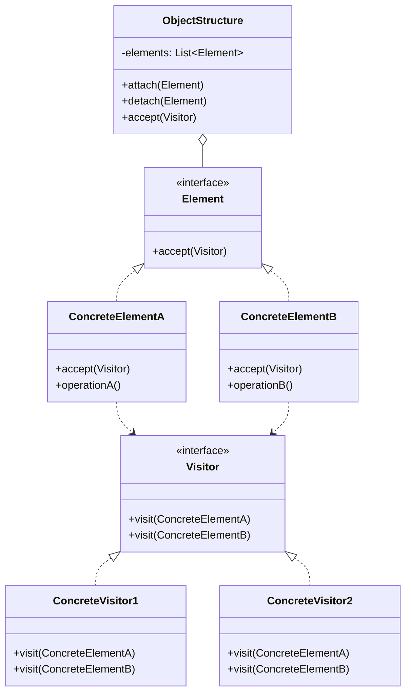

# 行为型：访问者模式 (Visitor)

访问者模式表示一个作用于某对象结构中的各元素的操作。它使你可以在不改变各元素的类的前提下定义作用于这些元素的新操作。

**核心思想：**

- 将数据结构（Element）和作用于结构上的操作（Visitor）分离。
- Element 提供一个 `accept` 方法，接收一个 Visitor 对象作为参数。
- Visitor 定义一系列 `visit` 方法，每个方法对应一个具体的 Element 类型。
- 在 `accept` 方法中，Element 调用 Visitor 的相应 `visit` 方法，并将自身（`this`）作为参数传递。
- 通过增加新的 Visitor，可以为对象结构添加新的操作，而无需修改 Element 类。

**应用场景：**

- 一个对象结构包含很多类对象，它们有不同的接口，而你想对这些对象实施一些依赖于其具体类的操作。
- 需要对一个对象结构中的对象进行很多不同的并且不相关的操作，而你想避免让这些操作"污染"这些对象的类。Visitor 使得你可以将相关的操作集中起来定义在一个类中。
- 当该对象结构被很多应用共享时，用 Visitor 模式让每个应用仅包含需要用到的操作。
- 定义对象结构的类很少改变，但经常需要在此结构上定义新的操作。
- 当需要对一个复杂对象结构中的每个节点执行一些操作，且这些操作之间彼此没有关联时。

**结构：**

- Visitor（抽象访问者）：为该对象结构中 ConcreteElement 的每一个类声明一个 Visit 操作。
- ConcreteVisitor（具体访问者）：实现每个由 Visitor 声明的操作。
- Element（抽象元素）：定义一个 Accept 操作，它以一个访问者为参数。
- ConcreteElement（具体元素）：实现 Accept 操作。
- ObjectStructure（对象结构）：能枚举它的元素；可以提供一个高层的接口以允许该访问者访问它的元素；可以是一个复合或是一个集合。

## 类图



## 优缺点

**优点：**

1. **开闭原则**：可以在不修改现有元素类的情况下，通过添加新的访问者来定义新的操作，符合开闭原则。
2. **单一职责原则**：将数据结构与数据操作分离，每个访问者类专注于特定功能，使得功能模块化，易于维护。
3. **相关操作集中**：将相关的操作集中到一个访问者类中，而不是分散在多个元素类中。
4. **双重分派**：通过双重分派机制，在运行时根据具体元素和访问者类型执行不同的操作，实现了很好的扩展性。

**缺点：**

1. **违反依赖倒置原则**：具体元素对访问者的依赖，导致添加新元素时需要修改所有的访问者，违反了依赖倒置原则。
2. **破坏封装**：元素必须暴露足够的内部细节给访问者，可能会破坏元素的封装性。
3. **复杂性**：访问者模式的实现较为复杂，涉及到双重分派，可能增加开发和理解的难度。
4. **状态改变**：如果元素的状态经常变化，可能导致访问者的兼容性问题。

## 实现步骤

1. **定义元素接口**：创建一个元素接口（Element），包含一个接受访问者的方法（accept）。
2. **实现具体元素类**：创建实现元素接口的具体元素类，实现 accept 方法，在方法中调用访问者的 visit 方法。
3. **定义访问者接口**：创建一个访问者接口（Visitor），为每种具体元素类型定义一个 visit 方法。
4. **实现具体访问者**：创建实现访问者接口的具体访问者类，实现每个 visit 方法。
5. **创建对象结构**：创建一个管理元素对象的结构，可以让访问者对象遍历所有元素。
6. **客户端代码**：创建具体访问者对象，通过对象结构让访问者访问所有元素。

## 代码示例

### Java 实现

```java
// 元素接口
interface Element {
    void accept(Visitor visitor);
}

// 具体元素A
class ConcreteElementA implements Element {
    @Override
    public void accept(Visitor visitor) {
        visitor.visit(this);
    }

    public String operationA() {
        return "ElementA的操作";
    }
}

// 具体元素B
class ConcreteElementB implements Element {
    @Override
    public void accept(Visitor visitor) {
        visitor.visit(this);
    }

    public String operationB() {
        return "ElementB的操作";
    }
}

// 访问者接口
interface Visitor {
    void visit(ConcreteElementA element);
    void visit(ConcreteElementB element);
}

// 具体访问者1
class ConcreteVisitor1 implements Visitor {
    @Override
    public void visit(ConcreteElementA element) {
        System.out.println("具体访问者1访问" + element.operationA());
    }

    @Override
    public void visit(ConcreteElementB element) {
        System.out.println("具体访问者1访问" + element.operationB());
    }
}

// 具体访问者2
class ConcreteVisitor2 implements Visitor {
    @Override
    public void visit(ConcreteElementA element) {
        System.out.println("具体访问者2访问" + element.operationA());
    }

    @Override
    public void visit(ConcreteElementB element) {
        System.out.println("具体访问者2访问" + element.operationB());
    }
}

// 对象结构
class ObjectStructure {
    private List<Element> elements = new ArrayList<>();

    public void attach(Element element) {
        elements.add(element);
    }

    public void detach(Element element) {
        elements.remove(element);
    }

    public void accept(Visitor visitor) {
        for (Element element : elements) {
            element.accept(visitor);
        }
    }
}

// 更具体的示例：文件系统访问者
interface FileSystemElement {
    void accept(FileVisitor visitor);
}

class File implements FileSystemElement {
    private String name;
    private String content;
    private int size;

    public File(String name, String content, int size) {
        this.name = name;
        this.content = content;
        this.size = size;
    }

    public String getName() {
        return name;
    }

    public String getContent() {
        return content;
    }

    public int getSize() {
        return size;
    }

    @Override
    public void accept(FileVisitor visitor) {
        visitor.visit(this);
    }
}

class Directory implements FileSystemElement {
    private String name;
    private List<FileSystemElement> children = new ArrayList<>();

    public Directory(String name) {
        this.name = name;
    }

    public String getName() {
        return name;
    }

    public void addElement(FileSystemElement element) {
        children.add(element);
    }

    public List<FileSystemElement> getChildren() {
        return children;
    }

    @Override
    public void accept(FileVisitor visitor) {
        visitor.visit(this);

        // 递归让子元素接受访问
        for (FileSystemElement element : children) {
            element.accept(visitor);
        }
    }
}

interface FileVisitor {
    void visit(File file);
    void visit(Directory directory);
}

class FileSizeVisitor implements FileVisitor {
    private int totalSize = 0;

    @Override
    public void visit(File file) {
        totalSize += file.getSize();
    }

    @Override
    public void visit(Directory directory) {
        // 目录本身不计算大小，只计算文件大小
    }

    public int getTotalSize() {
        return totalSize;
    }
}

class FileNamePrinterVisitor implements FileVisitor {
    private int indentLevel = 0;

    @Override
    public void visit(File file) {
        printIndent();
        System.out.println("文件: " + file.getName() + " (" + file.getSize() + " bytes)");
    }

    @Override
    public void visit(Directory directory) {
        printIndent();
        System.out.println("目录: " + directory.getName());
        indentLevel++;
    }

    private void printIndent() {
        for (int i = 0; i < indentLevel; i++) {
            System.out.print("  ");
        }
    }
}

// 客户端代码
public class VisitorPatternDemo {
    public static void main(String[] args) {
        // 基本示例
        ObjectStructure objectStructure = new ObjectStructure();
        objectStructure.attach(new ConcreteElementA());
        objectStructure.attach(new ConcreteElementB());

        ConcreteVisitor1 visitor1 = new ConcreteVisitor1();
        ConcreteVisitor2 visitor2 = new ConcreteVisitor2();

        System.out.println("访问者1的访问:");
        objectStructure.accept(visitor1);

        System.out.println("\n访问者2的访问:");
        objectStructure.accept(visitor2);

        // 文件系统示例
        System.out.println("\n===== 文件系统示例 =====");
        Directory rootDir = new Directory("root");
        Directory homeDir = new Directory("home");
        Directory userDir = new Directory("user");

        File fileA = new File("fileA.txt", "Hello", 5);
        File fileB = new File("fileB.doc", "World", 5);
        File fileC = new File("fileC.jpg", "Image", 10);

        rootDir.addElement(homeDir);
        homeDir.addElement(userDir);
        homeDir.addElement(fileA);
        userDir.addElement(fileB);
        userDir.addElement(fileC);

        // 使用文件名打印访问者
        FileNamePrinterVisitor printerVisitor = new FileNamePrinterVisitor();
        System.out.println("文件结构:");
        rootDir.accept(printerVisitor);

        // 使用文件大小统计访问者
        FileSizeVisitor sizeVisitor = new FileSizeVisitor();
        rootDir.accept(sizeVisitor);
        System.out.println("\n总文件大小: " + sizeVisitor.getTotalSize() + " bytes");
    }
}
```

### JavaScript 实现

```javascript
// 元素接口（在JavaScript中通过共同的方法实现）
class Element {
  accept(visitor) {
    throw new Error("子类必须实现accept方法");
  }
}

// 具体元素A
class ConcreteElementA extends Element {
  accept(visitor) {
    visitor.visitElementA(this);
  }

  operationA() {
    return "ElementA的操作";
  }
}

// 具体元素B
class ConcreteElementB extends Element {
  accept(visitor) {
    visitor.visitElementB(this);
  }

  operationB() {
    return "ElementB的操作";
  }
}

// 访问者接口
class Visitor {
  visitElementA(elementA) {
    throw new Error("子类必须实现visitElementA方法");
  }

  visitElementB(elementB) {
    throw new Error("子类必须实现visitElementB方法");
  }
}

// 具体访问者1
class ConcreteVisitor1 extends Visitor {
  visitElementA(elementA) {
    console.log(`具体访问者1访问${elementA.operationA()}`);
  }

  visitElementB(elementB) {
    console.log(`具体访问者1访问${elementB.operationB()}`);
  }
}

// 具体访问者2
class ConcreteVisitor2 extends Visitor {
  visitElementA(elementA) {
    console.log(`具体访问者2访问${elementA.operationA()}`);
  }

  visitElementB(elementB) {
    console.log(`具体访问者2访问${elementB.operationB()}`);
  }
}

// 对象结构
class ObjectStructure {
  constructor() {
    this.elements = [];
  }

  attach(element) {
    this.elements.push(element);
  }

  detach(element) {
    const index = this.elements.indexOf(element);
    if (index !== -1) {
      this.elements.splice(index, 1);
    }
  }

  accept(visitor) {
    this.elements.forEach((element) => {
      element.accept(visitor);
    });
  }
}

// DOM树访问者示例
class DOMElement {
  constructor(tagName, attributes = {}) {
    this.tagName = tagName;
    this.attributes = attributes;
    this.children = [];
  }

  addChild(child) {
    this.children.push(child);
  }

  accept(visitor) {
    visitor.visit(this);
    this.children.forEach((child) => {
      child.accept(visitor);
    });
  }
}

class DOMVisitor {
  visit(element) {
    // 默认实现，子类应该重写
  }
}

class HTMLGeneratorVisitor extends DOMVisitor {
  constructor() {
    super();
    this.html = "";
    this.indentLevel = 0;
  }

  visit(element) {
    const indent = "  ".repeat(this.indentLevel);

    // 生成开始标签
    let attributes = "";
    for (const [key, value] of Object.entries(element.attributes)) {
      attributes += ` ${key}="${value}"`;
    }

    this.html += `${indent}<${element.tagName}${attributes}>`;

    if (element.children.length > 0) {
      this.html += "\n";
      this.indentLevel++;
      // 子元素在accept方法中处理
    } else {
      this.html += `</${element.tagName}>\n`;
    }
  }

  getHTML() {
    return this.html;
  }
}

// 客户端代码
function run() {
  // 基本示例
  const objectStructure = new ObjectStructure();
  objectStructure.attach(new ConcreteElementA());
  objectStructure.attach(new ConcreteElementB());

  const visitor1 = new ConcreteVisitor1();
  const visitor2 = new ConcreteVisitor2();

  console.log("访问者1的访问:");
  objectStructure.accept(visitor1);

  console.log("\n访问者2的访问:");
  objectStructure.accept(visitor2);

  // DOM树示例
  console.log("\n===== DOM树示例 =====");
  const html = new DOMElement("html");
  const head = new DOMElement("head");
  const body = new DOMElement("body", { class: "main" });

  html.addChild(head);
  html.addChild(body);

  const title = new DOMElement("title");
  head.addChild(title);

  const h1 = new DOMElement("h1", { id: "title" });
  const p = new DOMElement("p");
  body.addChild(h1);
  body.addChild(p);

  const htmlVisitor = new HTMLGeneratorVisitor();
  html.accept(htmlVisitor);

  console.log("生成的HTML:");
  console.log(htmlVisitor.getHTML());
}

run();
```

## 双重分派机制

访问者模式使用了双重分派（Double Dispatch）机制，它是处理多态性的一种高级技术。

1. **第一次分派**：客户端调用元素的 accept 方法，根据元素的具体类型选择相应的 accept 实现。
2. **第二次分派**：元素调用访问者的 visit 方法，根据访问者的具体类型选择相应的 visit 实现。

这种机制使得系统可以根据两个对象（元素和访问者）的类型来选择正确的操作，提高了系统的灵活性和扩展性。

## 访问者模式的变体

### 无回调的访问者

在某些情况下，可以不需要元素调用访问者的方法，而是让访问者直接操作元素：

```java
interface Visitor {
    void visit(Element element);
}

class ConcreteVisitor implements Visitor {
    @Override
    public void visit(Element element) {
        if (element instanceof ConcreteElementA) {
            // 对ConcreteElementA的操作
        } else if (element instanceof ConcreteElementB) {
            // 对ConcreteElementB的操作
        }
    }
}
```

### 分层访问者

当对象结构很复杂，有多层次的元素时，可以使用分层访问者：

```java
interface Visitor {
    void beforeVisit(Element element); // 访问元素前调用
    void visit(Element element);       // 访问元素
    void afterVisit(Element element);  // 访问元素后调用
}
```

## 实际应用场景

1. **编译器**：抽象语法树的处理，不同的访问者可以对语法树执行不同的操作，如类型检查、代码生成等。
2. **文件系统**：如上面的示例，可以对文件系统执行不同的操作，如统计大小、查找特定文件等。
3. **HTML/XML 文档**：DOM 树的遍历和操作，如 HTML 生成、XML 验证等。
4. **报表生成**：对复杂的数据结构执行不同的报表生成操作。
5. **GUI 框架**：窗口部件遍历，如渲染、事件处理等。

## 与其他模式的关系

1. **组合模式**：访问者模式常与组合模式结合使用，访问者可以遍历组合结构中的所有元素。
2. **迭代器模式**：访问者模式使用了迭代器模式的思想，对一组对象进行遍历。
3. **解释器模式**：在解释器模式中，可以使用访问者模式来解释不同类型的节点。
4. **命令模式**：访问者可以看作是一种特殊的命令，执行对不同对象的操作。

## 总结

访问者模式是一种强大但复杂的设计模式，它将数据结构与数据操作分离，允许在不修改元素类的情况下定义新的操作。通过双重分派机制，访问者模式实现了高度的灵活性和扩展性。

访问者模式特别适用于对象结构相对稳定，但需要经常添加新操作的场景。然而，它也有一些缺点，如增加新元素类型时需要修改所有访问者，以及可能破坏元素的封装性。在使用访问者模式时，需要权衡这些优缺点，选择合适的应用场景。
